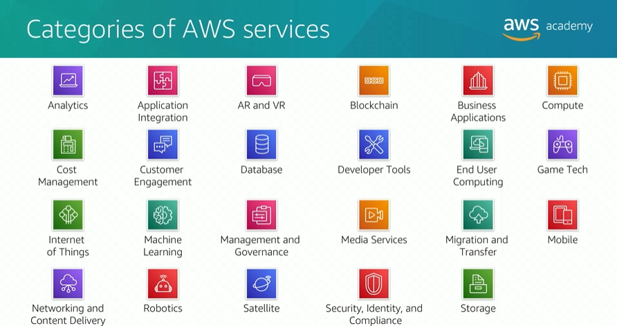

# Module 1: Amazon Web Services

Favorite: No
Archive: No
Notebook: AWS Cloud (../../AWS%20Cloud%2035b6c6880dca809b964ce3b71f757313.md)
Edited: May 9, 2026 4:47 PM
Created: May 9, 2026 4:30 PM

## What is a web service?

A web service is any piece of software thaat makes itself available over the internet and uses a standardized format - such as Extensible Markup Language (XML) or JavaScript Object Notation (JSON) - for the request and response of an app programming interface (API) interaction.

## What is AWS?

- AWS is a secure cloud platform that offers a broad set of global cloud-based products.
- AWS provides you with on-demand access to compute, storage, network, database, and other IT resources and management tools.
- AWS offers flexibility.
- You pay only for the individual services you need, for as long as you use them.
- AWS services work together like building blocks.

## Categories of AWS services

## Choosing a service

#### Amazon EC2

Complete control of compute resources and infrastructure

#### AWS Lambda

Run code; not manage or provision servers

### AWS Elastic Beanstalk

Provision services then deploys, manages, and scales the web app

#### Amazon Lightsail

Cloud platform for simple web app

#### AWS Batch

Run many massive batch workloads reliably

#### AWS Outposts

Run AWS infrastructure in on-premise data center

#### Amazon Elastic Container | Elastic Kubernetes | AWS Fargate

Implement containers or microservices architecture

#### VMware Cloud

On-premise server virtualization platform to migrate to AWS

## Services covered in the course

## Interaction with AWS

