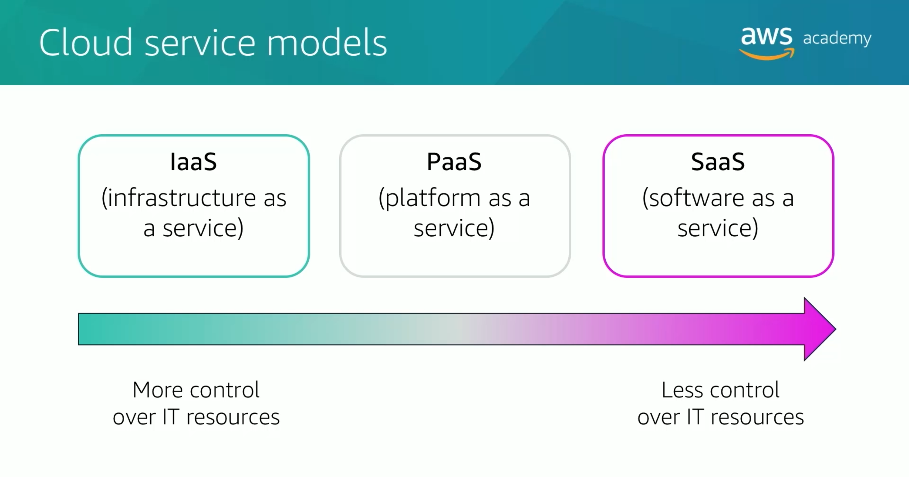

# Module 1: Introduction to Cloud Computing

Favorite: No
Archive: No
Notebook: AWS Cloud (../../AWS%20Cloud%2035b6c6880dca809b964ce3b71f757313.md)
Edited: May 9, 2026 4:48 PM
Created: May 9, 2026 4:08 PM

## What is cloud computing?

The on-demand delivery of compute power, database, storage, applications, and other IT resources via the Internet with pay-as-you-go pricing.

These resources run on server computers located in large data centers.

#### Infrastructure as Software

Cloud computing enables you to stop thinking of infrastructure as hardware, and instead use it as a software.

#### Traditional Computing Model

Infrastructure as hardware

Hardware solutions:

- Requires space, staff, physical security, capital expenditure
- Have a long hardware procurement cycle
- Requires capacity provisioning by guessing theoretical maximum peaks

#### Cloud Computing Model

Infrastructure as Software

Software solutions:

- Flexible
- Can change quickly, easily, and cost-effectively than hardware solutions
- Eliminate undifferentiated heavy-lifting tasks

## Cloud Service Models

### Infrastructure as a service

- Provide access to networking features, computers, storage space
- Highly flexible with IT resources

### Platform as a service

- Removes need of managing underlying infrastructure (hardware, os)
- Focuses on deployment and management of app

### Software as a service

- Provides a complete product managed by service provider
- End-user apps
- Do not have to maintain or manage
- Think only about how to use the software

## Cloud Computing Deployment Models

### Cloud

Fully deployed in the cloud

### Hybrid

Deployment is connecting the apps to cloud based resources.

### On-premises (private cloud)

Uses virtualization and resource management tools, but doesn’t provide benefits of cloud computing, instead sought after for dedicated resources.

## Similarities between AWS and traditional IT

