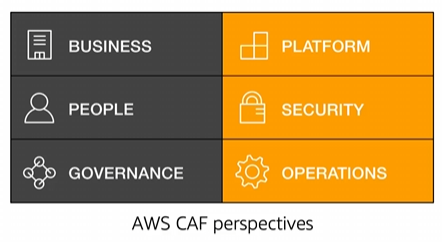

# Module 1: Moving to the AWS Cloud

Favorite: No
Archive: No
Notebook: AWS Cloud (../../AWS%20Cloud%2035b6c6880dca809b964ce3b71f757313.md)
Edited: May 9, 2026 4:47 PM
Created: May 9, 2026 4:40 PM

# The Cloud Adopting Framework (AWS CAF)

Cloud adoption does not happen instantly, it is important that infrastructure and organization must be aligned for successful adoption. This shifts how companies budget and pay for technology services.

Cloud adoption requires that fundamental changes are discussed and considered across the entire organization, while stakeholders are required to support all these new changes.

AWS CAF provides guidance and best practices to help organizations build a comprehensive approach to cloud computing across the organization and throughout the IT lifecycle to accelerate successful cloud adoption.

AWS CAF is organized into 6 perspectives and the perspectives consists of sets of capabilties.

## Six Core Perspectives

