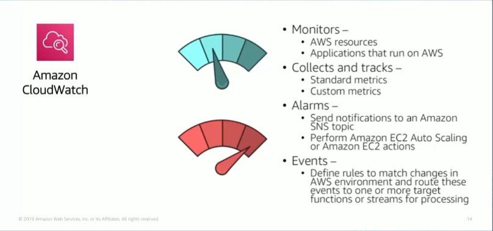

# Module 10: Amazon CloudWatch

Favorite: No
Archive: No
Notebook: AWS Cloud (../../AWS%20Cloud%2035b6c6880dca809b964ce3b71f757313.md)
Edited: June 1, 2026 6:13 PM
Created: June 1, 2026 6:01 PM

## Monitoring AWS Resources

- To use AWS efficiently, you need insight into your AWS resources:
  - How do you know when you shoud launch more Amazon EC2 instances?
  - Is your application’s performance or availability being affected by a lack of sufficient capacity?
  - How much of your infrastructure is actually being used?

## Amazon CloudWatch

- You capture all the information using Amazon CloudWatch.
- CloudWatch is a monitoring and observability service that is built for DevOps engineers, developers, site reliability engineers, and IT managers.
- With Amazon CloudWatch, you gain system-wide visibility into resource utilization, application performance, and operational health. There is no upfront commitment or minimum fee. You just pay for what you use.

## CloudWatch Alarms

- When you create an alarm based on static threshold, you choose a CloudWatch metric for the alarm and the threshold for that metric. The alarm state is triggered when the metric breaches the threshold for the specified number for evaluation periods.

