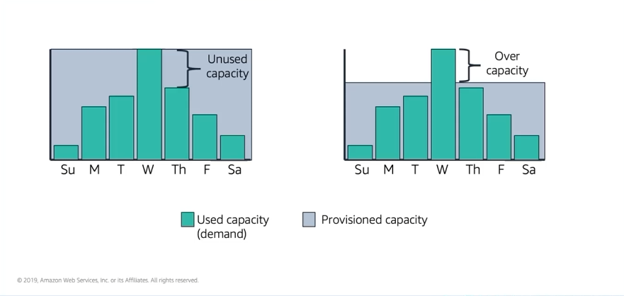

# Module 10: Amazon EC2 Auto Scaling

Favorite: No
Archive: No
Notebook: AWS Cloud (../../AWS%20Cloud%2035b6c6880dca809b964ce3b71f757313.md)
Edited: June 9, 2026 3:01 PM
Created: June 1, 2026 6:13 PM

## Why is scaling important?

- In the example below, it shows varying capacity requirements throughout the week. You provision capacity to meet your highest demand which is on Wednesday, if you provision this way, then you’re running resources will be under utilized most days of the week. With this option, your costs are unoptimized.
- Another option is to allocate less capacity to reduce costs. However, in this situation you are under capacity on certain days.
- Automatic capacity scaling is necessary to support the fluctuating demands for service. Without scaling, your application could underperform or potentially even become unavailable for your users.

## Amazon EC2 Auto Scaling

- In cloud, computing power is a programmatic resource. This means you can take a flexible approach to scaling.

## Typical Weekly Traffic at Amazon.com

## November traffic to Amazon.com

- Automatic scaling is also useful for dynamic, on-demand scaling.
- [Amazon.com](http://Amazon.com) experiences a seasonal peak in traffic at the end of November on Black Friday and Cyber Monday which are days when US retailers hold major sales.
- If Amazon provision servers using fixed capacity to accommodate the highest use, 76% of the resources would be idle for most of the year.

## Auto Scaling Groups

- The size of the Auto Scaling group depends on the number of instances you configure as the desired capacity.
- You can adjust its size to meet the demand either manually or by using automatic scaling.
- You can specify the minimum number of instances in each Auto Scaling group and Amazon EC2 Auto Scaling will prevent your group from going below that size.
- You can sepcify the maximum number of instances in each Auto Scaling group and Amazon EC2 auto scaling will prevent your group from going above the limit.
- If you specify the desired capacity, either when you create the group or anytime afterwards, Amazon EC2 Auto Scaling will adjust the size of your group so it has the specified number of instances.
- If you specify auto scaling policies, then Amazon EC2 Auto Scaling can launch or terminate instances when you have the demand or the application increases or decreases.
- Example. The diagram below shows this Auto Scaling group has a minimum size of 1 instance, a desired capacity of 2 instances, and a maximum size of 4 instances. The scaling policies defined adjust the number of instances within minimum and maximum number of instances based on the criteria specified.

## Scaling Out Vs. Scaling In

- With Amazon EC2 Auto Scaling, launching instances is referred to as scaling out and terminating instances is referred to as scaling in.

## How Amazon EC2 Auto Scaling works

- To launch EC2 instances, an Auto Scaling group uses a launch configuration which is an instance configuration template. When you create a launch configuration, you specify what information instances will use when scaling.
- After configuring the launch configuration, you specify where you want the scale. You define the minimum and maximum number of instances and desired capacity of your Auto Scaling group. Then, it’s launched into a subnet within a VPC.
- Amazon EC2 Auto Scaling, integrates with Elastic Load Balancing to enable you to attach one or more load balancers to an existing Auto Scaling group. After you attach the load balancer, it automatically registers the instances in a group and distributes incoming traffic across those instances.
- Finally, you specify when you want to scale the event. You may have other options to consider when scaling. You can configure your Auto Scaling group to maintain a specified number of running instances at all times.
- You may want to maintain the current instance levels and Amazon EC2 Auto Scaling performs a periodic health check on running instances in an Auto Scaling group.
- When Amazon EC2 Auto Scaling finds an unhealthy instance, it terminates and that instance is replaced with a new one.
- If you choose manual scaling, you specify only the change in the maximum and minimum or desired capacity of your Auto Scaling group.
- With Scheduled Scaling, scaling actions are performed automatially as a function of date and time. This is useful for predictable workloads when you know exactly when to increase or decrease the number of instances in your group over a period of time.
- You can configure dynamic on-demand scaling as a more advanced way to scale your resources where you define parameters that control the scaling process using scaling policies. Scaling events for on-demand scaling can use Amazon CloudWatch to check for CPU utilization and only scale when your predefined threshold for CPU utilization is breached. This option is useful for scaling in response to changing conditions when you don’t know when these conditions will change.
- Amazon EC2 Auto Scaling with AWS Scaling to implement predictive scaling where your capacity scales based on predictive demand. Predictive scaling uses data that is collected from your actual EC2 usage and data is further informed by billions of data points that are drawn from own observations.
- AWS then uses well-trained machine learning models to predict your expected traffic and EC2 usage including daily and weekly patterns. This model needs at least a day of historical data to start making predictions and is reevaluated every 24 hours to create a forecast for the next 48 hours.
- The prediction process produces a scaling plan that can drive one or more groups automatically for scaling EC2 instances.

## Implementing Dynamic Scaling

- One common configuration for implementing dynamic scaling is to create a CloudWatch alarm that is based on performance information collected from your EC2 instances or load balancers.
- When a performance threshold is breached, a CloudWatch alarm triggers an automatic scaling event that either scales out or scales in EC2 instances in the Auto Scaling group.
- The example below shows:
  - First, creating an Amazon CloudWatch alarm to monitor CPU utilization across the EC2 instances and run automatic scaling policies if the average CPU utilization across the entire fleet goes above 60% for more than 5 mins.
  - Next, Amazon EC2 Auto Scaling adds a new EC2 instance into your Auto Scaling group based on the launch configuration created.
  - After the new instance is added, Amazon EC2 Auto Scaling makes a call to the Elastic Load Balancing to register the new EC2 instance in that Auto Scaling group.
  - Finally, Elastic Load Balancing performs required health checks and starts distributing traffic to the instance.
  - Elastic Load Balancing then routes traffic between EC2 instances and feeds metrics to Amazon CloudWatch.

