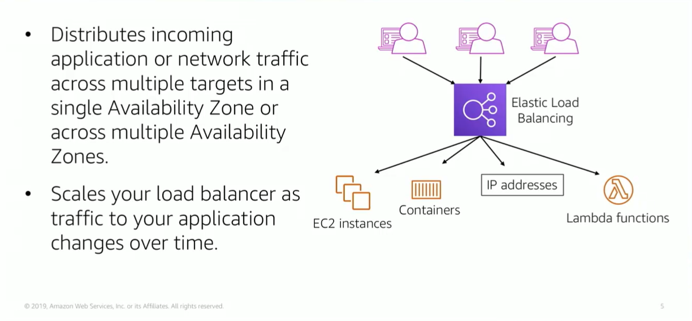

# Module 10: Elastic Load Balancing

Favorite: No
Archive: No
Notebook: AWS Cloud (../../AWS%20Cloud%2035b6c6880dca809b964ce3b71f757313.md)
Edited: June 1, 2026 6:01 PM
Created: June 1, 2026 4:22 PM

## Elastic Load Balancing

- Modern high-traffic websites must a large base of concurrent requests from users or clients and then return the correct text, images, video, or application data in a fast and reliable manner.
- To meet these high-volume demands, additional servers are generally required.
- Elastic Load Balancing is an AWS service that distributes incoming application or network traffic across multiple targets, such as EC2 instances, containers, IP addresses, and Lambda functions, in a single Availability Zone or across multiple Availability Zones.
- Elastic Load Balancing scales your load balancer as traffic to your application changes over time. It can automatically scale to most workloads.

## Types of Load Balancers

## How Elastic Load Balancer works

- A load balancer accepts incoming traffic from clients, and routes requests to registered targets in one or more Availability Zones.
- You configure your load balancer to accept incoming traffic by specifying one or more listeners.
- The listener is configured with a protocol, like HTTP, and a port number, such as Port 80. Similarly, it is configured with a protocol and a port number for connections from the load balancers to the targets.
- You can also configure the load balancer to perform health checks, which are used to monitor the health of the registered targets so that the load balancer only sends requests to the healthy instances. When the load balancer detects an unhealthy target, it stops routing traffic to that target. It will only resume routing if it detects that target is healthy again.

## Elastic Load Balancing Use Cases

- You can achieve high availability and better fault tolerance for your applications.
- Elastic Load Balancing balances traffic across healthy targets in multiple Availability Zones. If one or more of your targets is in a single Availability Zone and unhealthy, Elastic Load Balancing will route target traffic to healthy targets in other Availability Zones. When back to a healthy state, Elastic Load Balancing will automatically resume traffic to them.
- Enhanced container support for Elastic Load Balancing so you can use a load balancer to automatically load balance your containerized applications across multiple ports on the same EC2 instance.
- You can also take advantage of deep integration with Amazon Elastic Container Service, which provides fully managed container offering. You only need to register a service with a load balancer and Amazon ECS transparently manages registration and deregistration of the Docker containers. The Load Balancer automatically detects the port and dynamically reconfigures itself.

## Load Balancer Monitoring

- There are a few ways that you can monitor your load balancers, analyze traffic patterns, and troubleshoot issues with your load balancers and targets.
- Amazon CloudWatch Metrics Example:
  - You can create a CloudWatch alarm to monitor a specified metric and initiate an action, such as sending a notification to an email address. If the metric goes outside of what you consider is acceptable, it can then send that message.

