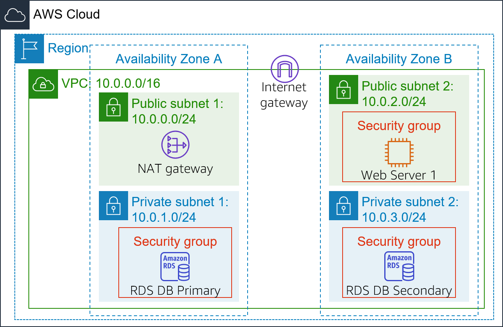
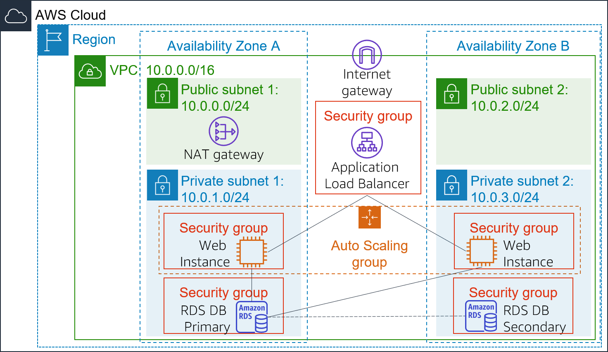

# Module 10: Lab 6 - Scale & Load Balance Architecture

Favorite: No
Archive: No
Notebook: AWS Cloud (../../AWS%20Cloud%2035b6c6880dca809b964ce3b71f757313.md)
Edited: June 1, 2026 6:51 PM
Created: June 1, 2026 6:49 PM

# **Lab 6: Scale and Load Balance Your Architecture**

## **Lab Overview and objectives**

This lab walks you through using the Elastic Load Balancing (ELB) and Auto Scaling services to load balance and automatically scale your infrastructure.

**Elastic Load Balancing** automatically distributes incoming application traffic across multiple Amazon EC2 instances. It enables you to achieve fault tolerance in your applications by seamlessly providing the required amount of load balancing capacity needed to route application traffic.

**Auto Scaling** helps you maintain application availability and allows you to scale your Amazon EC2 capacity out or in automatically according to conditions you define. You can use Auto Scaling to help ensure that you are running your desired number of Amazon EC2 instances. Auto Scaling can also automatically increase the number of Amazon EC2 instances during demand spikes to maintain performance and decrease capacity during lulls to reduce costs. Auto Scaling is well suited to applications that have stable demand patterns or that experience hourly, daily, or weekly variability in usage.

By the end of this lab, you will be able to:

- Create an Amazon Machine Image (AMI) from a running instance.
- Create a load balancer.
- Create a launch template and an Auto Scaling group.
- Automatically scale new instances
- Create Amazon CloudWatch alarms and monitor performance of your infrastructure.

## **Duration**

This lab takes approximately **30 minutes**.

## **AWS service restrictions**

In this lab environment, access to AWS services and service actions might be restricted to the ones that are needed to complete the lab instructions. You might encounter errors if you attempt to access other services or perform actions beyond the ones that are described in this lab.

**Caution**: Any attempt to have 20 or more concurrently running instances (regardless of size), will result in immediate deactivation of the AWS account and all resources in the account will be immediately deleted.

## **Scenario**

You start with the following infrastructure:

The final state of the infrastructure is:

## **Accessing the AWS Management Console**

1. At the top of these instructions, choose **Start Lab**.
   - The lab session starts.
   - A timer displays at the top of the page and shows the time remaining in the session.
     **Tip:** To refresh the session length at any time, choose **Start Lab** again before the timer reaches 0:00.
   - Before you continue, wait until the circle icon to the right of the AWS link in the upper-left corner turns green.
2. To connect to the AWS Management Console, choose the **AWS** link in the upper-left corner.
   - A new browser tab opens and connects you to the console.
     **Tip:** If a new browser tab does not open, a banner or icon is usually at the top of your browser with the message that your browser is preventing the site from opening pop-up windows. Choose the banner or icon, and then choose **Allow pop-ups**.
3. Arrange the AWS Management Console tab so that it displays along side these instructions. Ideally, you will be able to see both browser tabs at the same time, to make it easier to follow the lab steps.

## **Getting Credit for your work**

At the end of this lab you will be instructed to submit the lab to receive a score based on your progress.

**Tip:** The script that checks you works may only award points if you name resources and set configurations as specified. In particular, values in these instructions that appear in `This Format` should be entered exactly as documented (case-sensitive).

## **Task 1: Create an AMI for Auto Scaling**

In this task, you will create an AMI from the existing _Web Server 1_. This will save the contents of the boot disk so that new instances can be launched with identical content.

1. In the **AWS Management Console**, in the search box next to **Services** , search for and select **EC2**.
2. In the left navigation pane, choose **Instances**.

   First, you will confirm that the instance is running.

3. Wait until the **Status Checks** for **Web Server 1** displays _2/2 checks passed_. If necessary, choose refresh to update the status.

   You will now create an AMI based upon this instance.

4. Select **Web Server 1**.
5. In the **Actions** menu, choose **Image and templates** > **Create image**, then configure:
   - **Image name:** `WebServerAMI`
   - **Image description:** `Lab AMI for Web Server`
6. Choose **Create image**

   A confirmation banner displays the **AMI ID** for your new AMI.

   You will use this AMI when launching the Auto Scaling group later in the lab.

## **Task 2: Create a Load Balancer**

In this task, you will first create a target group and then you will create a load balancer that can balance traffic across multiple EC2 instances and Availability Zones.

1. In the left navigation pane, choose **Target Groups**.

   **Analysis**: _Target Groups_ define where to _send_ traffic that comes into the Load Balancer. The Application Load Balancer can send traffic to multiple Target Groups based upon the URL of the incoming request, such as having requests from mobile apps going to a different set of servers. Your web application will use only one Target Group.
   - Choose **Create target group**
   - Choose a target type: **Instances**
   - **Target group name**, enter: `LabGroup`
   - Select **Lab VPC** from the **VPC** drop-down menu.

2. Choose **Next**. The **Register targets** screen appears.

   Note: _Targets_ are the individual instances that will respond to requests from the Load Balancer.

   You do not have any web application instances yet, so you can skip this step.

3. Review the settings and choose **Create target group**
4. In the left navigation pane, choose **Load Balancers**.
5. At the top of the screen, choose **Create load balancer**.

   Several different types of load balancer are displayed. You will be using an _Application Load Balancer_ that operates at the request level (layer 7), routing traffic to targets — EC2 instances, containers, IP addresses and Lambda functions — based on the content of the request. For more information, see: [Comparison of Load Balancers](https://aws.amazon.com/elasticloadbalancing/features/#compare)

6. Under **Application Load Balancer**, choose **Create**
7. Under **Load balancer name**, enter: `LabELB`
8. Scroll down to the **Network mapping** section, then:
   - For **VPC**, choose **Lab VPC**
     You will now specify which _subnets_ the Load Balancer should use. The load balancer will be internet facing, so you will select both Public Subnets.
   - Choose the **first** displayed Availability Zone, then select **Public Subnet 1** from the Subnet drop down menu that displays beneath it.
   - Choose the **second** displayed Availability Zone, then select **Public Subnet 2** from the Subnet drop down menu that displays beneath it.
     You should now have two subnets selected: **Public Subnet 1** and **Public Subnet 2**.
9. In the **Security groups** section:
   - Choose the Security groups drop down menu and select **Web Security Group**
   - Below the drop down menu, choose the **X** next to the default security group to remove it.
     The **Web Security Group** security group should now be the only one that appears.
10. For the Listener HTTP:80 row, set the Default action to forward to **LabGroup**.
11. Scroll to the bottom and choose **Create load balancer**

    The load balancer is successfully created.
    - Choose **View load balancer**
      The load balancer will show a state of _provisioning_. There is no need to wait until it is ready. Please continue with the next task.

## **Task 3: Create a Launch Template and an Auto Scaling Group**

In this task, you will create a _launch template_ for your Auto Scaling group. A launch template is a template that an Auto Scaling group uses to launch EC2 instances. When you create a launch template, you specify information for the instances such as the AMI, the instance type, a key pair, and security group.

1. In the left navigation pane, choose **Launch Templates**.
2. Choose **Create launch template**
3. Configure the launch template settings and create it:
   - **Launch template name:** `LabConfig`
   - Under **Auto Scaling guidance**, select _Provide guidance to help me set up a template that I can use with EC2 Auto Scaling_
   - In the Application and OS Images (Amazon Machine Image) area, choose _My AMIs_.
   - **Amazon Machine Image (AMI)**: choose _Web Server AMI_
   - **Instance type:** choose _t2.micro_
   - **Key pair name**: choose _vockey_
   - **Firewall (security groups)**: choose _Select existing security group_
   - **Security groups**: choose _Web Security Group_
   - Scroll down to the **Advanced details** area and expand it.
   - Scroll down to the **Detailed CloudWatch monitoring** setting. Select _Enable_
     Note: This will allow Auto Scaling to react quickly to changing utilization.
   - Choose **Create launch template**
     Next, you will create an Auto Scaling group that uses this launch template.
4. In the Success dialog, choose the **LabConfig** launch template.
5. From the **Actions** menu, choose _Create Auto Scaling group_
6. Configure the details in Step 1 (Choose launch template or configuration):
   - **Auto Scaling group name:** `Lab Auto Scaling Group`
   - **Launch template**: confirm that the _LabConfig_ template you just created is selected.
   - Choose **Next**
7. Configure the details in Step 2 (Choose instance launch options):
   - **VPC**: choose _Lab VPC_
   - **Availability Zones and subnets**: Choose _Private Subnet 1_ and then choose _Private Subnet 2_.
   - Choose **Next**
8. Configure the details in Step 3 (Configure advanced options):
   - Choose **Attach to an existing load balancer**
     - **Existing load balancer target groups**: select _LabGroup_.
   - In the **Additional settings** pane:
     - Select **Enable group metrics collection within CloudWatch**
     This will capture metrics at 1-minute intervals, which allows Auto Scaling to react quickly to changing usage patterns.
   - Choose **Next**
9. Configure the details in Step 4 (Configure group size and scaling policies - optional):
   - Under **Group size**, configure:
     - **Desired capacity:** 2
     - **Minimum capacity:** 2
     - **Maximum capacity:** 6
       This will allow Auto Scaling to automatically add/remove instances, always keeping between 2 and 6 instances running.
   - Under **Scaling policies**, choose _Target tracking scaling policy_ and configure:
     - **Scaling policy name:** `LabScalingPolicy`
     - **Metric type:** _Average CPU Utilization_
     - **Target value:** `60`
       This tells Auto Scaling to maintain an _average_ CPU utilization _across all instances_ at 60%. Auto Scaling will automatically add or remove capacity as required to keep the metric at, or close to, the specified target value. It adjusts to fluctuations in the metric due to a fluctuating load pattern.
   - Choose **Next**
10. Configure the details in Step 5 (Add notifications - optional):

    Auto Scaling can send a notification when a scaling event takes place. You will use the default settings.
    - Choose **Next**

11. Configure the details in Step 6 (Add tags - optional):

    Tags applied to the Auto Scaling group will be automatically propagated to the instances that are launched.
    - Choose **Add tag** and Configure the following:
      - **Key:** `Name`
      - **Value:** `Lab Instance`
    - Choose **Next**

12. Configure the details in Step 6 (Review):
    - Review the details of your Auto Scaling group
    - Choose **Create Auto Scaling group**
      Your Auto Scaling group will initially show an instance count of zero, but new instances will be launched to reach the **Desired** count of 2 instances.

## **Task 4: Verify that Load Balancing is Working**

In this task, you will verify that Load Balancing is working correctly.

1. In the left navigation pane, choose **Instances**.

   You should see two new instances named **Lab Instance**. These were launched by Auto Scaling.

   If the instances or names are not displayed, wait 30 seconds and choose refresh in the top-right.

   Next, you will confirm that the new instances have passed their Health Check.

2. In the left navigation pane, choose **Target Groups**.
3. Select _LabGroup_
4. Choose the **Targets** tab.

   Two target instances named Lab Instance should be listed in the target group.

5. Wait until the **Status** of both instances transitions to _healthy_.

   Choose Refresh in the upper-right to check for updates if necessary.

   _Healthy_ indicates that an instance has passed the Load Balancer's health check. This means that the Load Balancer will send traffic to the instance.

   You can now access the Auto Scaling group via the Load Balancer.

6. In the left navigation pane, choose **Load Balancers**.
7. Select the _LabELB_ load balancer.
8. In the Details pane, copy the **DNS name** of the load balancer, making sure to omit "(A Record)".

   It should look similar to: _LabELB-1998580470.us-west-2.elb.amazonaws.com_

9. Open a new web browser tab, paste the DNS Name you just copied, and press Enter.

   The application should appear in your browser. This indicates that the Load Balancer received the request, sent it to one of the EC2 instances, then passed back the result.

## **Task 5: Test Auto Scaling**

You created an Auto Scaling group with a minimum of two instances and a maximum of six instances. Currently two instances are running because the minimum size is two and the group is currently not under any load. You will now increase the load to cause Auto Scaling to add additional instances.

1. Return to the AWS Management Console, but do not close the application tab — you will return to it soon.
2. in the search box next to **Services** , search for and select **CloudWatch**.
3. In the left navigation pane, choose **All alarms**.

   Two alarms will be displayed. These were created automatically by the Auto Scaling group. They will automatically keep the average CPU load close to 60% while also staying within the limitation of having two to six instances.

   **Note**: Please follow these steps only if you do not see the alarms in 60 seconds.
   - On the **Services** menu, choose **EC2**.
   - In the left navigation pane, choose **Auto Scaling Groups**.
   - Select **Lab Auto Scaling Group**.
   - In the bottom half of the page, choose the **Automatic Scaling** tab.
   - Select **LabScalingPolicy**.
   - Choose **Actions** and **Edit**.
   - Change the **Target Value** to `50`.
   - Choose **Update**
   - On the **Services** menu, choose **CloudWatch**.
   - In the left navigation pane, choose **All alarms** and verify you see two alarms.

4. Choose the **OK** alarm, which has _AlarmHigh_ in its name.

   If no alarm is showing **OK**, wait a minute then choose refresh in the top-right until the alarm status changes.

   The **OK** indicates that the alarm has _not_ been triggered. It is the alarm for **CPU Utilization > 60**, which will add instances when average CPU is high. The chart should show very low levels of CPU at the moment.

   You will now tell the application to perform calculations that should raise the CPU level.

5. Return to the browser tab with the web application.
6. Choose **Load Test** beside the AWS logo.

   This will cause the application to generate high loads. The browser page will automatically refresh so that all instances in the Auto Scaling group will generate load. Do not close this tab.

7. Return to browser tab with the **CloudWatch** console.

   In less than 5 minutes, the **AlarmLow** alarm should change to **OK** and the **AlarmHigh** alarm status should change to _In alarm_.

   You can choose Refresh in the top-right every 60 seconds to update the display.

   You should see the **AlarmHigh** chart indicating an increasing CPU percentage. Once it crosses the 60% line for more than 3 minutes, it will trigger Auto Scaling to add additional instances.

8. Wait until the **AlarmHigh** alarm enters the _In alarm_ state.

   You can now view the additional instance(s) that were launched.

9. In the search box next to **Services** , search for and select **EC2**.
10. In the left navigation pane, choose **Instances**.

    More than two instances labeled **Lab Instance** should now be running. The new instance(s) were created by Auto Scaling in response to the CloudWatch alarm.

## **Task 6: Terminate Web Server 1**

In this task, you will terminate _Web Server 1_. This instance was used to create the AMI used by your Auto Scaling group, but it is no longer needed.

1. Select **Web Server 1** (and ensure it is the only instance selected).
2. In the **Instance state**  menu, choose **Instance State** > **Terminate Instance**.
3. Choose **Terminate**

## **Submitting your work**

1. To record your progress, choose **Submit** at the top of these instructions.
2. When prompted, choose **Yes**.

   After a couple of minutes, the grades panel appears and shows you how many points you earned for each task. If the results don't display after a couple of minutes, choose **Grades** at the top of these instructions.

   **Tip:** You can submit your work multiple times. After you change your work, choose **Submit** again. Your last submission is recorded for this lab.

3. To find detailed feedback about your work, choose **Submission Report**.

   **Tip:** For any checks where you did not receive full points, there are sometimes helpful details provided in the submission report.

## **Lab Complete**

Congratulations! You have completed the lab.

1. Choose End Lab at the top of this page and then choose **Yes** to confirm that you want to end the lab.

   A panel will appear, indicating that "DELETE has been initiated... You may close this message box now."

2. Choose the **X** in the top right corner to close the panel.
