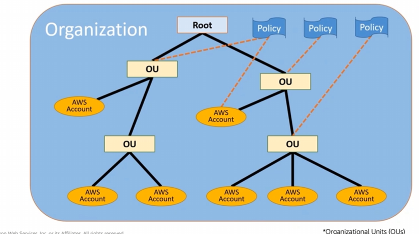

# Module 2 - AWS Organizations

Favorite: No
Archive: No
Notebook: AWS Cloud (../../AWS%20Cloud%2035b6c6880dca809b964ce3b71f757313.md)
Edited: May 9, 2026 5:58 PM
Created: May 9, 2026 5:50 PM

Depending on the size of the business, sometimes its easier to assign separate AWS accounts for each distinct department.

AWS Organizations is used for consolidated billings for those distinct accounts as an organization tree branch representing a department at the cost of nothing.

The Organizational Unit (OU) represents the branch for the account. The account contains the AWS resources.

## Key features and Benefits

## Security with AWS Organizations

## Organizations Setup

## Accessing AWS Organizations

