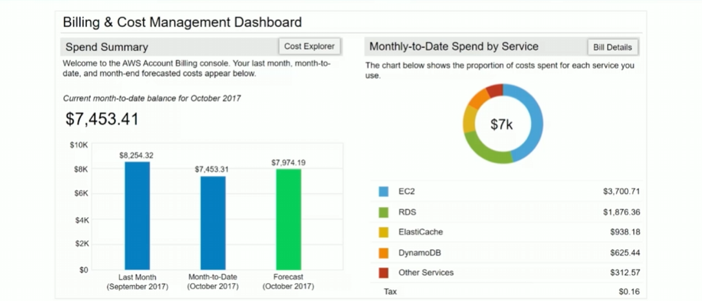

# Module 2: AWS Billing

Favorite: No
Archive: No
Notebook: AWS Cloud (../../AWS%20Cloud%2035b6c6880dca809b964ce3b71f757313.md)
Edited: May 9, 2026 6:06 PM
Created: May 9, 2026 5:59 PM

# AWS Billing and Cost Management

- A service used to pay for the AWS bill
- Allows monitoring for usage and budgeting for expenses
- Billing and Cost Management enables forecasting to obtain a better idea of what costs and usage might be in the future for planning.
- Allows setting up a custom time period, determing whether to view data monthly or daily
- Filtering and grouping functionality allows further analysis of data using varierty of available dimensions
- The AWS Cost and Usage Report Tool allows identifying opportunities for optimization, by understanding cost and usage trends

## AWS Billing Dashboard

## Tools

## Monthly Bills

## Cost Explorer

## Forecast and Track costs

## Cost and Usage reporting

