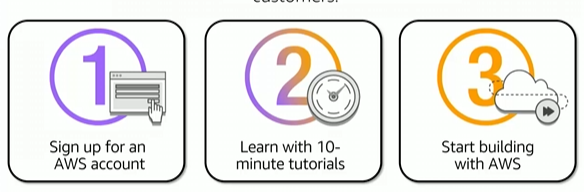

# Module 2: Fundamentals of Pricing

Favorite: No
Archive: No
Notebook: AWS Cloud (../../AWS%20Cloud%2035b6c6880dca809b964ce3b71f757313.md)
Edited: May 9, 2026 5:03 PM
Created: May 9, 2026 4:49 PM

## Three Fundamental drivers of cost with AWS

In most cases, there is no charge for inbound data transfer, data put into AWS, data transfer between services in the same region.

For outbound data transfer, its aggregated across services and then charged at outbound data transfer rate. This charge appears monthly.

#### Compute

- Charged per hour/second\*
- Varies by instance type
- Linux only!

#### Storage

- Charged typically per GB

#### Data transfer

- Outbound is aggregated and charged
- Inbound has no charge (with some exceptions)
- Charged typically per GB

## How to pay for AWS

- Pay for what you use
- Pay less when you reserve
- Pay less when you use more and as AWS grows

### Pay for what you use

In AWS, you only pay for services that you consume with no large upfront expenses, lowering operational costs, saving money from dedicating resources to spending on infrastructure, leases facilities.

This allows the company to instead focus on innovation for the business by paying only for what you use and for as long as you use it.

### Pay less by using more

Realize volume-based discounts:

- Savings as usage increases
- Tiered pricing for services like Amazon Simple Storage Service (Amazon S3), Amazon Elastic Block (Amazon EBS), or Amazon Elastic File System (Amazon EFS) → the more you use, the less you pay per GB.
- Multiple storage services deliver lower storage costs based on needs.

### Pay less as AWS grows

As AWS grows:

- AWS focuses on lowering cost of doing business
- This practice results in AWS passing savings from economies of scale to you.
- Since 2006, AWS has lowered pricing 75 times (as of Sept 2019)
- Future higher-performing resources replace current resources for no extra charge

## Custom pricing

- Meet varying needs through custom pricing
- Available for high-volume projects with unique requirements

## AWS Free Tier

Enables newcomers to gain free hands-on experience with the AWS platform, products, and services. Free for 1 year for new customers.

## Services with no charge

There is no charge for these services but there are charges for the resources these services provision. Example. When scaling additional EC2 instances, there will a charge.

