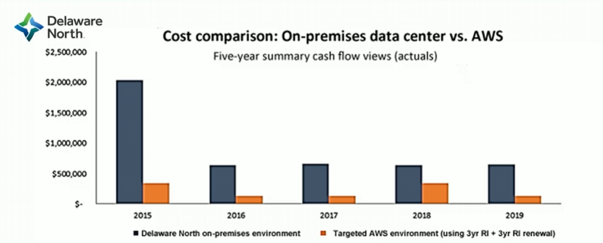

# Module 2: TCO Case Study

Favorite: No
Archive: No
Notebook: AWS Cloud (../../AWS%20Cloud%2035b6c6880dca809b964ce3b71f757313.md)
Edited: May 9, 2026 5:50 PM
Created: May 9, 2026 5:44 PM

# Delaware North

#### Background:

- Growing global company with over 200 locations
- Have 500 million customers, $3 billion (USD) annual revenue

#### Challenge:

- Meet demand to rapidly deploy new solutions
- Constantly upgrade aging equipment

#### Criteria:

- Have a broad solution to handle all workloads
- Be able to modify processes to improve efficiency and lower costs
- Elimate busy work (such as patching software)
- Achieve a positive return on investment (ROI)

#### Solution:

- Moved on-premises data center to AWS
  - Eliminated 205 servers (90%)
  - Moved nearly all apps to AWS
- Used 3-year Amazon EC2 Reserved Instances

## Cost comparison

## Results of Migration to AWS

