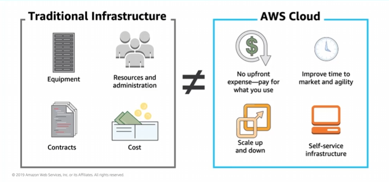

# Module 2: Total Cost of Ownership

Favorite: No
Archive: No
Notebook: AWS Cloud (../../AWS%20Cloud%2035b6c6880dca809b964ce3b71f757313.md)
Edited: May 9, 2026 5:44 PM
Created: May 9, 2026 5:30 PM

## On-premises versus Cloud

## Total Cost of Ownership (TCO)

Total cost of Ownership is the financial estimate to help identify direct and indireect costs of a system.

#### Why TCO?

- To compare the costs of running an entire infrastructure environment or specific workload on-premises versus on AWS
- To budget and build the business case for moving to the cloud

## TCO Considerations

## On-premises versus all-in-cloud

## AWS Pricing Calculator

- Estimate monthly costs
- Identify opportunities to reduce monthly costs
- Model solutions before building
- Explore price points and calculations behind estimate
- Find available instance types and contract terms that meet needs
- Name estimate and create and name groups (containers that you add services to) of services

## Reading an estimate

## Additional Benefit Considerations

