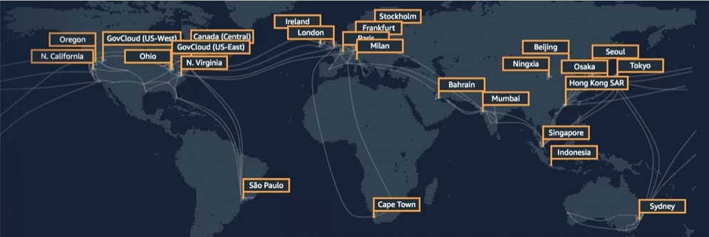

# Module 3: AWS Global Infrastructure

Favorite: No
Archive: No
Notebook: AWS Cloud (../../AWS%20Cloud%2035b6c6880dca809b964ce3b71f757313.md)
Edited: May 9, 2026 7:57 PM
Created: May 9, 2026 7:37 PM

# AWS Global Infrastructure

- The AWS Global Infrastructure is designed and built to deliver a flexible, reliable, scalable, and secure cloud computing environment with high-quality global network performance.
- This map shows the current AWS Regions and more that are coming soon.

## AWS Regions

- An AWS Region is a geographical area.
  - Data replication across Regions is controlled by you.
  - Communication between Regions uses AWS backbone network infrastructure.
- Each Region provides full redundancy and connectivity to the network.
- A Region typically consists of two or more Availability Zones.

## Selecting a Region

## Availability Zones

- Each Region has multiple Availability Zones.
- Each Availability Zone is a fully isolated partition of the AWS infrastructure.
  - There are currently 69 Availability Zones worldwide.
  - Availability Zones consist of discrete data centers.
  - They are interconnected with other Availability Zones by using high-speed private networking.
  - You choose your Availability Zones.
  - AWS recommends replicating data and resources across Availability Zones for resiliency.

## AWS Data Centers

- AWS data centers are designed for security.
- Data centers are where the data resides and data processing occurs.
- Each data center has redundant power, networking, and connectivity, and is housed in a separate facility.
- A data center typically has 50,000 to 80,000 physical servers.

## Points of Presence

- AWS provides a global network of 187 Points of Presence locations.
- Consists of 176 edge locations and 11 Regional edge caches
- Used with Amazon CloudFront
  - A global Content Delivery Network (CDN), that delivers content to end users with reduced latency.
- Regional edge caches used for content with infrequent access.

## AWS Infrastructure Features (Benefits)

- Elasticity and Scalability
  - Elastic infrastructure; dynamic adoption of capacity.
  - Scalable infrastructure; adapts to accommodate growth.
- Fault-tolerance
  - Continues operating properly in the presence of a failure.
  - Built-in redundancy of components.
- High Availability
  - High level of operational performance.
  - Minimized downtime.
  - No human intervention.
