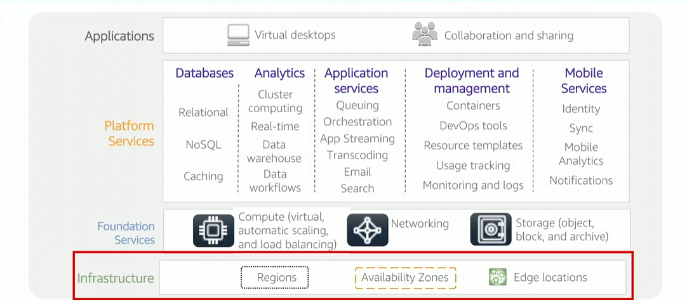

# Module 3: AWS Services and Service Categories

Favorite: No
Archive: No
Notebook: AWS Cloud (../../AWS%20Cloud%2035b6c6880dca809b964ce3b71f757313.md)
Edited: May 9, 2026 9:13 PM
Created: May 9, 2026 7:58 PM

# AWS Foundational Services

## AWS Categories of services

## Storage Service Category

#### Amazon S3

- Object service storage
- Offers scalability, data availability, security and performance

#### Amazon Elastic Block Store (Amazon EBS)

- High performance block storage designed for use with Amazon EC2 for throughput and transaction-extensive workloads

#### Amazon Elastic File System (Amazon EFS)

- Provides scalable and fully managed elastic elastic network file system (NFS)
- For use within AWS Cloud services and on-premise resources

#### Amazon Simple Storage Services Glacier

- Secure, durable and low cost
- AWS S3 Cloud storage class
- Used for data archiving and long-term backup

## Compute Service Category

#### Amazon EC2

- Provides resizable compute capacity as VM’s in the cloud

#### Amazon EC2 Auto Scaling

- Automatically add or remove EC2 instances

#### Amazon Elastic Container Service (Amazon ECS)

- Highly scalable and performing
- Container orchestration that supports Docker containers

#### Amazon Elsatic Container Registry (Amazon ECR)

- Fully managed docker container registry that makes it easy for developers to store, manage, and deploy Docker container images

#### AWS Elastic Beanstalk

- Deploying and scaling web applications (Apache)

#### AWS Lambda

- Run code without provisioning or managing servers
- Pay only for compute time

Amazon Elastic Kubernetes Services (Amazon EKS)

- Eaasily deploy manage and scale containerized apps that uses Kubernetes

#### AWS Fargate

- Compute engine for Amazon ECS
- Allows running containers without managing servers or clusters

## Database Service Category

#### Amazon Relational Database Service (Amazon RDS)

- Easy to setup and operate
- Scalable relational database in the cloud
- Resizable capacity
- Automates time-consuming administration tasks

#### Amazon Aurora (MySQL, PostgreSQL compatible relational DB)

- 5-times faster than standard MySQL DBs, 3-times faster than Postgres DBs

#### Amazon RedShift

- Allows running analytic queries against pentabytes of data stored locally in Amazon
- Fast performance at any scale

#### Amazon DynamoDB

- Fully managed key value and document NoSQL DB
- Delivers single-digit millisecond performance at any scale
- Built-in security, backup, restore, and in-memory caching

## Networking and Content Delivery Category

#### Amazon Virtual Private Cloud (Amazon VPC)

- Provision logically isolated sections of AWS Cloud to launch resources in a virtual network (self-defined)

#### Elastic Load Balancing

- Automatically distributes incoming application traffic across multiple targets (EC2 Instances, containers, IP addresses, and Lambda functions)

#### Amazon CloudFront

- Fast content delivery network (CDN)
- Securely delivers data, videos and apps and APIs to customers globally
- Low latency and high transfer speeds

#### AWS Transit Gateway

- Allows connection to Amazon Virtual Private Clouds and on-premises networks to single centrally managed gateway

#### Amazon Route 53

- Scalable cloud domain name system
- Reliable way to route end users to the app

#### AWS Direct Connect

- Establishes dedicated private network connection from data center to AWS
- Significantly reduce costs and increase bandwidth throughput

#### AWS VPN

- Provides secure private tunnel for devices through AWS

## Security, Identity, and Compliance Service Category

AWS Identity and Access Management (IAM)

- Manage access to AWS services and resources securely

AWS Organizations

- Restrict what services and actions are allowed in accounts

Amazon Cognito

- Adds user auth and access control to web and mobile apps

AWS Artifact

- Provides on-demand access to AW security, compliance reports, and select online agreements

AWS Key Management Service (AWS KMS)

- Create and manage encryption keys
- Control use of encryption across AWS services in apps

AWS Shield

- Managed distributed DOS protection service

## AWS Cost Management Service Category

#### AWS Cost and Usage Report

- Comprehensive set of usage data, including additional metadata about AWS services, pricing, and reservations

#### AWS Budgets

- Set custom budgets that alert when budgets are exceeded

#### AWS Cost Explorer

- Allows visualizing, understanding and managing usage

## AWS Management and Governance Category

#### AWS Management Console

- Web-based user interface for accessing AWS account

#### AWS Config

- Helps track resource inventory and changes

#### Amazon CloudWatch

- Monitor resources and apps

#### AWS Auto Scaling

- Scale multiple resources to meet demand

#### AWS Command Line Interface

- Unified tool to manage AWS services

#### AWS Trusted Advisor

- Helps optimize performance and security using AWS best practices

#### AWS Well-Architected Tool

- Helps in reviewing and improving workloads

#### AWS CloudTrail

- Tracks user activity, and API usage across AWS accounts

