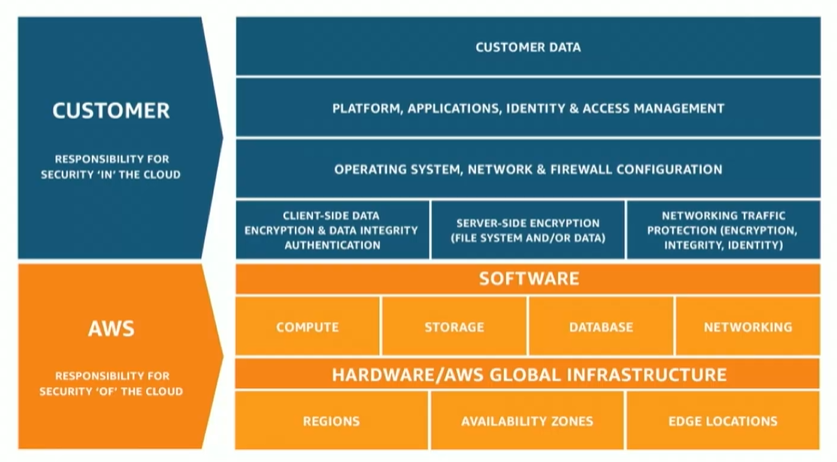

# Module 4: AWS Cloud Security

Favorite: No
Archive: No
Notebook: AWS Cloud (../../AWS%20Cloud%2035b6c6880dca809b964ce3b71f757313.md)
Edited: May 10, 2026 1:06 PM
Created: May 10, 2026 12:51 PM

# AWS Shared Reponsibility Model

## AWS Responsibility: Security of the Cloud

## Customer Responsibility: Security in the Cloud

## Service Characteristics and Security Responsibility

#### Infrastructure as a Service (IaaS)

- Customer has more flexibility over configuring networking and storage settings
- Customer is responsible for managing more aspects of the security
- Customer configures the access controls

#### Platform as a Service (PaaS)

- Customer does not need to manage the underlying infrastructure
- AWS handles the OS, database patching, firewall configuration, and disaster recovery
- Customer can focus on managing code or data

#### Software as a Service (SaaS)

- Software is centrally hosted
- Licensed based on a subscription model or pay-as-you-go basis
- Services are typically accessed via web browser, mobile app, or API
- Customer do not need to manage the infrastructure that supports the service

