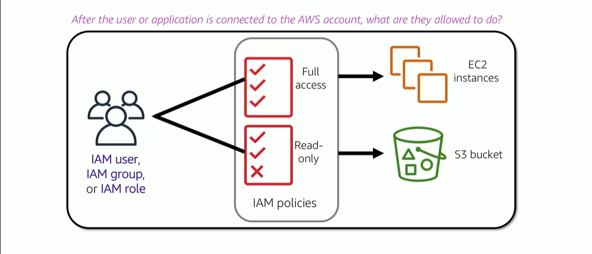

# Module 4: AWS IAM

Favorite: No
Archive: No
Notebook: AWS Cloud (../../AWS%20Cloud%2035b6c6880dca809b964ce3b71f757313.md)
Edited: May 10, 2026 1:36 PM
Created: May 10, 2026 1:07 PM

# AWS Identity and Access Management Service (IAM)

- Use IAM to manage access to AWS resources -
  - A resource is an entity in an AWS account that you can work with
  - Example resources; An Amazon EC2 instance or an Amazon S3 bucket
- Example - Control who can terminate Amazon EC2 instances
- Define fine-grained access rights -
  - Who can access the resource
  - Which resources can be accessed and what can the user do to the resource
  - How resources can be accessed
- IAM is a no-cost AWS account feature

## IAM: Essential Components

#### IAM User

A person or application that can authenticate with an AWS account.

#### IAM Group

A collection of IAM users that are granted identical authorization.

#### IAM Policy

The document that defines which resources can be accessed and the level of access to each resource.

#### IAM Role

Useful mechanism to grant a set of permissions for making AWS service requests.

## Authenticate as an IAM user to gain access

When you define an IAM user, you select what types of access the user is permitted to use.

#### Programmatic Access

- Authenticate using:
  - Access key ID
  - Secret access key
- Provides AWS CLI and AWS SDK access

#### AWS Management Console Access

- Authenticate using:
  - 12-digit Account ID or alias
  - IAM user name
  - IAM user password
- If enabled, multi-factor authentication prompts for MFA code

## IAM MFA

MFA provides security, in addition to username and password, MFA requires a unique auth code to access AWS services.

## Authorization: What actions are permitted

## IAM: Authorization

- Assign permissions by creating an IAM Policy.
- Permissions define which resources and operations are allowed:
  - All permissions are implictly denied by default.
  - If something is explicity denied, it is never allowed.
- Best practice: Follow the principle of least privilege.
- Grant only minimal privilege based on the needs of the user.

Note: The scope of IAM service configurations is global. Settings apply across all AWS Regions.

## IAM Policies

- An IAM policy is a document that defines permissions
  - Enables fine-grained access control
- Two types of policies - identity based and resource-based
- Identity-Based Policies -
  - Attach a policy to any IAM entity
    - An IAM user, IAM group, or IAM role
  - Policies specify:
    - Actions that may be performed by the entity
    - Actions that may not be performed by the entity
  - A single policy can be attached to multiple entities
  - A single entity can have multiple policies attached to it
- Resource-Based Policies
  - Attached to a resource (like an S3 bucket)

## IAM Policy Example

## Resource-based Policies

- Identity-based policies are attached to a user, group, role
- Resource-based policies are attached to a resource (not to a user, group, or role)
- Characteristics of resource-based policies -
  - Specifies who has access to the resource and what actions they can perform on it
  - The policies are inline only, not managed
- Resource-based policies are supported only by some AWS services

## IAM Permissions

## IAM Groups

- An IAM group is a collection of IAM users
- A group is used to grant the same permissions to multiple users
  - Permissions granted by attaching IAM policy or policies to the group
- A user can belong to multiple groups
- There is no default group
- Groups cannot be nested

## IAM Roles

- An IAM role is an IAM identity with specific permissions
- Similar to an IAM user
  - Attach permissions policies to it
- Different from an IAM user
  - Not uniquely associated with one person
  - Intended to be assumable by a person, application, or service
- Role provides temporary security credentials
- Examples of how IAM roles are used to delegate access -
  - Used by an IAM user in the same AWS account as the role
  - Used by an AWS service - such as Amazon EC2 - in the same account as the role
  - Used by an IAM user in a different AWS account than the role

## Example use of IAM Role

