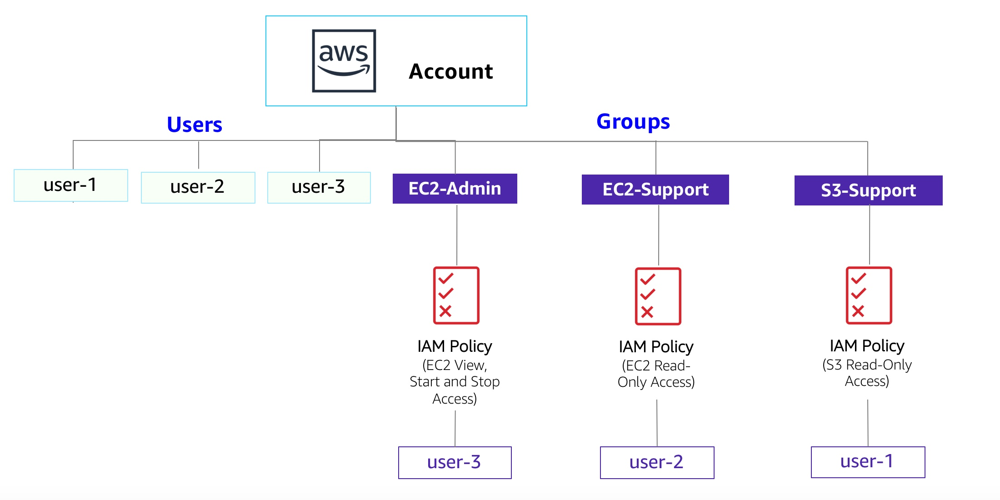

# Module 4: Lab 1 - AWS IAM

Favorite: No
Archive: No
Notebook: AWS Cloud (../../AWS%20Cloud%2035b6c6880dca809b964ce3b71f757313.md)
Edited: May 10, 2026 7:43 PM
Created: May 10, 2026 7:12 PM

# **Lab 1: Introduction to AWS IAM**

**AWS Identity and Access Management (IAM)** is a web service that enables Amazon Web Services (AWS) customers to manage users and user permissions in AWS. With IAM, you can centrally manage **users**, **security credentials** such as access keys, and **permissions** that control which AWS resources users can access.

## **Lab overview and objectives**

This lab will demonstrate:

- Exploring pre-created **IAM Users and Groups**
- Inspecting **IAM policies** as applied to the pre-created groups
- Following a **real-world scenario**, adding users to groups with specific capabilities enabled
- Locating and using the **IAM sign-in URL**
- **Experimenting** with the effects of policies on service access

## **AWS service restrictions**

In this lab environment, access to AWS services and service actions might be restricted to the ones that are needed to complete the lab instructions. You might encounter errors if you attempt to access other services or perform actions beyond the ones that are described in this lab.

## **AWS Identity and Access Management**

AWS Identity and Access Management (IAM) can be used to:

- **Manage IAM Users and their access:** You can create Users and assign them individual security credentials (access keys, passwords, and multi-factor authentication devices). You can manage permissions to control which operations a User can perform.
- **Manage IAM Roles and their permissions:** An IAM Role is similar to a User, in that it is an AWS identity with permission policies that determine what the identity can and cannot do in AWS. However, instead of being uniquely associated with one person, a Role is intended to be _assumable_ by anyone who needs it.
- **Manage federated users and their permissions:** You can enable _identity federation_ to allow existing users in your enterprise to access the AWS Management Console, to call AWS APIs and to access resources, without the need to create an IAM User for each identity.

## **Duration**

This lab takes approximately **40 minutes** to complete.

## **Accessing the AWS Management Console**

1. At the top of these instructions, choose **Start Lab**.
   - The lab session starts.
   - A timer displays at the top of the page and shows the time remaining in the session.
     **Tip:** To refresh the session length at any time, choose **Start Lab** again before the timer reaches 0:00.
   - Before you continue, wait until the circle icon to the right of the AWS link in the upper-left corner turns green.
2. To connect to the AWS Management Console, choose the **AWS** link in the upper-left corner.
   - A new browser tab opens and connects you to the console.
     **Tip:** If a new browser tab does not open, a banner or icon is usually at the top of your browser with the message that your browser is preventing the site from opening pop-up windows. Choose the banner or icon, and then choose **Allow pop-ups**.
3. Arrange the AWS Management Console tab so that it displays along side these instructions. Ideally, you will be able to see both browser tabs at the same time, to make it easier to follow the lab steps.

## **Getting Credit for your work**

At the end of this lab you will be instructed to submit the lab to receive a score based on your progress.

**Tip:** The script that checks you works may only award points if you name resources and set configurations as specified. In particular, values in these instructions that appear in `This Format` should be entered exactly as documented (case-sensitive).

## **Task 1: Explore the Users and Groups**

In this task, you will explore the Users and Groups that have already been created for you in IAM.

1. In the search box to the right of **Services**, search for and choose **IAM** to open the IAM console.
2. In the navigation pane on the left, choose **Users**.

   The following IAM Users have been created for you:
   - user-1
   - user-2
   - user-3

3. Choose the **user-1** link.

   This will bring to a summary page for user-1. The **Permissions** tab will be displayed.

4. Notice that user-1 does not have any permissions.
5. Choose the **Groups** tab.

   user-1 also is not a member of any groups.

6. Choose the **Security credentials** tab.

   user-1 is assigned a **Console password**.

7. In the navigation pane on the left, choose **User groups**.

   The following groups have already been created for you:
   - EC2-Admin
   - EC2-Support
   - S3-Support

8. Choose the **EC2-Support** group link.

   This will bring you to the summary page for the **EC2-Support** group.

9. Choose the **Permissions** tab.

   This group has a Managed Policy associated with it, called **AmazonEC2ReadOnlyAccess**. Managed Policies are pre-built policies (built either by AWS or by your administrators) that can be attached to IAM Users and Groups. When the policy is updated, the changes to the policy are immediately apply against all Users and Groups that are attached to the policy.

10. Choose the plus (**+**) icon next to the AmazonEC2ReadOnlyAccess policy to view the policy details.

    **Note**: A policy defines what actions are allowed or denied for specific AWS resources.

    This policy is granting permission to List and Describe information about EC2, Elastic Load Balancing, CloudWatch and Auto Scaling. This ability to view resources, but not modify them, is ideal for assigning to a Support role.

    The basic structure of the statements in an IAM Policy is:
    - **Effect** says whether to _Allow_ or _Deny_ the permissions.
    - **Action** specifies the API calls that can be made against an AWS Service (eg _cloudwatch:ListMetrics_).
    - **Resource** defines the scope of entities covered by the policy rule (eg a specific Amazon S3 bucket or Amazon EC2 instance, or * which means *any resource\*).

11. Choose the minus icon () to hide the policy details.
12. In the navigation pane on the left, choose **User groups**.
13. Choose the **S3-Support** group link and then choose the **Permissions** tab.

    The S3-Support group has the **AmazonS3ReadOnlyAccess** policy attached.

14. Choose the plus (**+**) icon to view the policy details.

    This policy grants permissions to Get and List resources in Amazon S3.

15. Choose the minus icon () to hide the policy details.
16. In the navigation pane on the left, choose **User groups**.
17. Choose the **EC2-Admin** group link and then choose the **Permissions** tab.

    This Group is slightly different from the other two. Instead of a _Managed Policy_, it has an **Inline Policy**, which is a policy assigned to just one User or Group. Inline Policies are typically used to apply permissions for one-off situations.

18. Choose the plus (**+**) icon to view the policy details.

    This policy grants permission to view (Describe) information about Amazon EC2 and also the ability to Start and Stop instances.

19. Choose the minus icon () to hide the policy details.

## **Business Scenario**

For the remainder of this lab, you will work with these Users and Groups to enable permissions supporting the following business scenario:

Your company is growing its use of Amazon Web Services, and is using many Amazon EC2 instances and a great deal of Amazon S3 storage. You wish to give access to new staff depending upon their job function:

| **User** | **In Group** | **Permissions**                           |
| -------- | ------------ | ----------------------------------------- |
| user-1   | S3-Support   | Read-Only access to Amazon S3             |
| user-2   | EC2-Support  | Read-Only access to Amazon EC2            |
| user-3   | EC2-Admin    | View, Start and Stop Amazon EC2 instances |

|

## **Task 2: Add Users to Groups**

You have recently hired **user-1** into a role where they will provide support for Amazon S3. You will add them to the **S3-Support** group so that they inherit the necessary permissions via the attached _AmazonS3ReadOnlyAccess_ policy.

You can ignore any "not authorized" errors that appear during this task. They are caused by your lab account having limited permissions and will not impact your ability to complete the lab.

### **Add user-1 to the S3-Support Group**

1. In the left navigation pane, choose **User groups**.
2. Choose the **S3-Support** group link.
3. Choose the **Users** tab.
4. In the **Users** tab, choose **Add users**.
5. In the **Add Users to S3-Support** window, configure the following:
   - Select **user-1**.
   - At the bottom of the screen, choose **Add users**.
     In the **Users** tab you will see that user-1 has been added to the group.

### **Add user-2 to the EC2-Support Group**

You have hired **user-2** into a role where they will provide support for Amazon EC2.

1. Using similar steps to the ones above, add **user-2** to the **EC2-Support** group.

   user-2 should now be part of the **EC2-Support** group.

### **Add user-3 to the EC2-Admin Group**

You have hired **user-3** as your Amazon EC2 administrator, who manage your EC2 instances.

1. Using similar steps to the ones above, add **user-3** to the **EC2-Admin** group.

   user-3 should now be part of the **EC2-Admin** group.

2. In the navigation pane on the left, choose **User groups**.

   Each Group should now have a **1** in the Users column, indicating the number of Users in each Group.

   If you do not have a **1** beside each group, revisit the above instructions above to ensure that each user is assigned to a User group, as shown in the table in the Business Scenario section.

## **Task 3: Sign-In and Test Users**

In this task, you will test the permissions of each IAM User.

1. In the navigation pane on the left, choose **Dashboard**.

   A **Sign-in URL for IAM users in this account** link is displayed on the right. It will look similar to: *https://123456789012.signin.aws.amazon.com/console*

   This link can be used to sign-in to the AWS Account you are currently using.

2. Copy the **Sign-in URL for IAM users in this account** to a text editor.
3. Open a private (Incognito) window.

   **Mozilla Firefox**
   - Choose the menu bars at the top-right of the screen
   - Select **New private window**

   **Google Chrome**
   - Choose the ellipsis at the top-right of the screen
   - Select **New Incognito Window**

   **Microsoft Edge**
   - Choose the ellipsis at the top-right of the screen
   - Choose **New InPrivate window**

   **Microsoft Internet Explorer**
   - Choose the **Tools** menu option
   - Choose **InPrivate Browsing**

4. Paste the **IAM users sign-in** link into the address bar of your private browser session and press **Enter**.

   Next, you will sign-in as **user-1**, who has been hired as your Amazon S3 storage support staff.

5. Sign-in with:
   - **IAM user name:** `user-1`
   - **Password:** `Lab-Password1`
6. In the search box to the right of **Services**, search for and choose **S3** to open the S3 console.
7. Choose the name of the bucket that exists in the account and browse the contents.

   Since your user is part of the **S3-Support** Group in IAM, they have permission to view a list of Amazon S3 buckets and the contents.

   Note: The bucket does not contain any objects.

   Now, test whether they have access to Amazon EC2.

8. In the search box to the right of **Services**, search for and choose **EC2** to open the EC2 console.
9. In the left navigation pane, choose **Instances**.

   You cannot see any instances. Instead, you see a message that states _You are not authorized to perform this operation_. This is because this user has not been granted any permissions to access Amazon EC2.

   You will now sign-in as **user-2**, who has been hired as your Amazon EC2 support person.

10. Sign user-1 out of the **AWS Management Console** by completing the following actions:
    - At the top of the screen, choose **user-1**
    - Choose **Sign Out**

    

11. Paste the **IAM users sign-in** link into your private browser tab's address bar and press **Enter**.

    Note: This link should be in your text editor.

12. Sign-in with:
    - **IAM user name:** `user-2`
    - **Password:** `Lab-Password2`
13. In the search box to the right of **Services**, search for and choose **EC2** to open the EC2 console.
14. In the navigation pane on the left, choose **Instances**.

    You are now able to see an Amazon EC2 instance because you have Read Only permissions. However, you will not be able to make any changes to Amazon EC2 resources.

    If you cannot see an Amazon EC2 instance, then your Region may be incorrect. In the top-right of the screen, pull-down the Region menu and select the region that you noted at the start of the lab (for example, **N. Virginia**).
    - Select the instance named _LabHost_.

15. In the **Instance state** menu above, select **Stop instance**.
16. In the **Stop Instance** window, select **Stop**.

    You will receive an error stating _You are not authorized to perform this operation_. This demonstrates that the policy only allows you to view information, without making changes.

17. Choose the X to close the _Failed to stop the instance_ message.

    Next, check if user-2 can access Amazon S3.

18. In the search box to the right of **Services**, search for and choose **S3** to open the S3 console.

    You will see the message **You don't have permissions to list buckets** because user-2 does not have permission to access Amazon S3.

    You will now sign-in as **user-3**, who has been hired as your Amazon EC2 administrator.

19. Sign user-2 out of the **AWS Management Console** by completing the following actions:
    - At the top of the screen, choose **user-2**
    - Choose **Sign Out**

    

20. Paste the **IAM users sign-in** link into your private window and press **Enter**.
21. Paste the sign-in link into the address bar of your private web browser tab again. If it is not in your clipboard, retrieve it from the text editor where you stored it earlier.
22. Sign-in with:
    - **IAM user name:** `user-3`
    - **Password:** `Lab-Password3`
23. In the search box to the right of **Services**, search for and choose **EC2** to open the EC2 console.
24. In the navigation pane on the left, choose **Instances**.

    As an EC2 Administrator, you should now have permissions to Stop the Amazon EC2 instance.

    Select the instance named _LabHost_ .

    If you cannot see an Amazon EC2 instance, then your Region may be incorrect. In the top-right of the screen, pull-down the Region menu and select the region that you noted at the start of the lab (for example, **N. Virginia**).

25. In the **Instance state** menu, choose **Stop instance**.
26. In the **Stop instance** window, choose **Stop**.

    The instance will enter the _stopping_ state and will shutdown.

27. Close your private browser window.

## **Submitting your work**

1. To record your progress, choose **Submit** at the top of these instructions.

   **Important:** Some of the checks made by the submission process in this lab will only give you credit if it has been at least 5 minutes since you completed the action. If you do not receive credit the first time you submit, you may need to wait a couple minutes and the submit again to receive credit for these items.

2. When prompted, choose **Yes**.

   After a couple of minutes, the grades panel appears and shows you how many points you earned for each task. If the results don't display after a couple of minutes, choose **Grades** at the top of these instructions.

   **Tip:** You can submit your work multiple times. After you change your work, choose **Submit** again. Your last submission is recorded for this lab.

3. To find detailed feedback about your work, choose **Submission Report**.

   **Tip:** For any checks where you did not receive full points, there are sometimes helpful details provided in the submission report.

## **Lab complete**

Congratulations! You have completed the lab.

1. Choose **End Lab** at the top of this page, and then select **Yes** to confirm that you want to end the lab.

   A panel indicates that _You may close this message box now..._

2. Select the **X** in the top-right corner to close the panel.

## **Conclusion**

Congratulations! You now have successfully:

- Explored pre-created IAM users and groups
- Inspected IAM policies as applied to the pre-created groups
- Followed a real-world scenario, adding users to groups with specific capabilities enabled
- Located and used the IAM sign-in URL
- Experimented with the effects of policies on service access
