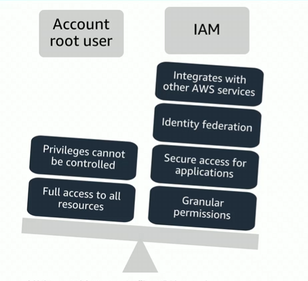

# Module 4: Securing a new AWS Account

Favorite: No
Archive: No
Notebook: AWS Cloud (../../AWS%20Cloud%2035b6c6880dca809b964ce3b71f757313.md)
Edited: May 10, 2026 6:19 PM
Created: May 10, 2026 1:38 PM

## AWS Account Root User Access vs. IAM Access

- Best practice: Do not use the AWS account root user except when necessary.
  - Access to the account root user requires logging in with the email address (and password) that you used to create the account.
- Example actions that can only be done with the root user:
  - Update the account root user password
  - Change the AWS Support plan
  - Restore an IAM user’s permissions
  - Change account settings (example, contact information, allowed Regions)

## Securing a new AWS account: Account root user

Step 1: Stop using the account root user ASAP

- The account root user has unrestricted access to all resources.
- To stop using the account root user:
  - While logged in as root, create an IAM user for self. Save the access keys if needed.
  - Create an IAM group, give it full administrator permissions, and add the IAM user to the group.
  - Disable and remove your account root user access keys, if they exist.
  - Enable a password policy for users.
  - Sign in with new IAM user credentials.
  - Store account root user credentials in a secure place.

## Securing a new AWS account: MFA

Step 2: Enable MFA

- Require MFA for account root user and for all IAM users.
- You can also use MFA to control access to AWS service APIs.
- Options for retrieving MFA token -
  - Virtual MFA-compliant applications:
    - Google Authenticator
    - Authy Authenticator (Windows phone app)
  - U2F security key devices:
    - YubiKey
  - Hardware MFA options:
    - Key fob or display card by Gemalto

## Securing a new AWS account: AWS CloudTrail

Step 3: Use AWS CloudTrail

- CloudTrail tracks user activity on your account.
  - Logs all API requests to resources in all supported services your account uses.
- Basic AWS CloudTrail event history is enabled by default and is free.
  - It contains all management event data on latest 90 days of account activity.
- To access CloudTrail -
  - Log in to AWS Management Console and select CloudTrail service.
  - Select Event History to view, filter, search last 90 days of events.
- To enable logs beyond 90 days and enable specific event alerting, create a trail
  - From the CloudTrail Console trails page, create a trail.
  - Give it a name, apply to all Regions, and create new Amazon S3 bucket for log storage.
  - Configure access restrictions on the S3 bucket (example, only admin users should have access).

## Securing a new AWS account: Billing Reports

Step 4: Enable a billing report, such as the AWS Cost and Usage Report

- Billing reports provide information about use of AWS resources and estimated costs for that use.
- AWS delivers the reports to an Amazon S3 bucket that you specify.
  - Report is updated at least once per day.
- The AWS Cost and Usage Report tracks your AWS usage and provides estimated charges associated with your AWS account, either by the hour or by the day.
