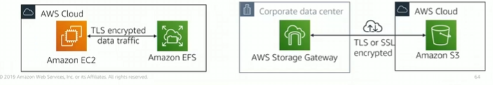

# Module 4: Securing data on AWS

Favorite: No
Archive: No
Notebook: AWS Cloud (../../AWS%20Cloud%2035b6c6880dca809b964ce3b71f757313.md)
Edited: May 10, 2026 6:59 PM
Created: May 10, 2026 6:41 PM

## Encryption of data at rest

- Encryption encodes data with a secret key, which makes it unreadable
  - Only those who have the secret key can decode the data
  - AWS KMS can manage your secret keys
- AWS supports encryption of data at rest
  - Data at rest = Data stored physically (on disk or on tape)
  - You can encrypt data stored in any service that is supported by AWS KMS, including:
    - Amazon S3
    - Amazon EBS
    - Amazon Elastic File System (Amazon EFS)
    - Amazon RDS managed databases

## Encryption of data in transit

- Encryption of data in transit (data moving across a network)
  - Transport Layer Security (TLS) - formerly SSL - is an open standard protocol
  - AWS Certificate Manager provides a way to manage, deploy, and renew TLS or SSL certificates
- Secure HTTP (HTTPS) creates a secure tunnel
  - Uses TLS or SSL for the bidirectional exchange of data
- AWS services support data in trasit encryption.
- Example:

## Securing Amazon S3 buckets and objects

- Newly created S3 buckets and objects are private and protected by default.
- When use cases require sharing data objects on Amazon S3 -
  - It is essential to manage and control data access.
  - Follow the permission that follow the principle of least privilege and consider using Amazon S3 encryption.

#### Tools and options for controlling access to S3 data include -

- Amazon S3 Block Public Access feature: Simple to use.
- IAM Policies: A good option when the user can authenticate using IAM.
- Bucket policies
- Access Control Lists (ACLs) A legacy access control mechanism.
- AWS Trusted Advisor bucket permission check: Free feature.
