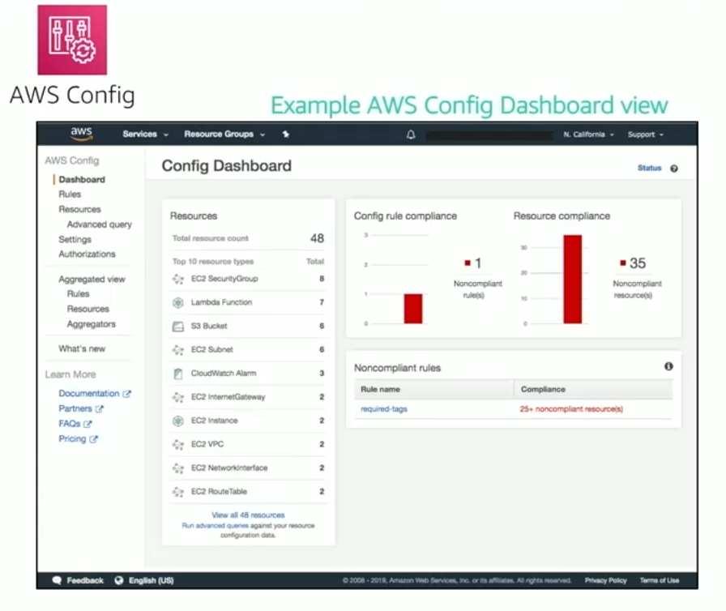

# Module 4: Working to ensure Compliance

Favorite: No
Archive: No
Notebook: AWS Cloud (../../AWS%20Cloud%2035b6c6880dca809b964ce3b71f757313.md)
Edited: May 10, 2026 7:11 PM
Created: May 10, 2026 7:01 PM

## AWS Compliance Programs

- Customers are subject to many different security and compliance regulations and requirements.
- AWS engages with certifying bodies and independent auditors to provide customers with detailed information about the policies, processes, and controls that are established and operated by AWS.
- Compliance Programs can be broadly categorized -
  - Certifications and attestations
    - Asessed by a third-party, independent auditor
    - Examples: ISO 27001, 27017, 17018, ISO/IEC 9001
  - Laws, regulations and privacy
    - AWS provides security features and legal agreements to support compliance
    - Example: EU General Data Protection Regulation (GDPR), HIPPA
  - Alignments and frameworks
    - Industry- or function-specific security or compliance requirements
    - Examples: Center for Internet Security (CIS), EU-US Privacy Shield certified

## AWS Config

- Assess, audit, and evaluate the configurations of AWS resources.
- Use for continuous monitoring of configurations.
- Automatically evaluate recorded configurations versus desired configurations.
- Review configuration changes.
- View detailed configuration histories.
- Simplify compliance auditing and security analysis.

## AWS Artifact

- Resource for compliance-related information
- Provide access to security and compliance reports, and select online agreements
- Can access example downloads:
  - AWS ISO certifications
  - Payment Card Industry (PCI) and Service Organization Control (SOC) reports
- Access AWS Artifact directly from the AWS Management Console
  - Under Security, Identify & Compliance, select Artifact
