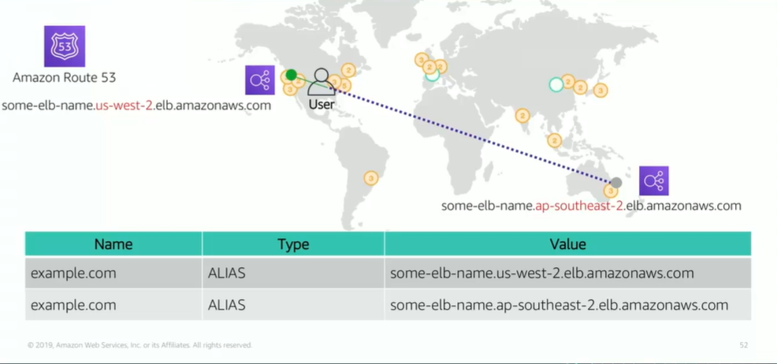

# Module 5: Amazon Route 53

Favorite: No
Archive: No
Notebook: AWS Cloud (../../AWS%20Cloud%2035b6c6880dca809b964ce3b71f757313.md)
Edited: May 20, 2026 3:24 PM
Created: May 20, 2026 3:07 PM

## Amazon Route 53

- Is a highly available and scalable Domain Name System (DNS) web service.
- Is used to route end users to internet applications by translating names (like www.amazon.com) into numeric IP addresses (like 192.0.2.1) that computers use to connect to each other.
- Is fully compliant with IPv4 and IPv6.
- Connects user requests to infrastructure running in AWS and also outside of AWS.
- Is used to check the health of resources.
- Features traffic flow.
- Enables you to register domain names.

## Route 53 Supported Routing

- **Simple routing** - Use in single-server environments.
- **Weighted routing** - Assign weights to resource record sets to specify the frequency.
- **Latency routing** - Help improve global applications.
- **Geolocation routing** - Route traffic based on location of your users.
- **Geoproximity routing** - Route traffic based on location of your resources.
- **Failover routing** - Fail over to a backup site if your primary site becomes unreachable. This requires a health check to be configured.
- **Multivalue answer routing** - Respond to DNS queries with up to eighty healthy records selected at random.

## Use case: Multi-region Deployment

- With Amazon Route 53, the user is automatically directed to the Elastic Load Balancing that is closest to the user.
- Multi-region deployment of Route 53 enables latency-based routing to the Region and load balancing routing to the next availability zone.

## Route 53 DNS Failover

- Enables to improve availability of application that runs on AWS by configuring a backup and failover scenarios for applications.
- It also enables highly available multi-Region architectures in AWS and it requires a health check in order to monitor the health and performance of web applications, web servers, and other resources.
- Each health check created can monitor the health of a specified resource such as a web server, the status of other health checks, and the status of an Amazon CloudWatch alarm.

## DNS failover for a multi-tiered web application

- Route 53 passes traffic to load balancer, which then distributes the traffic to fleet of EC2 instances.
- To ensure high availability, you can create 2 DNS records for the host www with a routing policy of failover.
- The first record is called the primary and it points to the load balancer for your web app.
- The second record is the secondary and it points to a static web page hosted in a specific Amazon S3 bucket.
- That bucket is configured as a website.
- Route 53 health checks make sure that the primary site is available. If the health check fails, a static splash page will be distributed.
- The static page alerts customers that you are restoring the service.

