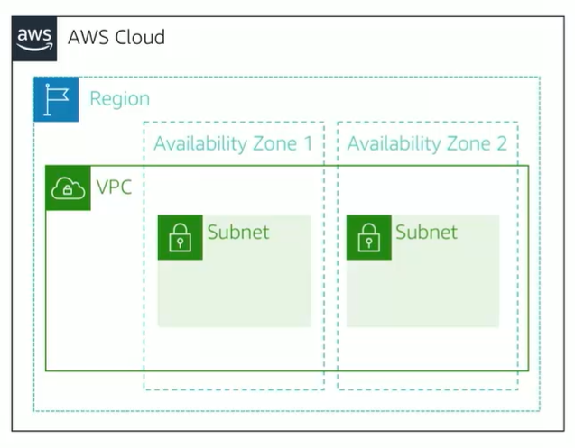

# Module 5: Amazon VPC

Favorite: No
Archive: No
Notebook: AWS Cloud (../../AWS%20Cloud%2035b6c6880dca809b964ce3b71f757313.md)
Edited: May 11, 2026 9:59 AM
Created: May 11, 2026 9:37 AM

## Amazon VPC

- Enables provisioning a logically isolated section of the AWS Cloud where you can launch AWS resources in a virtual network that you define
- Gives control over virtual networking resources, including:
  - Selection of IP address range
  - Creation of subnets
  - Configuration of route tables and network gateways
- Enables customization of network configuration for VPC
- Enables use of multiple layers of security

## VPCs and Subnets

- VPCs:
  - Logically isolated from other VPCs
  - Dedicated to your AWS account
  - Belong to a single AWS Region and can span multiple availability Zones
- Subnets:
  - Range of IP addresses that divide a VPC
  - Belong to a single Availability Zone
  - Classified as Public or Private
  - Private subnets do not have direct access to the internet

## IP Addressing

- When creating a VPC, you assign it to an IPv4 CIDR block (range of private IPv4 addresses).
- You cannot change the address range after creating the VPC.
- The largest IPv4 CIDR block is /16.
- The smallest IPv4 CIDR block is /28.
- IPv6 is also supported (with different block size limit).
- CIDR blocks of subnets cannot overlap.

## Reserved IP Addresses

- Example: A VPC with an IPv4 CIDR block of 10.0.0.0/16 has 65,536 total IP addresses. The VPC has four equal-sized subnets. Only 251 IP addresses are available for use by each subnet.

| IP addresses for CIDR block 10.0.0.0/24 | Reserved for                        |
| --------------------------------------- | ----------------------------------- |
| 10.0.0.0                                | Network address                     |
| 10.0.0.1                                | Internal communication              |
| 10.0.0.2                                | Domain Name System (DNS) resolution |
| 10.0.0.3                                | Future use                          |
| 10.0.0.255                              | Network broadcast address           |

## Public IP address types

#### Public IPv4 address

- Manually assigned through an elastic IP address
- Automatically assigned through the auto-assign public IP address at the subnet level

#### Elastic IP address

- Associated with an AWS account
- Can be allocated and remapped anytime
- Additional costs might apply

## Elastic Network Interface

- An elastic network interface is a virtual network interface that you can:
  - Attach to an instance.
  - Detach from the instance, and attach to another instance to redirect network traffic.
- Its attributes follow when it is reattached to a new instance.
- Each instance in the VPC has a default network interface that is assigned a private IPv4 address from the IPv4 address range of the VPC.

## Route tables and Routes

- A route table contains a set of rules (or routes) that is configured to direct network traffic from your subnet.
- Each route specifies a destination and a target.
- By default, every route table contains a local route for communication within the VPC.
- Each subnet must be associated with a route table (at most one).
