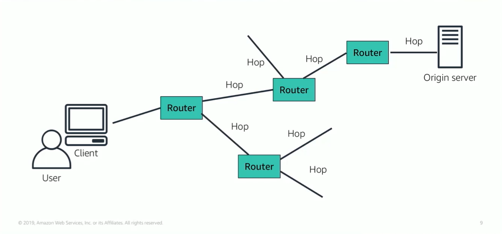

# Module 5: CloudFront

Favorite: No
Archive: No
Notebook: AWS Cloud (../../AWS%20Cloud%2035b6c6880dca809b964ce3b71f757313.md)
Edited: May 20, 2026 3:35 PM
Created: May 20, 2026 3:24 PM

## Content Delivery and Network Latency

- One of the challenges of network communication is **network performance**.
- The origin server stores the original version of the data, so high-dense data like images, songs, videos.
- The distance between the customer and the original data server significantly affects playback and UX.
- Network latency also differs depending on geographic location of users.
- Because of this, CDN is an essential part of smooth UX.

## Amazon CloudFront

- Fast, global, and secure CDN service that securely delivers data to customers at high transfer speeds. It also provides a developer friendly environment.
- CloudFront delivers files to users over a global network of edge locations. It is different from traditional content delivery solutions because you can take advantage of high-performance content delivery without negotiated contracts, high prices or minimum fees.
- It is a self-service offering with pay-as-you-go pricing

## Amazon CloudFront Infrastructure

- Amazon CloudFront relies on Route 53’s geolocation routing.
- A customer makes a request, Route 53 finds out where the customer is location in the world, and it responds with the IP address of the edge location closest to that customer. CloudFront then obtains the data from where it normally lives and copies it to edge location. Then the customer’s UX begins.
- As data becomes stale, it is removed from the cache at the edge location in order to make room for new content.
- You can define the expiration of data in the cache using a TTL number. This defines amount of time in which the data cache will remain valid.

