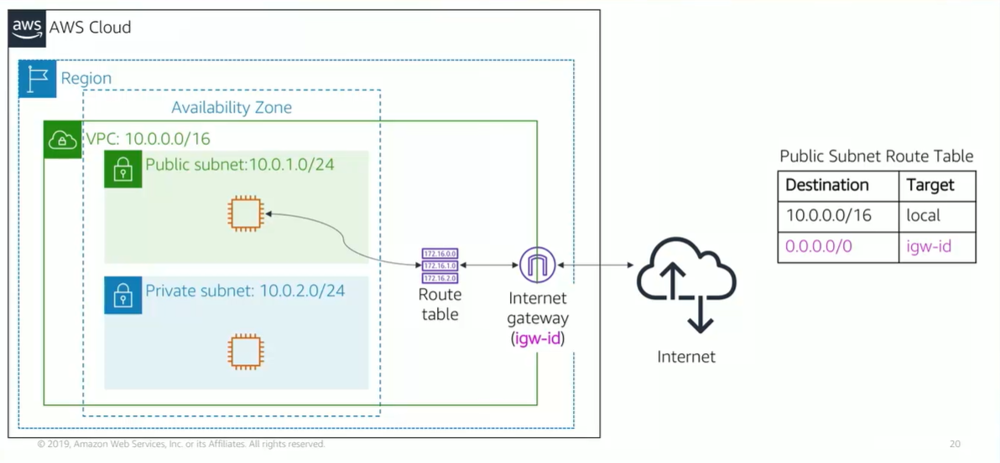

# Module 5: VPC Networking

Favorite: No
Archive: No
Notebook: AWS Cloud (../../AWS%20Cloud%2035b6c6880dca809b964ce3b71f757313.md)
Edited: May 19, 2026 9:50 PM
Created: May 17, 2026 1:07 AM

## Internet Gateway

- An Internet Gateway is a scalable, redundant, and highly available VPC component that allows communication between instances in VPC and public internet.
- Two Purposes:
  - Provide target in VPC route tables for internet traffic.
  - Perform network address translation for instances assigned public IPv4 addresses.
- To make a subnet public, it should be attached to an internet gateway to the VPC and a route entry to route table associated with the subnet.

## Network Address Translation (NAT)

- NAT gateway enables instances in a private subnet to connect to internet or other AWS services, but prevents public internet from initiating a connection with those instances.
- To create a NAT, the public subnet must be specified in which NAT gateway should live.
- An elastic IP must also be specified to associate with the NAT gateway when creating it.
- After creating NAT gateway, the route table should be updated that is associated with one or more of private subnets to point internet-bound traffic to the NAT gateway.
- This allows instances in private subnets to communicate with the internet.
- A NAT instance can also be used in a public subnet in the VPC instead of NAT gateway.
- A NAT gateway is better than NAT instance because NAT gateway is a managed service that provides better availability, higher bandwidth, and less admin effort.

## VPC Sharing

- VPC Sharing enables customers to share subnets with other AWS accounts in the same organization.
- VPC sharing enables multiple AWS accounts to create their application resources (Amazon EC2, Amazon RDS, Amazon RedShift Clusters, AWS Lambda functions) into a shared, centrally managed VPC.
- In this model the account that owns the VPC, shares one or more subnets with other accounts called participants that belong to the same organization.
- After a subnet is shared, participants can view, create, modify, and delete their app resources in the subnets that are shared with them.

## VPC Peering

- VPC Peering connection enables private routing of traffic between two VPCs.
- Instances in either VPC can communicate with each other as if they were on same network.
- VPC Peering connection can be created with a VPC in another AWS account, or a different AWS region.
- When VPC peering connection is set up, you create rules in route table to allow VPCs to communicate with each other through the peering resource.

## VPC Site-to-Site VPN

- Instances launched in a VPC cannot communicate with own remote network.
- Access can be enabled from VPC by attaching a virtual private gateway to the VPC, creating a custom route table, updating security group rules, creating AWS Site-to-Site VPN, and configuring routing to pass through traffic to the connection.

## AWS Direct Connect

- Enables establishing a dedicated private connection between your network and one of the direct connect locations.
- This private connection can increase bandwidth, throughput, and provide more consistent network experience than internet-based connections or VPN.
- Uses open standard 802.1q VLANs

## VPC Endpoints

- A virtual device that enables private connection of VPC to the supported AWS services.
- A VPC gateway endpoint is a gateway that you specify as a target for a route in your route table, for traffic destined to Amazon S3 or Amazon DynamoDB.
- Traffic between VPC and the services does not leave the Amazon network.
- AWS PrivateLink simplifies security of data shared with cloud-based apps by eliminating exposure of data to public internet.
- AWS PrivateLink provides private connectivity between VPCs, AWS Services, and on-premises apps.
- AWS PrivateLink makes it easy to connect services across different accounts and VPCs to simplify network architecture.

## AWS Transit Gateway

- A network transit hub used to interconnect VPCs.
- On-premises network can also be connected.
- A VPC can be attached, AWS Direct Connect gateways, or VPN connections to a transit gateway.
- The topology becomes a hub-and-spoke, which reduces number of connections required, complexity to implement, and be able to maintain it.

