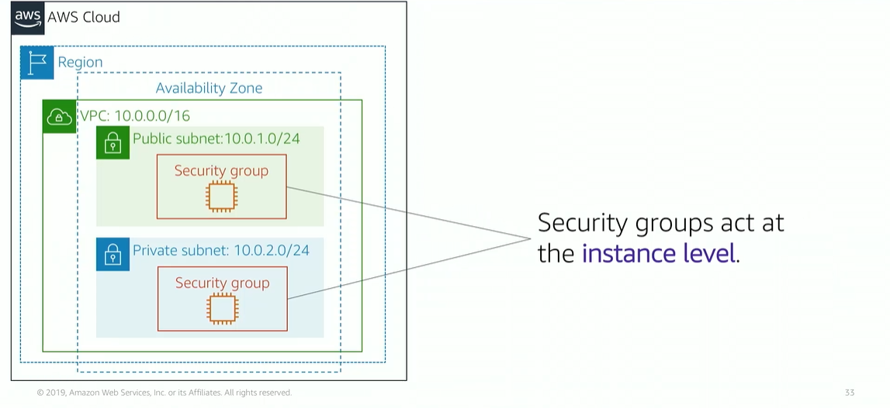

# Module 5: VPC Security

Favorite: No
Archive: No
Notebook: AWS Cloud (../../AWS%20Cloud%2035b6c6880dca809b964ce3b71f757313.md)
Edited: May 20, 2026 3:06 PM
Created: May 19, 2026 9:52 PM

## Security Groups

- Acts as a virtual firewall that controls inbound and outbound traffic, to and from your instance.
- Security groups act at the instance level, particularly at the NIC (Network Interface Card).
- Each instance can be assigned to VPC to a different set of security groups.

- Security groups are the equivalent of firewalls for EC2 instances.
- They contain rules to allow inbound traffic.
- By default, security groups are sealed shut, the type of traffic to be allowed must be defined.
- Security groups are stateful, and only concern with defining the inbound traffic rules, the outbound is always allowed.

## Network Access Control List (ACLs)

- Work at subnet level, and control traffic in and out of subnet.
- Network ACL can be configured with rules to allow or deny.
- Ports and protocols can also be specified.
  

## Network ACL

- Each subnet in the VPC must be associated with a network ACL.
- If not, the default network ACL is used.
- A network can be associated with multiple subnets, however a subnet can only be associated with one network ACL.
- A network ACL and subnet is 1:1 relationship.
- Network ACL is stateless, and has separate inbound and outbound rules that need configuration.

## Security Groups vs. Network ACLs

