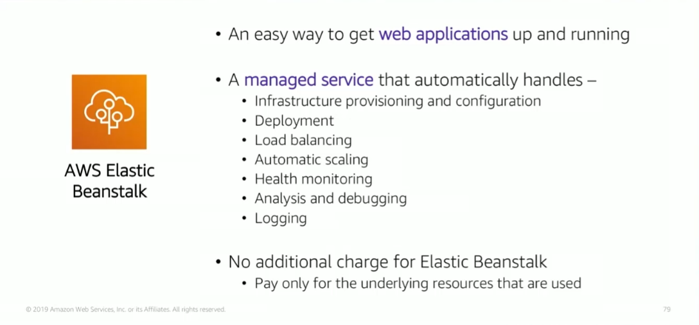

# Module 6: AWS Elastic Beanstalk

Favorite: No
Archive: No
Notebook: AWS Cloud (../../AWS%20Cloud%2035b6c6880dca809b964ce3b71f757313.md)
Edited: May 21, 2026 11:05 PM
Created: May 21, 2026 10:56 PM

## AWS Elastic Beanstalk

- AWS Elastic Beanstalk is another AWS compute service option.
- You upload your code and Elastic Beanstalk automatically handles the deployment, from capacity provisioning to load balancing, to automatic scaling and monitoring and application health.
- In AWS Elastic Beanstalk, you retain full control over the AWS resources that power your app, and you can choose to access underlying resources at any time.
- There is no additional charge for AWS Elastic Beanstalk. You only pay for the AWS resources, like EC2 or S3 buckets, that you create and store and run your app on.
- You only pay for what you use, as you use it.

## AWS Elastic Beanstalk Deployments

- You can deploy code through AWS Management Console, AWS CLI, Visual Studio, or Eclipse IDE.
- Elastic Beanstalk provides all the app services that you need for the app, you must only create the code.

## Benefits of Elastic Beanstalk

