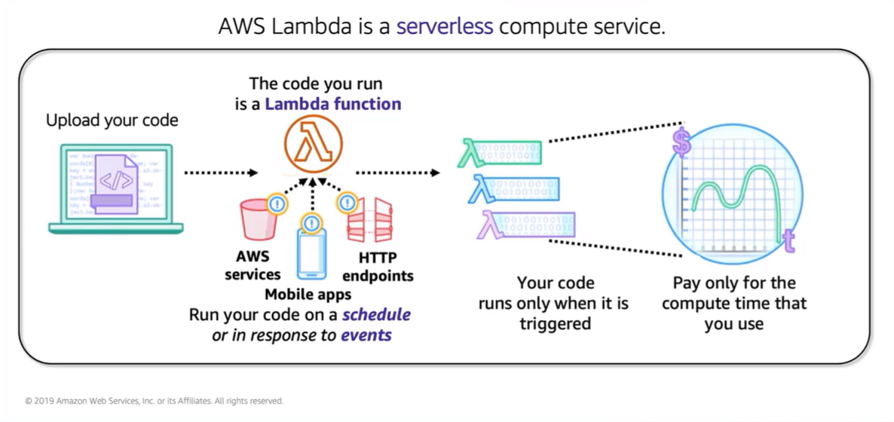

# Module 6: AWS Lambda

Favorite: No
Archive: No
Notebook: AWS Cloud (../../AWS%20Cloud%2035b6c6880dca809b964ce3b71f757313.md)
Edited: May 21, 2026 4:55 PM
Created: May 21, 2026 4:20 PM

## AWS Lambda: Run code without servers

- Amazon AWS and EKS offer container-based compute services, however the other approach to compute that does not require provisioning or managing servers is serverless computing through AWS Lambda.

## Benefits of Lambda

- Lambda supports multiple programming languages like Java, Go, PowerShell, Node.js C#, Python and Ruby.
- Completely automated administration manages all infrastructure to run your code on highly-available fault tolerant infrastructure.

## AWS Lambda Event Sources

- Lambda functions are triggered by event sources.
- An event source can be an AWS service or developer-created app that produces events that trigger the AWS Lambda function to run.
- Some services like Amazon S3 and CloudWatch publish events to Lambda by invoking the Lambda function directly.
- Other services are polled by Lambda.
- Example: Lambda can pull records from an Amazon Simple Queue Service and Lambda can read events from the Amazon DynamoDB database service.
- Some services like Elastic Load Balancing and Amazon API Gateway can invoke your Lambda function directly.
- Functions can also be invoked directly from Lambda console or via API, SDK, or AWS CLI.
- Direct invocation can be useful, example, when developing a mobile app and want the app to call Lambda functions.
- AWS Lambda also automatically monitors functions by using Amazon CloudWatch to assist you to troubleshoot failures in a function.
- Lambda logs all requests handled by your function.

## AWS Lambda function configuration

- When using the AWS Management Console to create a Lambda function, you first give a function a name, then specify the runtime environment the function will use.
- You also specify an execution role to grant IAM permission to the function so that it can interact with other AWS services as necessary.
- Next is configuring the function, like adding a trigger. You specify one of the available event sources.
- Add function code, either by you or provided code editor or uploading a file that contains the code.
- Specify memory in MBs to allocate to the function.
- Optionally, specify environment variables such as timeout, the specific VPC to run the function in, and other settings.
- All the settings mentioned end up in a Lambda deployment package which is zip archive that contains function code and dependencies.
- When using the Lambda console to author your function, the console manages the package for you. However, if you use the Lambda API to manage functions, you need to create a deployment package yourself.

## Schedule-based Lambda function example: Start and Stop EC2 instances

- Say this is a situation where you want to reduce Amazon EC2 usage. You decide that you want to stop instances at a predefined time.
- Example: At night when no one is using them, and then you want to start the instances back in the morning before workday starts.
- In this situation, you could configure AWS Lambda and Amazon CloudWatch Events to accomplish these actions automatically.

## Event-based Lambda function example: Create thumbnail images

- Suppose you want to create a thumbnail for an image that is uploaded to an S3 bucket.
- To build a solution, you create a Lambda function that Amazon S3 invokes when objects are uploaded. The Lambda function reads the image object from the source bucket and creates a thumbnail image in a target bucket

## AWS Lambda quotas

- Lambda limits the amount of compute and storage resources you can use to run and store functions.
- Lambda also limits you to 1000 concurrent invocations in a Region.
- Lambda functions can be configured to run up to 15 minutes at a time.
- You can set a timeout to any value between 1 second and 15 minutes.
- There is 250 MB limit on the deployment package size of a Lambda function.
- A layer is a zip archive that contains libraries or other dependencies. With layers, you can use libraries in your function without needing to include them in your deployment package.
- Limits are either soft or hard. Soft limits can be requested to be lifted, while hard limits are fixed.

