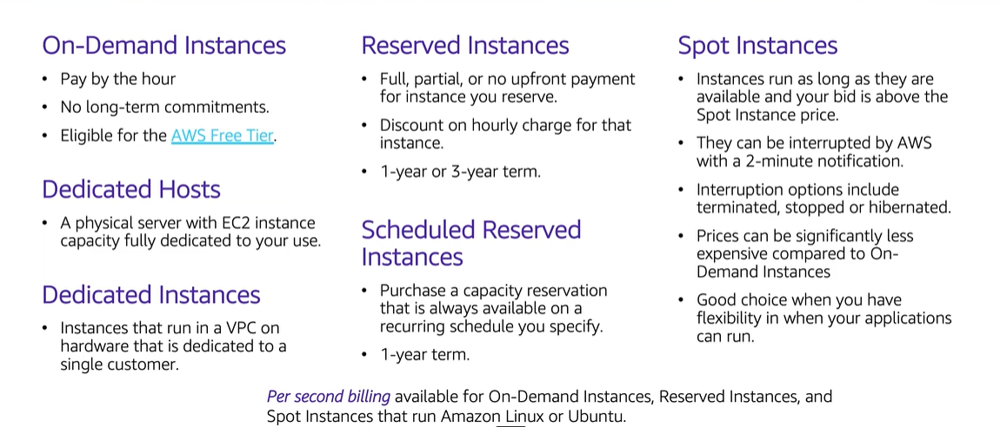

# Module 6: Amazon EC2 Cost Optimization

Favorite: No
Archive: No
Notebook: AWS Cloud (../../AWS%20Cloud%2035b6c6880dca809b964ce3b71f757313.md)
Edited: May 21, 2026 3:37 PM
Created: May 21, 2026 3:19 PM

## Amazon EC2 Pricing Models

## Amazon EC2 Pricing Models: Benefits

## Amazon EC2 Pricing Models: Use Cases

## 4 Pillars of Cost Optimization

### Pillar 1: Right Size

### Pillar 2: Increase Elasticity

### Pillar 3: Optimal Pricing Model

### Pillar 4: Optimize Storage Choices

## Measure, Monitor, and Improve

