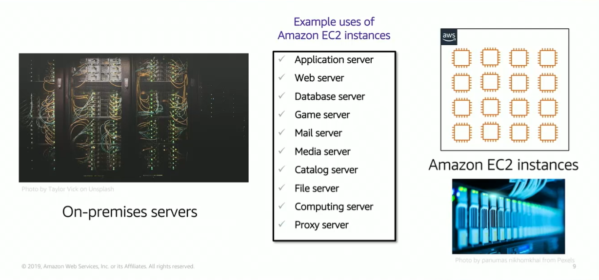

# Module 6: Amazon EC2

Favorite: No
Archive: No
Notebook: AWS Cloud (../../AWS%20Cloud%2035b6c6880dca809b964ce3b71f757313.md)
Edited: May 21, 2026 2:37 PM
Created: May 21, 2026 9:38 AM

## Amazon Elastic Compute Cloud (EC2)

- Amazon EC2 provides virtual machines where you can host the same applications you run on premises servers.
- It provides secure, resizable compute capacity in the cloud.
- Common uses for EC2 instances include application servers, web servers, database servers, etc.

## Amazon EC2 Overview

- Amazon EC2 provides virtual machines or VMs, in the cloud, these VMs are referred to as EC2 instances.
- You have full administration control over the Windows or Linux OS that runs on these instances.
- Most server OS are supported, including recent versions of Windows, RedHat, SUSE, Ubuntu and Amazon Linux.
- With Amazon EC2, you can launch any number of instances of any size into any Availability Zone, pretty much anywhere in the entire world in minutes.
- Instances launch from Amazon Machine Images (AMI), which are effectively virtual machine templates.
- You can control traffic to and from these instances by using security groups.

## Launching an Amazon EC2 Instance

- The launch instance wizard simplifies the EC2 instance creation process.
- For most deployments, the settings should be modified so the servers you launch are deployed in a way that matches your specific application needs.

## Key Decisions when Launching EC2 Instance

## 1. Creating an AMI: Example

- You can create a quick instance from a starter AMI such as a Quick Start, or you can create an instance from a VM that you imported from your on-premises data center that you turned into an AMI.
- Regardless of which AMI you launch the instance from, you can then connect to the instance, which is labelled unmodified instance in the diagram here, and make some modifications to it.
- Example: You can run a script to update the OS with security patches, or install software on it. The result of this is you get a modified instance.
- You can then capture the modified instance as a new AMI. When you create an AMI, Amazon EC2 stops the instance, creates a snapshot of the root volume, and registers the snapshot as an AMI.
- After an AMI is registered, the AMI can be used to launch new instances in the same AWS region.
- The new AMI can now be thought of as a starter AMI.
- You might also want to copy the AMI to other regions, so that EC2 instances can also be launched to those locations as well.

## 2. Selecting an Instance Type

- After choosing the AMI for launching the instance, you must next choose the instance type.
- AWS EC2 provides a selection of instance types optimized for different use cases.
- Instance types reflect combinations of CPU, Memory, Storage, and Networking capacity.
- The different instance types give you flexibility to choose the most appropriate mix of resources, such as memory, processing power, disk type, and network performance capabilities as they’re needed for your apps.
- **Instance type categories** include general purpose, compute optimized, memory optimized, storage optimized, and accelerated computing instances.

## EC2 Instance Type naming and sizes

- Instance type names consist of several parts.
- Example: t3.large.
- T is the family which is then followed by a number. The number is known as the generation number of that instance type. So t3 instance is the 3rd generation of the T family.
- In general instance types that are of higher generation are more powerful and provide better value for the price.
- The next part of the name indicates the size of the instance.

## Select Instance Type: Based on use case

- As seen below, t3 instances are general purpose, that provide a baseline of CPU performance with the ability to burst above the baseline.
- Use cases for these types of instance include web applications, dev environments, code repos, microservices, test and staging environments, etc.
- C5 instances are optimized for compute intensive workloads, and deliver high performance at low price per compute ratio.
- Use cases include scientific modelling, batch processing, ad serving, highly scalable multiplayer games, and video encoding.
- R5 instances are optimized for memory intensive apps.
- Use cases include high performance databases, data mining and data analysis, in memory databases, real-time processes of unstructured big data, Apache Spark clusters, and other enterprise apps.

## Instance types: Networking Features

## 3. Network Settings

- You must specify the network location where the EC2 instance will be deployed.
- The choice of Region must be made before you start the Launch Instance Wizard.
- Verify that you are in the correct Region within the Amazon EC2 Console before launching instance.
- Within the region, you can specify to place the instance into any existing subnet, into any existing VPC.
- The wizard also provides a link to create a new VPC or to create a new subnet if wanted.
- In the example below, the user has indicated that the instance should be deployed into a specific subnet inside a specific VPC.
- If you don’t specify a VPC when launching an instance, the instance will be placed in the default VPC.
- When an instance is launched in the default VPC, AWS will assign it a public IP address by default.
- When launching an instance into a non-default VPC, the subnet has an attribute that determines if instances launched into it will receive a public IP. This setting can be override when launching the instances as well.

## 4. Attach IAM role (Optional)

- AWS allows you to create and attach an IAM role to the EC2 instance.
- Without this feature, you might be tempted to place AWS credentials on EC2 instances so an application can use them to call another AWS service.
- But you should never store credentials on an EC2 instance because it’s not secure.
- Instead, attach an IAM role to the EC2 instance.
- An instance profile is a container for an IAM role.

## 5. User data script (Optional)

- When creating an instance, you have the option of passing user data to the instance.
- User data can automate the completion of installations and configurations at instance launch.
- When the EC2 instance is created, the user data script will run during the final phase of the boot process. By default, user data only runs the first time that an instance starts up.

## 6. Specify Storage

- When launching an EC2 instance, you can configure storage options.
- Example: You can configure the size of the root volume where the guest OS like Windows or Linux is installed.
- You can also attach additional storage volumes when you launch the instance, some AMI are configured to launch more than one storage volume by default to provide storage options that are separate from the root volume.
- For each volume that your instance will have, you can specify the size of the volumes, volume type, and whether storage will be retained if the instance is terminated.
- You can also specify if encryption should be used or not.

## Amazon EC2 Storage Options

### Example storage options

## 7. Tags

- A tag is a label that you assign to an AWS resource, such as an EC2 instance.
  - Each tag will consist of a key and an optional value, both defined by the user.
- Tags enable you to categorize AWS resources in different ways.
- Example: You might tag instances by purpose, owner, or environment.
- Tagging is how you can attach metadata to an EC2 instance.
- A commonly used tag for EC2 instances is a tag key called Name and a tag value that describes the instance like WebServer1.
- The name tag is exposed by default in the Amazon Console instances page.
- Using a consistent set of tag keys makes it easier for you to manage resources.

## 8. Security Group

- A security group acts as a virtual firewall that controls network traffic for one or more instances.
- When you launch an instance you can specify one or more security groups, otherwise the default security group is used.
- When traffic attempts to reach an instance, all the rules from security groups that are associated with instance are evaluated.
- When defining a rule, you can specify the allowable source of the network communication for inbound rules or destination for outbound rules.
- By default a security group includes an outbound rule that allows all outbound traffic.
- The inbound traffic rules below allow SSH traffic over TCP in port 22 if the source of request is the specified My IP.

## 9. Identify or create the key pair

- When creating an EC2 instance, you can choose an existing key pair, proceed without a keypair, or create a new keypair.
- If you create a new keypair, download it and save it somewhere safe, because it can be only downloaded once upon creation.
- You can login to the EC2 instance’s Windows Desktop, you must use the private key to get the admin password and then access using Remote Desktop Protocol (RDP).
- To establish an SSH connection from a Windows machine to an Amazon EC2 instance. You can use a tool such as PuTTY which requires the same private key.
- For Linux, by using SSH, you must provide the private key when establishing connection.

## Alternative: Launch EC2 instance with AWS CLI

- You can also launch EC2 instances programmatically either by using AWS CLI or through AWS SDKs.
- The example below shows, it uses the AWS CLI that specifies minimal information that is needed to launch an instance.
- The command will create the instance if it is properly formatted, the resources the command needs exist, you have permissions to run command, and you have sufficient capacity in the AWS account.
- If successful, the API responds with the instance ID and other relevant data for the app to use in subsequent API requests.

## Amazon EC2 Instance Lifecycle

## Consider using an Elastic IP Address

## EC2 Instance Metadata

## Amazon CloudWatch for monitoring

