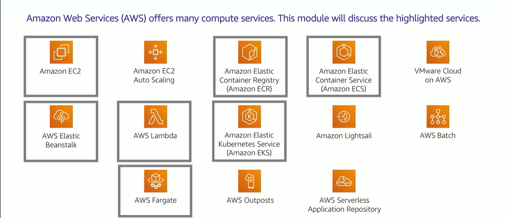

# Module 6: Compute Services

Favorite: No
Archive: No
Notebook: AWS Cloud (../../AWS%20Cloud%2035b6c6880dca809b964ce3b71f757313.md)
Edited: May 21, 2026 9:38 AM
Created: May 21, 2026 9:14 AM

## Computer Services

- Amazon Elastic Compute Cloud, Amazon EC2 provides resizable virtual machines.
- Amazon EC2 Auto Scaling supports application availability by allowing you to define conditions that will automatically launch or terminate EC2 instances.
- Amazon Elastic Container Registry (Amazon ECR) is used to store and retrieve docker images.
- Amazon Elastic Container Service (Amazon ECS) is a container orchestration service that supports Docker.
- VMware cloud on AWS enables you to provision a hybrid cloud without custom hardware.
- AWS Elastic Beanstalk provides a simple way to run and manage web applications.
- AWS Lambda is a serverless compute solution, you pay only for the compute time that you use.
- Amazon Elastic Kubernetes Service (Amazon EKS) enables you to run managed Kubernetes on AWS.
- Amazon Lightsail provides a simple-to-use service for building an application or a website.
- AWS Batch provides a tool for running batch jobs at any scale.
- AWS Fargate provides a way to run containers that reduce the need for you to manage servers or clusters.
- AWS Outpost provides a way to run select AWS services in your on-premises datacenter.
- AWS Serverless Application Repository provides a way to discover, deploy, and publish serverless applications.

## Categorizing Compute Services

## Choosing Optimal Compute Services

- The optimal compute service or services that you use will depend on your use case
- Some aspects to consider -
  - What is your application design?
  - What are your usage patterns?
  - Which configuration settings will you want to manage?
- Selecting the wrong compute solution for an architecture can lead to lower performance efficiency
  - A good starting place - Understand the available compute options
