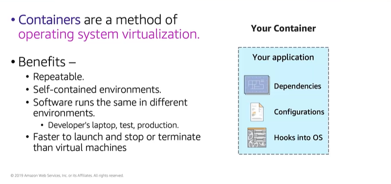

# Module 6: Container Services

Favorite: No
Archive: No
Notebook: AWS Cloud (../../AWS%20Cloud%2035b6c6880dca809b964ce3b71f757313.md)
Edited: May 21, 2026 4:19 PM
Created: May 21, 2026 3:39 PM

## Container Basics

- Containers are smaller than VMs and don’t contain an entire OS.
- Containers share a virtualized OS and run as resource isolated processes.
- Containers deliver environmental consistency because the app’s code, configurations, and dependencies are packaged into self-contained environments.
- They ensure apps deploy quickly, reliably and consistently, regardless of deployment environment.
- In terms of space, container images are usually an order of magnitude smaller than VMs.
- Spinning up a container happens in 100ms resulting in faster launch times than traditional VMs.

## Docker

- Docker packages software such as apps into containers.
- Docker is installed on each server that will host containers and it provides simple commands that you can use to build, start, or stop containers.
- Containers are created from templates called Docker images, they have everything that an app that you want to run needs, including libraries, system tools, and app’s code, as well as runtime libraries.

## Containers vs. Virtual Machines

- Usually people think containers are exactly like Virtual Machines, but there are key differences.
- One significant difference is that VMs run directly on a hypervisor, while containers run on any OS if they have appropriate kernel features to support Docker host software, and Docker daemon is present.

- The right side of the diagram shows a VM-based deployment. Each of three EC2 instances runs directly on the hypervisor that is provided by the AWS global infrastructure.
- Each EC2 instance is a VM, in this VM-based deployment, each of three apps runs on its own VM and each VM provides process isolation.

- The left side of the diagram shows a container-based deployment. Only one EC2 instance runs a VM.
- The Docker engine is installed on the Linux guest OS of the EC2 instance, and that there are three containers.
- In this container-based deployment each app runs its own container which provides process isolation, but all containers run on a single EC2 instance.
- The Docker engine is present to manage how the containers interact with the Linux guest OS, and it also provides central management functions throughout the container lifecycle.

- In an actual container-based deployment, a large EC2 instance could run hundreds of containers.

## Amazon Elastic Container Service (Amazon ECS)

## Amazon ECS Orchestrates Containers

- To prepare your app, you create a task definition, which is considered a blueprint for your application.
- Task definitions specify details, such as which containers should be deployed to run the task.
- You specify the number of tasks that will run on your cluster and Amazon ECS task scheduler is responsible for placing tasks within your cluster.
- When Amazon ECS runs the container based on your task, it places them on an ECS cluster.
- When you choose the EC2 launch type, the cluster consists of a group of EC2 instances, each of which is running an Amazon ECS Container Agent.

- In the example below, the Amazon ECS task scheduler has received request to run a task that will require three instances of Container A, and two instances of Container B. Amazon ECS places these five containers on the EC2 instances and the ECS cluster.
- They’re distributed in a way that accounts for the CPU and memory capacity available on the cluster nodes.

## Amazon ECS Cluster Options

- You need to specify details about the EC2 instances that will make up your cluster. The same details you specify when launching a standalone EC2 instance.

## Kubernetes

- With Kubernetes, you can run any type of containerized app by using the same toolset in both-on premise and your data center, including the cloud.

## Amazon Elastic Kubernetes Service (Amazon EKS)

## Amazon Elastic Container Registry (Amazon ECR)

- One challenge of deploying apps on containers is keeping track of storing and managing all those containers; Amazon ECR addresses this challenge.
- When you specify the Amazon ECR repository in your task definition, Amazon ECS will retrieve the appropriate images for your apps.

