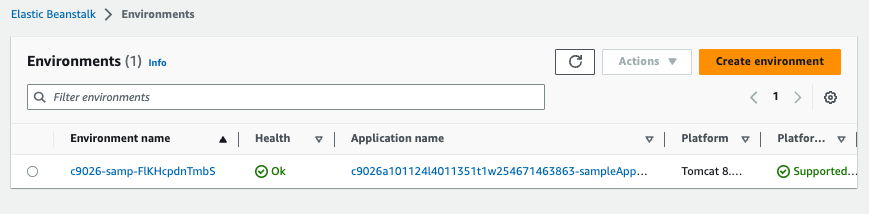
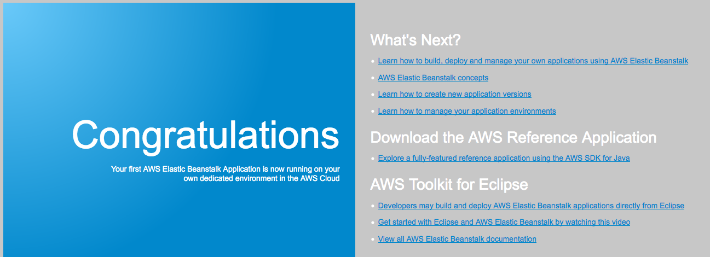

# Module 6: Lab - AWS Elastic Beanstalk

Favorite: No
Archive: No
Notebook: AWS Cloud (../../AWS%20Cloud%2035b6c6880dca809b964ce3b71f757313.md)
Edited: May 21, 2026 11:08 PM
Created: May 21, 2026 11:06 PM

# **Activity: AWS Elastic Beanstalk**

## **Lab overview**

This activity provides you with an Amazon Web Services (AWS) account where an AWS Elastic Beanstalk environment has been pre-created for you. You will deploy code to it and observe the AWS resources that make up the Elastic Beanstalk environment.

## **Duration**

This activity takes approximately **30 minutes** to complete.

## **AWS service restrictions**

In this lab environment, access to AWS services and service actions might be restricted to the ones that are needed to complete the lab instructions. You might encounter errors if you attempt to access other services or perform actions beyond the ones that are described in this lab.

## **Accessing the AWS Management Console**

1. At the top of these instructions, choose **Start Lab**.
   - The lab session starts.
   - A timer displays at the top of the page and shows the time remaining in the session.
     **Tip:** To refresh the session length at any time, choose **Start Lab** again before the timer reaches 0:00.
   - Before you continue, wait until the circle icon to the right of the AWS link in the upper-left corner turns green.
2. To connect to the AWS Management Console, choose the **AWS** link in the upper-left corner.
   - A new browser tab opens and connects you to the console.
     **Tip:** If a new browser tab does not open, a banner or icon is usually at the top of your browser with the message that your browser is preventing the site from opening pop-up windows. Choose the banner or icon, and then choose **Allow pop-ups**.
3. Arrange the AWS Management Console tab so that it displays along side these instructions. Ideally, you will be able to see both browser tabs at the same time, to make it easier to follow the lab steps.

## **Getting Credit for your work**

At the end of this lab you will be instructed to submit the lab to receive a score based on your progress.

**Tip:** The script that checks you works may only award points if you name resources and set configurations as specified. In particular, values in these instructions that appear in `This Format` should be entered exactly as documented (case-sensitive).

## **Task 1: Access the Elastic Beanstalk environment**

1. In the console, in the search box to the right of to **\*Services\*\***, search for and choose **\*Elastic Beanstalk\*\***.

   A page titled **Environments** should open, and it should show a table that lists the details for an existing Elastic Beanstalk application.

   **Note**: If the status in the **Health** column is not Ok, it has not finished starting yet. Wait a few moments, and it should change to Ok.

   

2. Under the **Environment name** column, choose the name of the environment.

   The **Dashboard** page for your Elastic Beanstalk environment opens.

3. Notice that the page shows that the health of your application is Ok.

   The Elastic Beanstalk environment is ready to host an application. However, it does not yet have running code.

4. Test access to the environment.
   - Near the top of the page, choose the Domain link (the URL ends in _elasticbeanstalk.com_).
     When you choose the URL, a new browser tab opens. However, you should see that it displays an **HTTP Status 404 - Not Found** message.
     _This behavior is expected_ because this application server doesn't have an application running on it yet.
   - Return to the Elastic Beanstalk console.
     In the next step, you will deploy code in your Elastic Beanstalk environment.

## **Task 2: Deploy a sample application to Elastic Beanstalk**

1. To download a sample application, choose this link:
   [https://docs.aws.amazon.com/elasticbeanstalk/latest/dg/samples/tomcat.zip](https://docs.aws.amazon.com/elasticbeanstalk/latest/dg/samples/tomcat.zip)
2. Back in the Elastic Beanstalk Dashboard, choose **Upload and Deploy**.
3. Choose **Choose File**, then navigate to and open the **tomcat.zip** file that you just downloaded.
4. Choose **Deploy**.

   It will take a minute or two for Elastic Beanstalk to update your environment and deploy the application.

5. After the deployment is complete, choose the Domain URL link (or, if you still have the browser tab that displayed the 404 status, refresh that page).

   The web application that you deployed displays.

   

   Congratulations, you have successfully deployed an application on Elastic Beanstalk!

6. Back in the Elastic Beanstalk console, choose **Configuration** in the left pane.

   Notice the details here.

   For example, in the **Instance traffic and scaling** panel, it indicates the EC2 Security groups, minimum and maximum instances, and instance type details of the Amazon Elastic Compute Cloud (Amazon EC2) instances that are hosting your web application.

7. In the **Networking, database, and tags** panel, no configuration details display, because the environment does not include a database.
8. In the **Networking, database, and tags** row, choose **Edit**.

   Note that you could easily enable a database to this environment if you wanted to: you only need to set a few basic configurations and choose **Apply**. (However, for the purposes of this activity, you do not need to add a database.)
   - Choose **Cancel** at the bottom of the screen.

9. In the left panel under _Environment_, choose **Monitoring**.

   Browse through the charts to see the kinds of information that are available to you.

## **Task 3: Explore the AWS resources that support your application**

1. In the console, in the search box to the right of to **\*Services\*\***, search for and choose **EC2**
2. Choose **Instances**.

   Note that two instances that support your web application are running (they both contain _samp_ in their names).

3. If you want to continue exploring the Amazon EC2 service resources that were created by Elastic Beanstalk, feel free to explore them. You will find:
   - A _security group_ with port 80 open
   - A _load balancer_ that both instances belong to
   - An _Auto Scaling group_ that runs from two to six instances, depending on the network load

   Though Elastic Beanstalk created these resources for you, you still have access to them.

## **Submitting your work**

1. To record your progress, choose **Submit** at the top of these instructions.
2. When prompted, choose **Yes**.

   After a couple of minutes, the grades panel appears and shows you how many points you earned for each task. If the results don't display after a couple of minutes, choose **Grades** at the top of these instructions.

   **Important:** Some of the checks made by the submission process in this lab will only give you credit if it has been at least 5 minutes since you completed the action. If you do not receive credit the first time you submit, you may need to wait a couple minutes and the submit again to receive credit for these items.

   **Tip:** You can submit your work multiple times. After you change your work, choose **Submit** again. Your last submission is recorded for this lab.

3. To find detailed feedback about your work, choose **Submission Report**.

   **Tip:** For any checks where you did not receive full points, there are sometimes helpful details provided in the submission report.

## **Activity complete**

Congratulations! You have completed the activity.

1. At the top of this page, choose End Lab and then to confirm that you want to end the activity, choose **Yes**.

   A panel appears, with a message that indicates: _DELETE has been initiated... You may close this message box now._

2. To close the panel, go to the top-right corner and choose the **X**.
