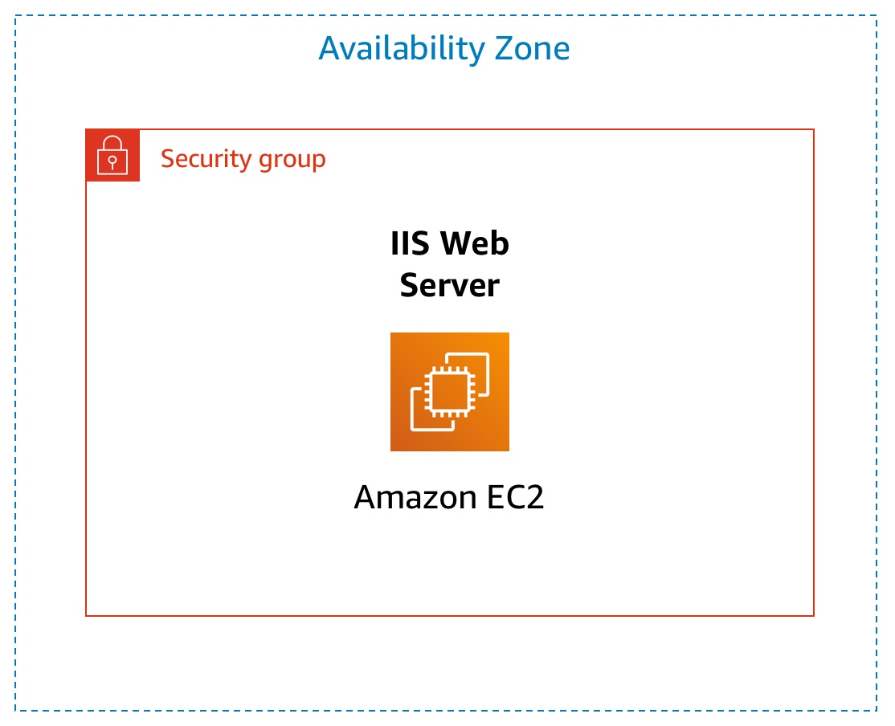
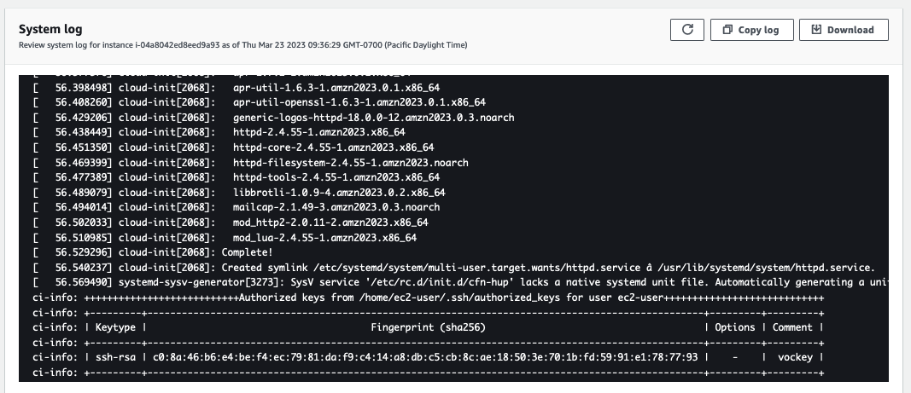
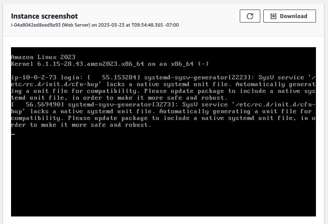

# Module 6: Lab 3 - Introduction to Amazon EC2

Favorite: No
Archive: No
Notebook: AWS Cloud (../../AWS%20Cloud%2035b6c6880dca809b964ce3b71f757313.md)
Edited: May 21, 2026 3:19 PM
Created: May 21, 2026 2:47 PM

# **Lab 3: Introduction to Amazon EC2**

## **Lab overview and objectives**



This lab provides you with a basic overview of launching, resizing, managing, and monitoring an Amazon EC2 instance.

**Amazon Elastic Compute Cloud (Amazon EC2)** is a web service that provides resizable compute capacity in the cloud. It is designed to make web-scale cloud computing easier for developers.

Amazon EC2's simple web service interface allows you to obtain and configure capacity with minimal friction. It provides you with complete control of your computing resources and lets you run on Amazon's proven computing environment. Amazon EC2 reduces the time required to obtain and boot new server instances to minutes, allowing you to quickly scale capacity, both up and down, as your computing requirements change.

Amazon EC2 changes the economics of computing by allowing you to pay only for capacity that you actually use. Amazon EC2 provides developers the tools to build failure resilient applications and isolate themselves from common failure scenarios.

After completing this lab, you should be able to do the following:

- Launch a web server with termination protection enabled
- Monitor Your EC2 instance
- Modify the security group that your web server is using to allow HTTP access
- Resize your Amazon EC2 instance to scale and enable stop protection
- Explore EC2 limits
- Test stop protection
- Stop your EC2 instance

## **Duration**

This lab takes approximately **35 minutes** to complete.

## **AWS service restrictions**

In this lab environment, access to AWS services and service actions might be restricted to the ones that are needed to complete the lab instructions. You might encounter errors if you attempt to access other services or perform actions beyond the ones that are described in this lab.

## **Accessing the AWS Management Console**

1. At the top of these instructions, choose **Start Lab**.
   - The lab session starts.
   - A timer displays at the top of the page and shows the time remaining in the session.
     **Tip:** To refresh the session length at any time, choose **Start Lab** again before the timer reaches 0:00.
   - Before you continue, wait until the circle icon to the right of the AWS link in the upper-left corner turns green.
2. To connect to the AWS Management Console, choose the **AWS** link in the upper-left corner.
   - A new browser tab opens and connects you to the console.
     **Tip:** If a new browser tab does not open, a banner or icon is usually at the top of your browser with the message that your browser is preventing the site from opening pop-up windows. Choose the banner or icon, and then choose **Allow pop-ups**.
3. Arrange the AWS Management Console tab so that it displays along side these instructions. Ideally, you will be able to see both browser tabs at the same time, to make it easier to follow the lab steps.

## **Getting Credit for your work**

At the end of this lab you will be instructed to submit the lab to receive a score based on your progress.

**Tip:** The script that checks you works may only award points if you name resources and set configurations as specified. In particular, values in these instructions that appear in `This Format` should be entered exactly as documented (case-sensitive).

## **Task 1: Launch Your Amazon EC2 Instance**

In this task, you will launch an Amazon EC2 instance with _termination protection_ and _stop protection_. Termination protection prevents you from accidentally terminating the EC2 instance and stop protection prevents you from accidentally stopping the EC2 instance. You will also specify a User Data script when you launch the instance that will deploy a simple web server.

1. In the **AWS Management Console** choose **Services**, choose **Compute** and then choose **EC2**.

   **Note**: Verify that your EC2 console is currently managing resources in the **N. Virginia** (us-east-1) region. You can verify this by looking at the drop down menu at the top of the screen, to the left of your username. If it does not already indicate N. Virginia, choose the N. Virginia region from the region menu before proceeding to the next step.

2. Choose the **Launch instance**  menu and select **Launch instance**.

### **Step 1: Name and tags**

1. Give the instance the name `Web Server`.

   The Name you give this instance will be stored as a tag. Tags enable you to categorize your AWS resources in different ways, for example, by purpose, owner, or environment. This is useful when you have many resources of the same type — you can quickly identify a specific resource based on the tags you have assigned to it. Each tag consists of a Key and a Value, both of which you define. You can define multiple tags to associate with the instance if you want to.

   In this case, the tag that will be created will consist of a _key_ called `Name` with a _value_ of `Web Server`

### **Step 2: Application and OS Images (Amazon Machine Image)**

1. In the list of available _Quick Start_ AMIs, keep the default **Amazon Linux** AMI selected.
2. Also keep the default **Amazon Linux 2023 AMI** selected.

   An **Amazon Machine Image (AMI)** provides the information required to launch an instance, which is a virtual server in the cloud. An AMI includes:
   - A template for the root volume for the instance (for example, an operating system or an application server with applications)
   - Launch permissions that control which AWS accounts can use the AMI to launch instances
   - A block device mapping that specifies the volumes to attach to the instance when it is launched

   The **Quick Start** list contains the most commonly-used AMIs. You can also create your own AMI or select an AMI from the AWS Marketplace, an online store where you can sell or buy software that runs on AWS.

### **Step 3: Instance type**

1. In the _Instance type_ panel, keep the default **t2.micro** selected.

   Amazon EC2 provides a wide selection of _instance types_ optimized to fit different use cases. Instance types comprise varying combinations of CPU, memory, storage, and networking capacity and give you the flexibility to choose the appropriate mix of resources for your applications. Each instance type includes one or more _instance sizes_, allowing you to scale your resources to the requirements of your target workload.

   The t2.micro instance type has 1 virtual CPU and 1 GiB of memory.

   **Note**: You may be restricted from using other instance types in this lab.

### **Step 4: Key pair (login)**

1. For **Key pair name - _required_**, choose **vockey**.

   Amazon EC2 uses public–key cryptography to encrypt and decrypt login information. To ensure you will be able to log in to the guest OS of the instance you create, you identify an existing key pair or create a new key pair when launching the instance. Amazon EC2 then installs the key on the guest OS when the instance is launched. That way, when you attempt to login to the instance and you provide the private key, you will be authorized to connect to the instance.

   **Note**: In this lab you will not actually use the key pair you have specified to log into your instance.

### **Step 5: Network settings**

1. Next to Network settings, choose **Edit**.
2. For **VPC**, select **Lab VPC**.

   The Lab VPC was created using an AWS CloudFormation template during the setup process of your lab. This VPC includes two public subnets in two different Availability Zones.

   **Note**: Keep the default subnet **PublicSubnet1**. This is the subnet in which the instance will run. Notice also that by default, the instance will be assigned a public IP address.

3. Under **Firewall (security groups)**, choose **Create security group** and configure:
   - **Security group name:** `Web Server security group`
   - **Description:** `Security group for my web server`
     A _security group_ acts as a virtual firewall that controls the traffic for one or more instances. When you launch an instance, you associate one or more security groups with the instance. You add _rules_ to each security group that allow traffic to or from its associated instances. You can modify the rules for a security group at any time; the new rules are automatically applied to all instances that are associated with the security group.
   - Under **Inbound security group rules**, notice that one rule exists. **Remove** this rule.

### **Step 6: Configure storage**

1. In the _Configure storage_ section, keep the default settings.

   Amazon EC2 stores data on a network-attached virtual disk called _Elastic Block Store_.

   You will launch the Amazon EC2 instance using a default 8 GiB disk volume. This will be your root volume (also known as a 'boot' volume).

### **Step 7: Advanced details**

1. Expand **Advanced details**.
2. For **Termination protection**, select **Enable**.

   When an Amazon EC2 instance is no longer required, it can be _terminated_, which means that the instance is deleted and its resources are released. A terminated instance cannot be accessed again and the data that was on it cannot be recovered. If you want to prevent the instance from being accidentally terminated, you can enable _termination protection_ for the instance, which prevents it from being terminated as long as this setting remains enabled.

3. Scroll to the bottom of the page and then copy and paste the code shown below into the **User data** box:

   ```

   #!/bin/bashdnf install -y httpdsystemctl enable httpdsystemctl start httpdecho '<html><h1>Hello From Your Web Server!</h1></html>' > /var/www/html/index.html
   ```

   When you launch an instance, you can pass _user data_ to the instance that can be used to perform automated installation and configuration tasks after the instance starts.

   Your instance is running Amazon Linux 2023. The _shell script_ you have specified will run as the _root_ guest OS user when the instance starts. The script will:
   - Install an Apache web server (httpd)
   - Configure the web server to automatically start on boot
   - Run the Web server once it has finished installing
   - Create a simple web page

### **Step 8: Launch the instance**

1. At the bottom of the **Summary** panel choose **Launch instance**

   You will see a Success message.

2. Choose **View all instances**
   - In the Instances list, select **Web Server**.
   - Review the information displayed in the **Details** tab. It includes information about the instance type, security settings and network settings.
     The instance is assigned a _Public IPv4 DNS_ that you can use to contact the instance from the Internet.
     To view more information, drag the window divider upwards.
     At first, the instance will appear in a _Pending_ state, which means it is being launched. It will then change to _Initializing_, and finally to _Running_.
3. Wait for your instance to display the following:
   - **Instance State:** _Running_
   - **Status Checks:** _2/2 checks passed_

**Congratulations!** You have successfully launched your first Amazon EC2 instance.

## **Task 2: Monitor Your Instance**

Monitoring is an important part of maintaining the reliability, availability, and performance of your Amazon Elastic Compute Cloud (Amazon EC2) instances and your AWS solutions.

1. Choose the **Status checks** tab.

   With instance status monitoring, you can quickly determine whether Amazon EC2 has detected any problems that might prevent your instances from running applications. Amazon EC2 performs automated checks on every running EC2 instance to identify hardware and software issues.

   Notice that both the **System reachability** and **Instance reachability** checks have passed.

2. Choose the **Monitoring** tab.

   This tab displays Amazon CloudWatch metrics for your instance. Currently, there are not many metrics to display because the instance was recently launched.

   You can choose the three dots icon in any graph and select **Enlarge** to see an expanded view of the chosen metric.

   Amazon EC2 sends metrics to Amazon CloudWatch for your EC2 instances. Basic (five-minute) monitoring is enabled by default. You can also enable detailed (one-minute) monitoring.

3. In the **Actions**  menu towards the top of the console, select **Monitor and troubleshoot** **Get system log**.

   The System Log displays the console output of the instance, which is a valuable tool for problem diagnosis. It is especially useful for troubleshooting kernel problems and service configuration issues that could cause an instance to terminate or become unreachable before its SSH daemon can be started. If you do not see a system log, wait a few minutes and then try again.

4. Scroll through the output and note that the HTTP package was installed from the **user data** that you added when you created the instance.



1. Choose **Cancel**.
2. Ensure **Web Server** is still selected. Then, in the **Actions**  menu, select **Monitor and troubleshoot** **Get instance screenshot**.

   This shows you what your Amazon EC2 instance console would look like if a screen were attached to it.

   

   If you are unable to reach your instance via SSH or RDP, you can capture a screenshot of your instance and view it as an image. This provides visibility as to the status of the instance, and allows for quicker troubleshooting.

3. Choose **Cancel**.

   **Congratulations!** You have explored several ways to monitor your instance.

## **Task 3: Update Your Security Group and Access the Web Server**

When you launched the EC2 instance, you provided a script that installed a web server and created a simple web page. In this task, you will access content from the web server.

1. Ensure **Web Server** is still selected. Choose the **Details** tab.
2. Copy the **Public IPv4 address** of your instance to your clipboard.
3. Open a new tab in your web browser, paste the IP address you just copied, then press **Enter**.

   **Question:** Are you able to access your web server? Why not?

   You are **not** currently able to access your web server because the _security group_ is not permitting inbound traffic on port 80, which is used for HTTP web requests. This is a demonstration of using a security group as a firewall to restrict the network traffic that is allowed in and out of an instance.

   To correct this, you will now update the security group to permit web traffic on port 80.

4. Keep the browser tab open, but return to the **EC2 Console** tab.
5. In the left navigation pane, choose **Security Groups**.
6. Select **Web Server security group**.
7. Choose the **Inbound rules** tab.

   The security group currently has no inbound rules.

8. Choose **Edit inbound rules**, select **Add rule** and then configure:
   - **Type:** _HTTP_
   - **Source:** _Anywhere-IPv4_
   - Choose **Save rules**
9. Return to the web server tab that you previously opened and refresh the page.

   You should see the message _Hello From Your Web Server!_

   **Congratulations!** You have successfully modified your security group to permit HTTP traffic into your Amazon EC2 Instance.

## **Task 4: Resize Your Instance: Instance Type and EBS Volume**

As your needs change, you might find that your instance is over-utilized (too small) or under-utilized (too large). If so, you can change the _instance type_. For example, if a _t2.micro_ instance is too small for its workload, you can change it to an _m5.medium_ instance. Similarly, you can change the size of a disk.

### **Stop Your Instance**

Before you can resize an instance, you must _stop_ it.

When you stop an instance, it is shut down. There is no runtime charge for a stopped EC2 instance, but the storage charge for attached Amazon EBS volumes remains.

1. On the **EC2 Management Console**, in the left navigation pane, choose **Instances** and then select the **Web Server** instance.
2. In the **Instance state**  menu, select **Stop instance**.
3. Choose **Stop**

   Your instance will perform a normal shutdown and then will stop running.

4. Wait for the **Instance state** to display: _Stopped_.

### **Change The Instance Type and enable stop protection**

1. Select the Web Server instance, then in the **Actions**  menu, select **Instance settings** **Change instance type**, then configure:
   - **Instance Type:** _t2.small_
   - Choose **Apply**
     When the instance is started again it will run as a _t2.small_, which has twice as much memory as a _t2.micro_ instance. **NOTE**: You may be restricted from using other instance types in this lab.
2. Select the Web Server instance, then in the **Actions**  menu, select **Instance settings** **Change stop protection**. Select **Enable** and then **Save** the change.

   When you stop an instance, the instance shuts down. When you later start the instance, it is typically migrated to a new underlying host computer and assigned a new _public_ IPv4 address. An instance retains its assigned _private_ IPv4 address. When you stop an instance, it is not deleted. Any EBS volumes and the data on those volumes are retained.

### **Resize the EBS Volume**

1. With the Web Server instance still selected, choose the **Storage** tab, select the name of the Volume ID, then select the checkbox next to the volume that displays.
2. In the **Actions**  menu, select **Modify volume**.

   The disk volume currently has a size of 8 GiB. You will now increase the size of this disk.

3. Change the size to: `10` **NOTE**: You may be restricted from creating Amazon EBS volumes larger than 10 GB in this lab.
4. Choose **Modify**
5. Choose **Modify** again to confirm and increase the size of the volume.

### **Start the Resized Instance**

You will now start the instance again, which will now have more memory and more disk space.

1. In left navigation pane, choose **Instances**.
2. Select the **Web Server** instance.
3. In the **Instance state**  menu, select **Start instance**.

   **Congratulations!** You have successfully resized your Amazon EC2 Instance. In this task you changed your instance type from _t2.micro_ to _t2.small_. You also modified your root disk volume from 8 GiB to 10 GiB.

## **Task 5: Explore EC2 Limits**

Amazon EC2 provides different resources that you can use. These resources include images, instances, volumes, and snapshots. When you create an AWS account, there are default limits on these resources on a per-region basis.

1. In the AWS Management Console, in the search box next to **Services**, search for and choose `Service Quotas`
2. Choose **AWS services** from the navigation menu and then in the AWS services _Find services_ search bar, search for `ec2` and choose **Amazon Elastic Compute Cloud (Amazon EC2)**.
3. In the _Find quotas_ search bar, search for `running on-demand`, but do not make a selection. Instead, observe the filtered list of service quotas that match the criteria.

   Notice that there are limits on the number and types of instances that can run in a region. For example, there is a limit on the number of _Running On-Demand Standard..._ instances that you can launch in this region. When launching instances, the request must not cause your usage to exceed the instance limits currently defined in that region.

   If you are the AWS account owner, you can request an increase for many of these limits.

## **Task 6: Test Stop Protection**

You can stop your instance when you do not need to access but you would still like to retain it. In this task, you will learn how to use _stop protection_.

1. In the AWS Management Console, in the search box next to **Services**, search for and choose `EC2` to return to the EC2 console.
2. In left navigation pane, choose **Instances**.
3. Select the **Web Server** instance and in the **Instance state**  menu, select **Stop instance**.
4. Then choose **Stop**

   Note that there is a message that says: _Failed to stop the instance i-1234567xxx. The instance 'i-1234567xxx' may not be stopped. Modify its 'disableApiStop' instance attribute and try again._

   This shows that the stop protection that you enabled earlier in this lab is now providing a safeguard to prevent the accidental stopping of an instance. If you really want to stop the instance, you will need to disable the stop protection.

5. In the **Actions**  menu, select **Instance settings** **Change stop protection**.
6. Remove the check next to **Enable**.
7. Choose **Save**

   You can now stop the instance.

8. Select the **Web Server** instance again and in the **Instance state**  menu, select **Stop instance**.
9. Choose **Stop**

   **Congratulations!** You have successfully tested stop protection and stopped your instance.

## **Submitting your work**

1. To record your progress, choose **Submit** at the top of these instructions.
2. When prompted, choose **Yes**.

   After a couple of minutes, the grades panel appears and shows you how many points you earned for each task. If the results don't display after a couple of minutes, choose **Grades** at the top of these instructions.

   **Important:** Some of the checks made by the submission process in this lab will only give you credit if it has been at least 5 minutes since you completed the action. If you do not receive credit the first time you submit, you may need to wait a couple minutes and the submit again to receive credit for these items.

   **Tip:** You can submit your work multiple times. After you change your work, choose **Submit** again. Your last submission is recorded for this lab.

3. To find detailed feedback about your work, choose **Submission Report**.

   **Tip:** For any checks where you did not receive full points, there are sometimes helpful details provided in the submission report.

## **Lab Complete**

Congratulations! You have completed the lab.

1. Choose End Lab at the top of this page and then choose **Yes** to confirm that you want to end the lab.

   An End Lab panel will appear, indicating that "You may close this message box now."

2. Choose the **X** in the top right corner to close the panel.
