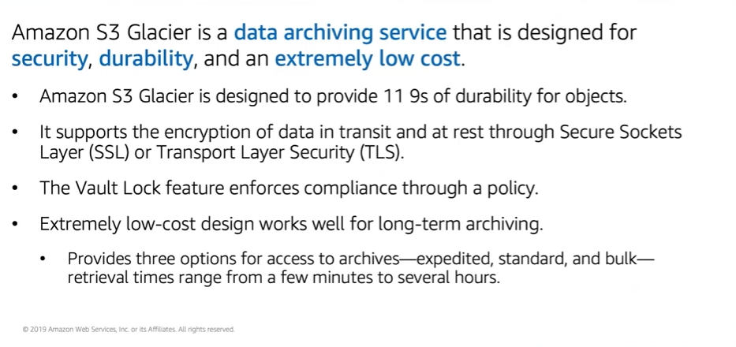

# Module 7: AWS S3 Glacier

Favorite: No
Archive: No
Notebook: AWS Cloud (../../AWS%20Cloud%2035b6c6880dca809b964ce3b71f757313.md)
Edited: May 23, 2026 5:14 PM
Created: May 23, 2026 4:30 PM

## Amazon S3 Glacier

- S3 Glacier is a secure, durable and extremely low-cost cloud storage service for data archiving and long-term backup.
- When you use Glacier to archive data, you can store data at extremely low cost even in comparison with Amazon S3.
- But you can’t retrieve data immediately when you want it, because data stored in Glacier can take several hours to retrieve which is why it works well for archiving.
- 3 Glacier Terms to remember:
  - Archive
  - Vault
  - Vault Access/Lock Policy

- 3 options for retrieving data:
  - Expedited Retrievals made available within 1-5 minutes and have the highest cost.
  - Standard Retrievals complete within 3-5 hours and less expensive but more expensive than bulk
  - Bulk Retrievals complete in 5-12 hours and are the least expensive.

## S3 Glacier Use Cases

## Using S3 Glacier

- To store and access data in S3 Glacier, you can use the AWS Management Console, however only a few operations such as creating and deleting vaults, and creating and managing archive policies are available in the console.
- For other operations and interactions with S3 Glacier, you must use either S3 Glacier REST APIs, AWS Java or .NET SDKs, or AWS CLI.
- You can also use lifecycle policies to archive data into Glacier.

## Lifecycle Policies

- You should automate the lifecycle of data that you store in S3.
- By using lifecycle policies, you can cycle data at regular intervals between different S3 storage types.
- This automation reduces overall cost because you pay less for data as it becomes less important with time.
- Additionally, you can also seet lifecycle rules per bucket.
- Example: A lifecycle policy that moves data as it ages from S3 Standard to S3 Standard-Infrequent Access, and finally into S3 Glacier before it is deleted.
- Suppose a user uploads a video to your app and your app generates a thumbnail preview of the video. This video preview is stored to S3 Standard because it’s likely the user wants to access it right away.
- Your usage data indicates that most thumbnail previews are not accessed after 30 days.
- Your lifecycle policy takes these previews and moves them to S3 Infrequent-Access after 30 days, and after another 30 days elapsed, the preview is likely not going to be accessed again, so it’s moved to S3 Glacier, where it’ll remain for a year and then be deleted.
- The lifecycle policy manages all this movement automatically.

## S3 Storage Classes

- Each object in S3 has a storage class associated with it
- All storage classes are designed for 11 nines of durability for objects across multiple Availability Zones, except S3 One Zone-Infrequent Access, which is in a single Availability Zone.
- S3 works well for performance-sensitive use cases and frequently used data. Standard is the default storage class in S3.
- S3 Intelligent-Tiering is designed to optimize cost by automatically moving data to the most cost-effective access tier without impacting performance or operational costs.
- S3 Standard-Infrequent Access is optimized for long-lived and less frequently accessed data. Example: Backups and older data that are accessed less frequently, but still require high performance.
- S3 One Zone-Infrequent Acess stores data in a single Availability Zone and costs less than S3 Standard-Infrequent Access. It works well for customers who want lower-cost option for infrequently accessed data, but do not require availability and resilience of S3 Standard or S3 Standard-Infrequent Access.
- S3 Glacier is suitable for archiving data where access is infrequent and retrieval time of several hours is acceptable.
- S3 Glacier Deep Archive is the lowest storage class for Amazon S3, and it supports long-term retention and digital preservation of data that might be accessed once or twice a year. It is designed for customers that must retain data sets for 7-10 years or longer to meet regulatory compliance requirements.

## Storage Comparison

## Server-Side Encryption

- Server-side encryption is focused on protecting data at rest.
- With both solutions, you can securely transfer data over HTTPS.
- Any data you archive in Glacier is encrypted by default.
- With Amazon S3, your app must initiate server-side encryption.
- You can use server-side encryption wwith S3 Managed Encryption Keys or SSE S3.
- S3 encrypts each object with a unique key. As an additional safeguard, it encrypts the key with a main key that it rotates regularly.
- S3 server-side encryption uses one of the strongest block ciphers available, AES-256.
- You can also use server-side encryption with customer-provided encryption keys, or SSE-C. This option enables you to set your own encryption keys. You include the encryption key as part of your request, and Amazon S3 manages both encryption as it writes to disks and decryption when you access objects.
- Lastly, you can use server-side encryption with AWS Key Management Service (AWS KMS). It’s a service that combines secure, highly-available hardware and software to provide a key management system that is scaled for the cloud. AWS KMS uses customer master keys to encrypt S3 objects.
- You access KMS through the encryption keys section in the IAM console. You can also access AWS KMS through the API to centrally create encryption keys, define the policies that control how keys can be used, and audit key usage to prove that they are being used correctly.

## Security with S3 Glacier

- 2 different layers you can apply to glacier:
  - You can enable and controll access to data in S3 Glacier with IAM.
  - Glacier encrypts data by default, and you can choose how you want to manage the keys to that encrypted data.

