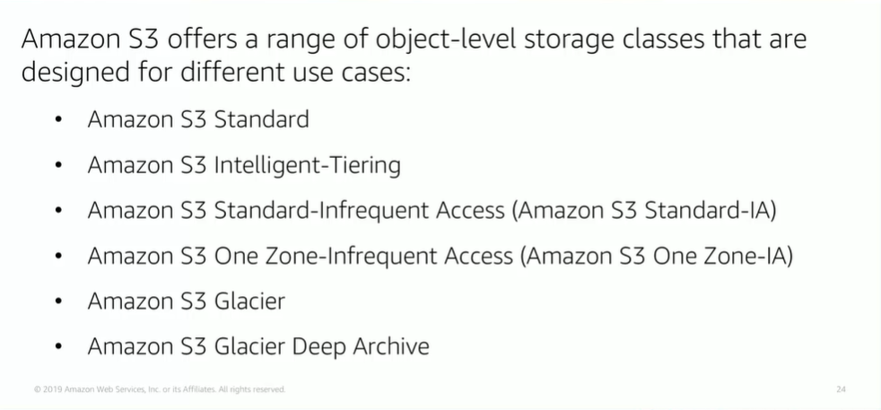

# Module 7: AWS S3

Favorite: No
Archive: No
Notebook: AWS Cloud (../../AWS%20Cloud%2035b6c6880dca809b964ce3b71f757313.md)
Edited: May 22, 2026 11:08 AM
Created: May 22, 2026 10:43 AM

## Amazon S3

- Amazon S3 is object-level storage, which means that if you want to change a part of a file, you must make change, then reupload the entire modified file.
- S3 stores data as objects in resources that are called buckets.

### Overview

- Amazon S3 is a managed cloud storage solution that is designed to scale seamlessly and provide 11 9’s of durability.
- You can store virtually as many objects as you want in a bucket, and you can write, read, and delete objects in your bucket.
- Bucket names are universal, and must be unique across the world.
- Objects can be up to 5TB in size.
- By default, data in Amazon S3 is stored redundantly across multiple facilities.
- The data that you store in Amazon S3 is not associated with any particular server, and you don’t need to manage any infrastructure yourself.
- You can put as many objects into S3 as you want.
- Amazon S3 holds trillions of objects, and regularly peaks at millions of requests per second.
- Objects can be almost any data file, like images, videos, or server logs.
- You get fine-grained control over who can access your data by using AWS Identity and Access Management Policies, Amazon S3 bucket policies, and even per object access control lists.
- By default, none of your data is shared publicly. You can encrypt your data in transit and at rest by enabling server-side encryption.
- Amazon S3 includes event notifications that enable you to setup automatic notifications when certain events occur, such as when an object is uploaded to a bucker or deleted from a bucket. Those notifications can be sent to you, or they can be used to triggers other processes, such as AWS Lambda functions.

## Amazon S3 Storage Classes

- S3 Standard is designed for high availability, high durability, and performance for frequently accessed data, because it delivers low latency and high throughput.
- S3 Standard is appropriate for a variety of use cases, like content distribution and big data analytics.

- S3 Standard-Infrequent Access is used for data that is accessed less frequently, but requires rapid access when needed. It is designed to provide the high durability, high throughput, and low latency of Amazon S3 Standard, with a low per GB storage and per GB retrieval fee. This combination of low cost and high performance makes Amazon S3 Standard-Infrequent Access good for long-term storage and backups, and it’s a datastore for disaster recovery files.

- Amazon S3 One Zone-Infrequent Access is for data that is accessed less frequently, but requires rapid access when needed

