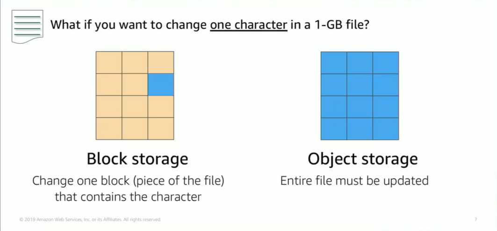

# Module 7: Amazon Elastic Block Store (Amazon EBS)

Favorite: No
Archive: No
Notebook: AWS Cloud (../../AWS%20Cloud%2035b6c6880dca809b964ce3b71f757313.md)
Edited: May 22, 2026 10:09 AM
Created: May 22, 2026 9:51 AM

## Amazon Elastic Block Store

- Provides persistent block storage volumes for use with Amazon EC2 instances.
- Persistent storage is any data storage device that retains data after power to that device is shut off.
- It also called non-volatile storage.
- Each Amazon EBS volume is automatically replicated within its availability zone to protect you from component failure.
- It is designed for high availability and durability.
- Amazon EBS volumes provide the consistent and low latency performance that is needed to run your workloads.
- With Amazon EBS, you can scale usage up or down within minutes, while paying a low price for only what you provision.

## Block Storage vs. Object Storage

- One critical difference between storage types is whether they offer block-level storage or object level storage.
- The diagram below shows the difference.
- With block storage, you change only the block that contains the character, and with object storage you have to update the entire file.
- This affects throughput, latency, and cost of storage solution
- Block storage solutions are typically faster and uses less bandwidth, but they can cost more than object storage.

## Amazon EBS

## Amazon EBS Volume Types

- You can use EBS volumes as primary storage for data that requires frequent updates such as the system drive for an instance or storage for a database app.
- You can also use them for throughput intensive apps that perform continuous disk scans.
- Only SSDs can be used as boot volumes for EC2 instances.

## Amazon EBS

## Amazon EBS: Volumes, IOPS, Pricing

## Amazon EBS: Snapshots and Data Transfer

