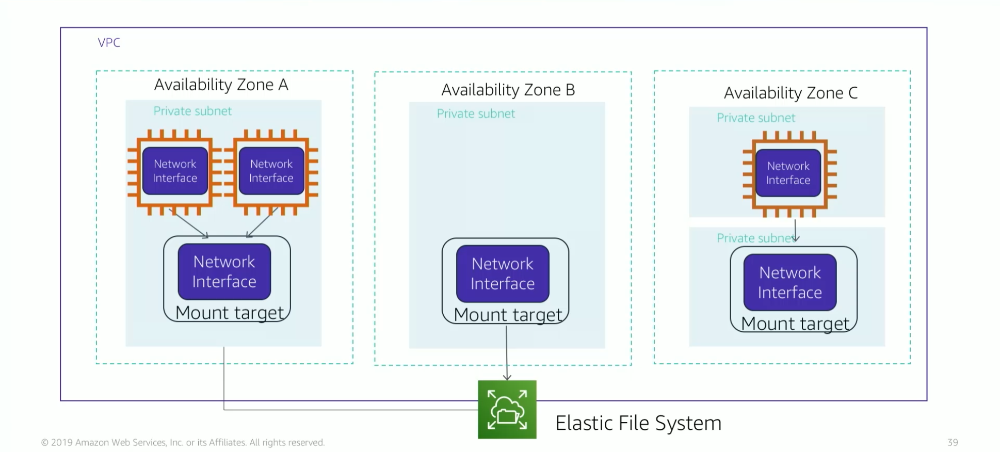

# Module 7: Amazon Elastic File System (EFS)

Favorite: No
Archive: No
Notebook: AWS Cloud (../../AWS%20Cloud%2035b6c6880dca809b964ce3b71f757313.md)
Edited: May 23, 2026 4:18 PM
Created: May 23, 2026 3:53 PM

## Amazon EFS

- Implement storage for EC2 instances that multiple virtual machines can access at the same time.
- It is implemented as a shared file system that uses the Network File System.

#### Features

- File storage in the AWS Cloud
- Works well for big data and analytics, media processing workflows, content management, web serving, and home directories
- Petabyte-scale, low-latency file system
- Shared storage
- Elastic capacity
- Supports Network File System (NFS) and NFSv4
- Compatible with all Linux-based AMIs for Amazon EC2

## Amazon EFS Architecture

- Amazon EFS is like a file storage in the cloud.
- With Amazon EFS, you can create a file system, mount the file system on an Amazon EC2 instance, and then read and write data to and from your file system.
- You can mount an Amazon EFS file system in your VPC.
- You can access Amazon EFS file system concurrently from multiple Amazon EC2 instance in your VPC, so applications that scale beyond a single connection can access a file system.
- Amazon EC2 instances that run in multiple availability zones within the same AWS Region can access the file system, so many users can access and share a common data source.
- The diagram below shows a VPC having 3 availability zones, and each availability zone has one mount target that was created in it.
- It is recommended that you access the file system from a mount target within the same availability zone.
- One of the availability zones has two subnets, however a mount target is created in only one of the subnets.

## Amazon EFS Implementation

1. Create Amazon EC2 resources and launch the EC2 instance.
2. Create Amazon EFS file system.
3. Create mount targets in the appropriate subnets.
4. Connect Amazon EC2 instances to the mount targets.
5. Verify resources and protection of AWS account.

## Amazon EFS Resources

- In EFS, a file system is the primary resource.
- Each file system has properties like ID, creation token, creation time and file system size.
- Mount targets also have properties like mount target id, subnet id, and the subnet where it was created and file system id for the file system where it was created.

