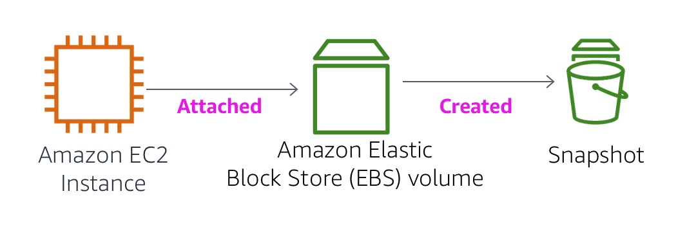

# Module 7: Lab 4 - Working with EBS

Favorite: No
Archive: No
Notebook: AWS Cloud (../../AWS%20Cloud%2035b6c6880dca809b964ce3b71f757313.md)
Edited: May 22, 2026 10:43 AM
Created: May 22, 2026 10:22 AM

# **Lab 4: Working with EBS**

## **Lab Overview**



This lab focuses on Amazon Elastic Block Store (Amazon EBS), a key underlying storage mechanism for Amazon EC2 instances. In this lab, you will learn how to create an Amazon EBS volume, attach it to an instance, apply a file system to the volume, and then take a snapshot backup.

## **Topics covered**

By the end of this lab, you will be able to:

- Create an Amazon EBS volume
- Attach and mount your volume to an EC2 instance
- Create a snapshot of your volume
- Create a new volume from your snapshot
- Attach and mount the new volume to your EC2 instance

## **Lab Pre-requisites**

To successfully complete this lab, you should be familiar with basic Amazon EC2 usage and with basic Linux server administration. You should feel comfortable using the Linux command-line tools.

## **Duration**

This lab will require approximately **30 minutes** to complete.

## **AWS service restrictions**

In this lab environment, access to AWS services and service actions might be restricted to the ones that are needed to complete the lab instructions. You might encounter errors if you attempt to access other services or perform actions beyond the ones that are described in this lab.

### **What is Amazon Elastic Block Store?**

**Amazon Elastic Block Store (Amazon EBS)** offers persistent storage for Amazon EC2 instances. Amazon EBS volumes are network-attached and persist independently from the life of an instance. Amazon EBS volumes are highly available, highly reliable volumes that can be leveraged as an Amazon EC2 instances boot partition or attached to a running Amazon EC2 instance as a standard block device.

When used as a boot partition, Amazon EC2 instances can be stopped and subsequently restarted, enabling you to pay only for the storage resources used while maintaining your instance's state. Amazon EBS volumes offer greatly improved durability over local Amazon EC2 instance stores because Amazon EBS volumes are automatically replicated on the backend (in a single Availability Zone).

For those wanting even more durability, Amazon EBS provides the ability to create point-in-time consistent snapshots of your volumes that are then stored in Amazon Simple Storage Service (Amazon S3) and automatically replicated across multiple Availability Zones. These snapshots can be used as the starting point for new Amazon EBS volumes and can protect your data for long-term durability. You can also easily share these snapshots with co-workers and other AWS developers.

This lab guide explains basic concepts of Amazon EBS in a step-by-step fashion. However, it can only give a brief overview of Amazon EBS concepts. For further information, see the [Amazon EBS documentation](http://aws.amazon.com/ebs/).

### **Amazon EBS Volume Features**

Amazon EBS volumes deliver the following features:

- **Persistent storage:** Volume lifetime is independent of any particular Amazon EC2 instance.
- **General purpose:** Amazon EBS volumes are raw, unformatted block devices that can be used from any operating system.
- **High performance:** Amazon EBS volumes are equal to or better than local Amazon EC2 drives.
- **High reliability:** Amazon EBS volumes have built-in redundancy within an Availability Zone.
- **Designed for resiliency:** The AFR (Annual Failure Rate) of Amazon EBS is between 0.1% and 1%.
- **Variable size:** Volume sizes range from 1 GB to 16 TB.
- **Easy to use:** Amazon EBS volumes can be easily created, attached, backed up, restored, and deleted.

## **Accessing the AWS Management Console**

1. At the top of these instructions, click Start Lab to launch your lab.

   A Start Lab panel opens displaying the lab status.

2. Wait until you see the message "**Lab status: ready**", then click the **X** to close the Start Lab panel.
3. At the top of these instructions, click AWS

   This will open the AWS Management Console in a new browser tab. The system will automatically log you in.

   **Tip**: If a new browser tab does not open, there will typically be a banner or icon at the top of your browser indicating that your browser is preventing the site from opening pop-up windows. Choose the banner or icon and choose "Allow pop ups."

4. Arrange the AWS Management Console tab so that it displays along side these instructions. Ideally, you will be able to see both browser tabs at the same time, to make it easier to follow the lab steps.

## **Task 1: Create a New EBS Volume**

In this task, you will create and attach an Amazon EBS volume to a new Amazon EC2 instance.

1. In the **AWS Management Console**, on the **Services** menu, click **EC2**.
2. In the left navigation pane, choose **Instances**.

   An Amazon EC2 instance named **Lab** has already been launched for your lab.

3. Note the **Availability Zone** of the instance. It will look similar to _us-east-1a_.
4. In the left navigation pane, choose **Volumes**.

   You will see an existing volume that is being used by the Amazon EC2 instance. This volume has a size of 8 GiB, which makes it easy to distinguish from the volume you will create next, which will be 1 GiB in size.

5. Choose **Create volume** then configure:
   - **Volume Type:** _General Purpose SSD (gp2)_
   - **Size (GiB):** `1`. **NOTE**: You may be restricted from creating large volumes.
   - **Availability Zone:** Select the same availability zone as your EC2 instance.
   - Choose **Add Tag**
   - In the Tag Editor, enter:
     - **Key:** `Name`
     - **Value:** `My Volume`
6. Choose **Create Volume**

   Your new volume will appear in the list, and will move from the _Creating_ state to the _Available_ state. You may need to choose **refresh** to see your new volume.

## **Task 2: Attach the Volume to an Instance**

You can now attach your new volume to the Amazon EC2 instance.

1. Select **My Volume**.
2. In the **Actions** menu, choose **Attach volume**.
3. Choose the **Instance** field, then select the instance that appears (Lab).
4. For the **Device Name**, choose _/dev/sdb/_ from the dropdown.

   **Note:** You will use this device identifier in a later task.

5. Choose **Attach volume**The volume state is now _In-use_.

## **Task 3: Connect to Your Amazon EC2 Instance**

In this task, you will connect to the Lab EC2 instance using Session Manager.

1. In the **AWS Management Console**, in the EC2 service, choose **Instances**.
2. Select the **Lab** instance.
3. Choose **Connect**
4. Choose the **Session Manager** tab, then choose **Connect**

   _A new browser tab will open with a terminal session connected to the instance._

   Run the following command to switch to the ec2-user home directory:

   ```bash
   sudo su -l ec2-user
   ```

## **Task 4: Create and Configure Your File System**

In this task, you will add the new volume to a Linux instance as an ext3 file system under the /mnt/data-store mount point.

1. View the storage available on your instance:

   ```bash
   df -h
   ```

   You should see output similar to:

   ```bash
   Filesystem      Size  Used Avail Use% Mounted on
   devtmpfs        484M     0  484M   0% /dev
   tmpfs           492M     0  492M   0% /dev/shm
   tmpfs           492M  460K  491M   1% /run
   tmpfs           492M     0  492M   0% /sys/fs/cgroup
   /dev/xvda1      8.0G  1.5G  6.6G  19% /
   tmpfs            99M     0   99M   0% /run/user/0
   tmpfs            99M     0   99M   0% /run/user/1000
   ```

   This is showing the original 8GB disk volume. Your new volume is not yet shown.

2. Create an ext3 file system on the new volume:

   ```bash
   sudo mkfs -t ext3 /dev/sdb
   ```

3. Create a directory for mounting the new storage volume:

   ```bash
   sudo mkdir /mnt/data-store
   ```

4. Mount the new volume:

   ```bash
   sudo mount /dev/sdb /mnt/data-store
   ```

   To configure the Linux instance to mount this volume whenever the instance is started, you will need to add a line to _/etc/fstab_.

   ```bash
   echo "/dev/sdb   /mnt/data-store ext3 defaults,noatime 1 2" | sudo tee -a /etc/fstab
   ```

5. View the configuration file to see the setting on the last line:

   ```bash
   cat /etc/fstab
   ```

6. View the available storage again:

   ```bash
   df -h
   ```

   The output will now contain an additional line - _/dev/xvdb_:

   ```bash
   Filesystem      Size  Used Avail Use% Mounted on
   devtmpfs        484M     0  484M   0% /dev
   tmpfs           492M     0  492M   0% /dev/shm
   tmpfs           492M  460K  491M   1% /run
   tmpfs           492M     0  492M   0% /sys/fs/cgroup
   /dev/xvda1      8.0G  1.5G  6.6G  19% /
   tmpfs            99M     0   99M   0% /run/user/0
   tmpfs            99M     0   99M   0% /run/user/1000
   /dev/xvdb       976M  1.3M  924M   1% /mnt/data-store
   ```

7. On your mounted volume, create a file and add some text to it.

   ```bash
   sudo sh -c "echo some text has been written > /mnt/data-store/file.txt"
   ```

8. Verify that the text has been written to your volume.

   ```bash
   cat /mnt/data-store/file.txt
   ```

## **Task 5: Create an Amazon EBS Snapshot**

In this task, you will create a snapshot of your EBS volume.

You can create any number of point-in-time, consistent snapshots from Amazon EBS volumes at any time. Amazon EBS snapshots are stored in Amazon S3 with high durability. New Amazon EBS volumes can be created out of snapshots for cloning or restoring backups. Amazon EBS snapshots can also be easily shared among AWS users or copied over AWS regions.

1. In the **AWS Management Console**, choose **Volumes** and select **My Volume**.
2. In the **Actions** menu, select **Create snapshot**.
3. Choose **Add tag** then configure:
   - **Key:** `Name`
   - **Value:** `My Snapshot`
   - Choose **Create snapshot**
4. In the left navigation pane, choose **Snapshots**.

   Your snapshot is displayed. The status will first have a state of _Pending_, which means that the snapshot is being created. It will then change to a state of _Completed_.

   Note: Only used storage blocks are copied to snapshots, so empty blocks do not occupy any snapshot storage space.

5. In your terminal session, delete the file that you created on your volume.

   ```bash
   sudo rm /mnt/data-store/file.txt
   ```

6. Verify that the file has been deleted.

   ```bash
   ls /mnt/data-store/
   ```

   Your file has been deleted.

## **Task 6: Restore the Amazon EBS Snapshot**

If you ever wish to retrieve data stored in a snapshot, you can **Restore** the snapshot to a new EBS volume.

### **Create a Volume Using Your Snapshot**

1. In the **AWS Management Console**, select **My Snapshot**.
2. In the **Actions** menu, select **Create volume from snapshot**.
3. For **Availability Zone** Select the same availability zone that you used earlier.
4. Choose **Add tag** then configure:
   - **Key:** `Name`
   - **Value:** `Restored Volume`
   - Choose **Create volume**

   Note: When restoring a snapshot to a new volume, you can also modify the configuration, such as changing the volume type, size or Availability Zone.

### **Attach the Restored Volume to Your EC2 Instance**

1. In the left navigation pane, choose **Volumes**.
2. Select **Restored Volume**.
3. In the **Actions** menu, select **Attach volume**.
4. Choose the **Instance** field, then select the (Lab) instance that appears.
5. For the **Device Name**, choose _/dev/sdc/_ (or any next available identifier) from the dropdown.
6. Choose **Attach volume**

   The volume state is now _in-use_.

### **Mount the Restored Volume**

1. Create a directory for mounting the new storage volume:

   ```bash
   sudo mkdir /mnt/data-store2
   ```

2. Mount the new volume:

   ```bash
   sudo mount /dev/sdc /mnt/data-store2
   ```

3. Verify that volume you mounted has the file that you created earlier.

   ```bash
   ls /mnt/data-store2/
   ```

   You should see file.txt.

## **Submitting your work**

1. To record your progress, choose **Submit** at the top of these instructions.
2. When prompted, choose **Yes**.

   After a couple of minutes, the grades panel appears and shows you how many points you earned for each task. If the results don't display after a couple of minutes, choose **Grades** at the top of these instructions.

   **Tip:** You can submit your work multiple times. After you change your work, choose **Submit** again. Your last submission is recorded for this lab.

3. To find detailed feedback about your work, choose **Submission Report**.

   **Tip:** For any checks where you did not receive full points, there are sometimes helpful details provided in the submission report.

## **Conclusion**

Congratulations! You now have successfully:

- Created an Amazon EBS volume
- Attached the volume to an EC2 instance
- Created a file system on the volume
- Added a file to volume
- Created a snapshot of your volume
- Created a new volume from the snapshot
- Attached and mounted the new volume to your EC2 instance
- Verified that the file you created earlier was on the newly created volume

## **Lab Complete**

Congratulations! You have completed the lab.

1. Choose End Lab at the top of this page and then click **Yes** to confirm that you want to end the lab.

   A panel will appear, indicating that "DELETE has been initiated... You may close this message box now."

2. Choose the **X** in the top right corner to close the panel.
