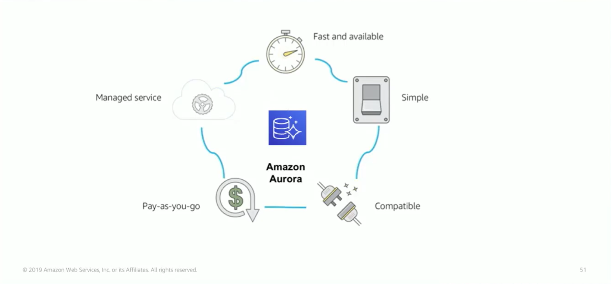

# Module 8: Amazon Aurora

Favorite: No
Archive: No
Notebook: AWS Cloud (../../AWS%20Cloud%2035b6c6880dca809b964ce3b71f757313.md)
Edited: June 1, 2026 1:12 PM
Created: June 1, 2026 12:50 PM

## Amazon Aurora

- Aurora is a MySQL and PostgreSQL compatible relational database that is built for the cloud.
- It combines performance and availability of high-end commercial databases with the simplicity and cost effectiveness of open-source databases.
- Using Aurora can reduce database costs while improving the reliability and availability of the database instance.
- As a fully managed service, Aurora is designed to automate time-consuming tasks like provisioning, patching, backup, recovery, failure detection and repair.

## Amazon Aurora Service Benefits

## High Availability

- Aurora offers high availability and resilient design.
- Aurora achieves high availability by storing multiple copies of data across different Availability Zones.
- The data is continuously backed up to Amazon S3.
- You can use up to 15 read replicas with Aurora to greatly improve performance of high read use cases.
- This also reduces possibility of losing data.

## Resilient Design

- Aurora is designed for instant crash recovery if your primary database becomes unhealthy.
- After a database crash, Amazon Aurora does not need to replay the redo log from the last database checkpoint, instead it performs this on every read operation. This reduces restart time after a database crash to less than 60s in most cases.
- The Aurora architecture removes the buffer cache from the database process, that’s why the buffer is available immediately after a restart. This means you don’t need to throttle access after a crash while you wait for the cache to repopulate.

