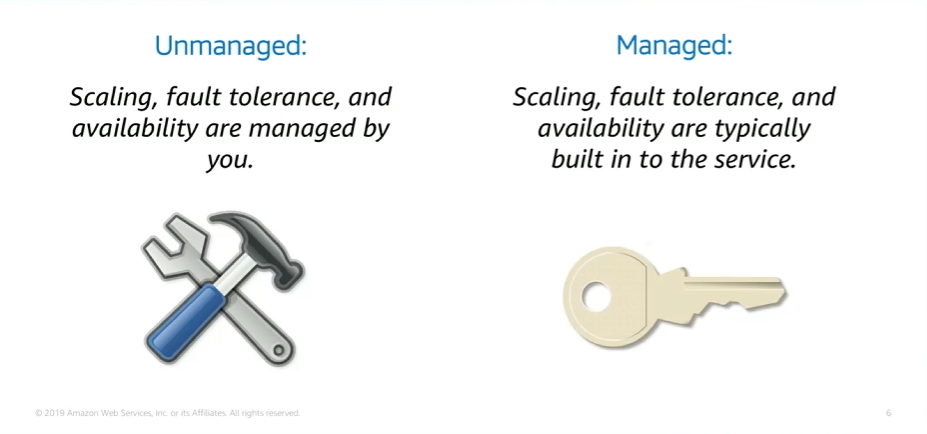

# Module 8: Amazon RDS

Favorite: No
Archive: No
Notebook: AWS Cloud (../../AWS%20Cloud%2035b6c6880dca809b964ce3b71f757313.md)
Edited: May 23, 2026 5:59 PM
Created: May 23, 2026 5:18 PM

## Unmanaged vs. Managed Services

- Example: You launched an EC2 instance, because EC2 is an unmanaged solution, that web server will not scale to handle increased traffic load or replace unhealthy instances with healthy ones unless you specify that it use a scaling solution. It could be auto scaling service.
- The benefit of using an unmanaged service is that you have a more fine-tuned control over how your solution handles changes in load, errors, and situations where resources become unavailable.
- There is also come configuration for managed services. Example: You can create an S3 bucket and then set permissions for it. However, managed services typically require less configuration.

## Challenges of Relational Databases

## Amazon RDS

- To address the challenge of running an unmanaged standalone relational database, AWS provides RDS, a service that sets up, operates, and scale relational databases without any ongoing administration.
- With Amazon RDS, your primary focus is your data on optimizing your app.

## Managed Services Responsibilities

- Offloading these operations to the managed RDS service reduces your operational workload and the costs that are associated with your relational database.

## RDS DB Instances

- The basic building blocks of RDS is the database instance.
- A database instance is an isolated database environment that you can contain multiple user created database.
- You can access your databases using the same tools and apps that you use with a standalone database instance.
- When setting up your database, you pick an instance class and the storage type needed for the database.
- Database instances and storage differ in performance characteristics and price. This enables you to customize performance and cost to needs of your business.
- When you create a datbase instance, you specify which database engine to run.
- Amazon RDS supports 6 database engines (shown below).

## RDS in a Virtual Private Cloud (VPC)

- You can run an instance in an Amazon VPC. When you use a VPC, you have control over your virtual network environment. You can select your own IP address range, create subnets, and configure routing and access control lists to control access to database.
- The basic functionality of RDS is the same whether or not you run it in a VPC.
- Usually the database instance is isolated in a private subnet, and it’s only made directly accessible to the apps that you choose.

## High Availability with Multi-AZ Deployment

- One of the most powerful features of RDS is ability to configure your database instance for high availability with a Multi-AZ deployment.
- When you configure a Multi-AZ deployment, RDS automatically generates a standby copy of the database instance in another availability zone within the same VPC. After seeding the database copy, transactions are synchronously replicated to the standby copy.
- Running a database instance in a Multi-AZ deployment can enhance availability during planned system maintenance, and it can help protect your database instance if there is ever a disruption within the availability zone.
- If the main database fails in a Multi-AZ deployment, RDS automatically brings the standby database instance online as the new main instance.
- The synchronous replication minimizes the potential for data loss, because your apps reference the database by name by using the DNS domain endpoint, you don’t need to change anything in your app code to use the standby copy for failover.

## RDS Read Replicas

- RDS supports creation of read replicas for MySQL, etc.
- Updates that are made to the source database instance are asynchronously copied to the read replica instance.
- You can reduce the load on your source database instance by routing read queries from your apps to the read replica.
- This is a configuration to choose, if you have an app with a high number of read operations.

## Use Cases

## When to use Amazon RDS

## Amazon RDS: Clock-hour billing and Database characteristics

- When you begin to estimate the cost of Amazon RDS, consider the clock-hours of service time. You are billed based on the amount of time your service is running.
- The physical capacity of the database you choose will also affect how you are charged. Database engine, instance size, and memory class will impact the cos running your database RDS instance.

## Amazon RDS: DB Purchase type and Multiple DB instances

- Database purchase type also has impact on cost.
- The number of instances created also impact cost. Example: You want to provision multiple database instances to handle peak loads.

## Amazon RDS: Storage

- Selecting the best storage configuration is another factor that will impact the cost of running an RDS implementation.
- There is no additional charge for backup storage of up to 100% of your provisioned database storage for an active database instance.
- After the database instance is terminated, backup storage is billed per GB per month.

## Amazon RDS: Deployment type and Data transfer

- Also consider the number of I/O requests that will be made to the database, and any data transfers.
- Depending on the needs of the app, you can optimize your costs by purchasing reserved instances.

