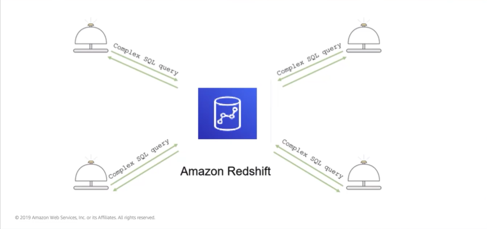

# Module 8: Amazon RedShift

Favorite: No
Archive: No
Notebook: AWS Cloud (../../AWS%20Cloud%2035b6c6880dca809b964ce3b71f757313.md)
Edited: June 1, 2026 12:25 PM
Created: June 1, 2026 12:10 PM

## Amazon RedShift

- RedShift is a fast, fully managed, data warehouse that makes it simple and cost effective to analyse all your data by using standard SQL and existing business intelligence tools.
- Analytics is important in businesses today, but building a data warehouse is complex and expensive. Data warehouses can take months and financial resources to set up.
- RedShift is a fast and powerfully fully-managed data warehouse that is simple and cost effective to set up, use and to scale.
- It enables you to run complex analytics queries against petabytes of structured data by using sophisticated query optimization, columnar storage on high-performance local disk, and massively parallel queries; results come back in seconds.

## Parallel Processing Architecture

- A RedShift implementation consists of a cluster of leader and compute nodes.
- The leader node manages communications with client programs and all communication with the compute nodes.
- It parses and develops plans to perform the series of steps needed to obtain results from complex queries.
- The leader node complies code for individual elements of the plan and assigns the code to individual computer nodes.
- The compute nodes run the compiled code and send intermediate results back to the leader node for final aggregation.
- Just like other AWS services, you pay for what you use in RedShift.

## Automation and Scaling

- You can automate most administrative tasks to manage, monitor and scale Amazon RedShift cluster.
- This allows you to focus on your data and your business.
- Scalability is intrinsic in RedShift. Your cluster can be scaled up and down as your needs change.
- In RedShift, security is built-in, and designed to provide strong encryption of data at rest and in transit.

## Compatibility

- RedShift is compatible with the tools that you already use.
- RedShift supports standard SQL and also provides high-performance Java Database Connectivity and Open Database Connectivity connectors.
- This means you can connect your RedShift cluster with SQL clients and business intelligence tools of choice.
- You can also interact directly with RedShift cluster via AWS console or AWS CLI.

## Amazon RedShift Use Cases

