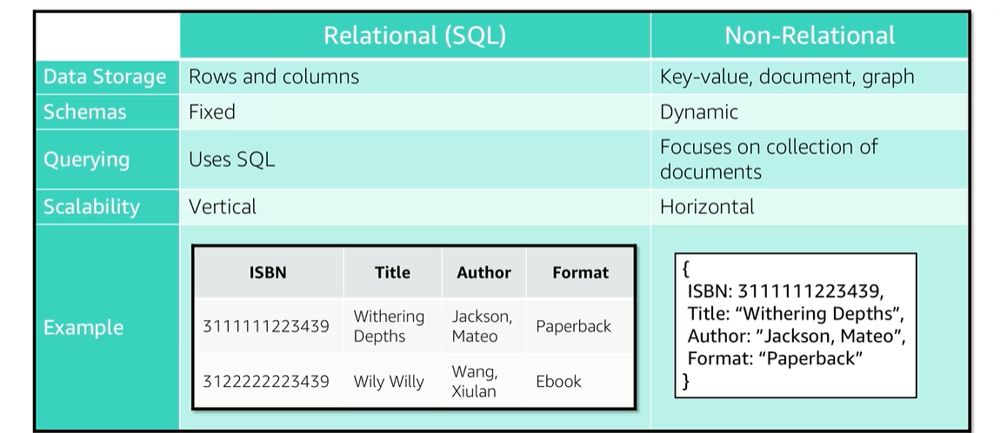

# Module 8: Dynamo DB

Favorite: No
Archive: No
Notebook: AWS Cloud (../../AWS%20Cloud%2035b6c6880dca809b964ce3b71f757313.md)
Edited: June 1, 2026 12:06 PM
Created: June 1, 2026 11:50 AM

## Relational Vs. Non-Relational Databases

## Amazon DynamoDB

- Amazon manages all the underlying data structure for this service and redundantly store data across multiple facilities in a region in a fault-tolerant architecture.
- All the data stored in DynamoDB are stored in SSDs and its simple query language enables consistent low latency query performance.
- You can also provision the amount of read or write throughput that you need for the table.
- Automatic Scaling can also be enabled so DynamoDB monitors the load on the table and automatically scales throughput.
- DynamoDB also allows you to:
  - Include global tables that allow you to automatically replicate your choice across AWS regions.
  - Data at Rest encryption.
  - Set TTL for specific items.

## DynamoDB Core Components

- Tables, items, and attributes are the core DynamoDB components.
- DynamoDB supports two different kinds of primary keys: Partition key and Partition and Sort key

## Items in a table must have a key

- A simple primary key is an attribute that uniquely identifies an item.
- The attribute is called the partition key.
- A composite primary key is composed of two attributes. The first attribute is the partition key, and the second attribute is the sort key.

