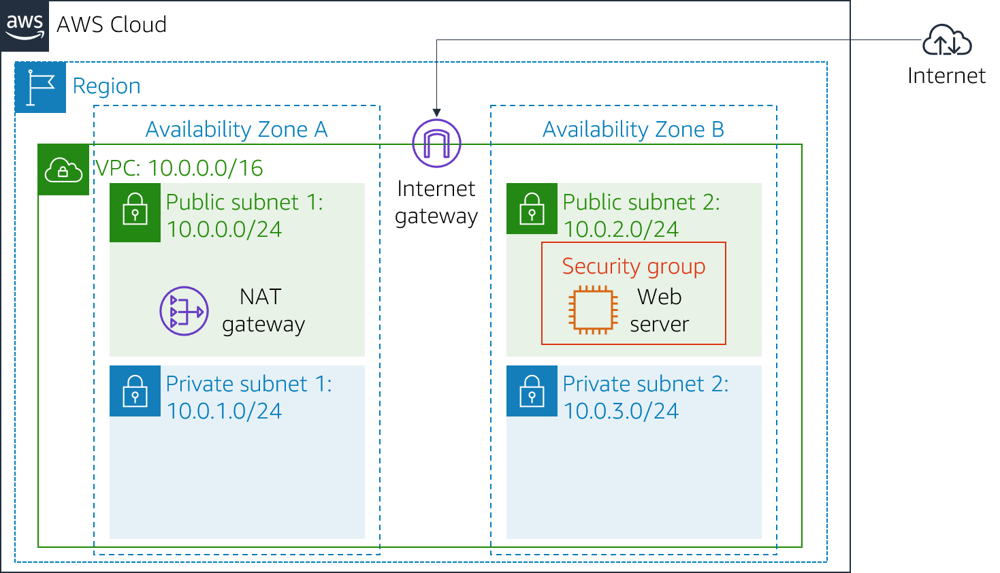
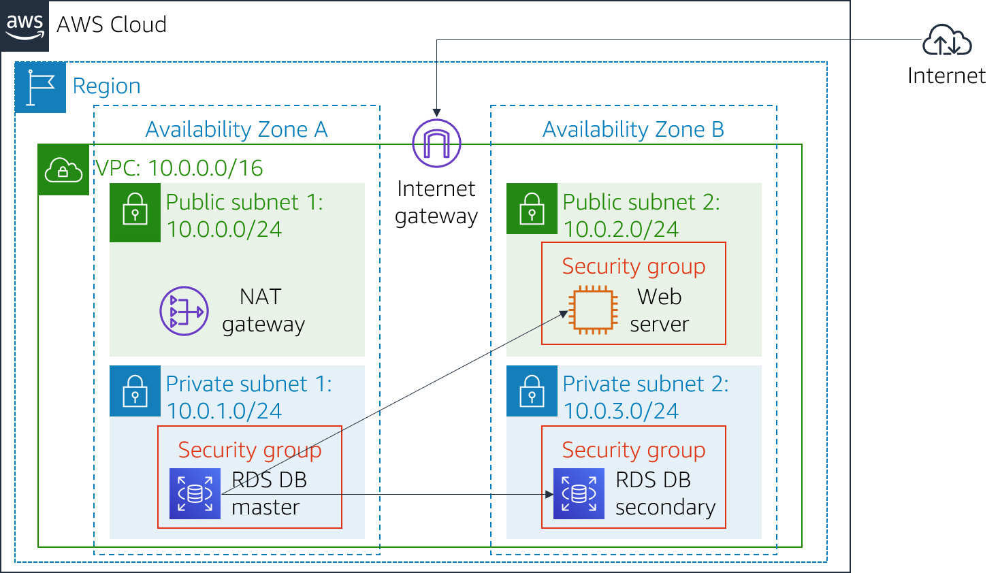

# Module 8: Lab 5 - Build a Database Server

Favorite: No
Archive: No
Notebook: AWS Cloud (../../AWS%20Cloud%2035b6c6880dca809b964ce3b71f757313.md)
Edited: May 24, 2026 3:21 PM
Created: May 24, 2026 3:17 PM

# **Lab 5: Build Your DB Server and Interact With Your DB Using an App**

## **Lab Overview and objectives**

This lab is designed to reinforce the concept of leveraging an AWS-managed database instance for solving relational database needs.

**_Amazon Relational Database Service_** (Amazon RDS) makes it easy to set up, operate, and scale a relational database in the cloud. It provides cost-efficient and resizable capacity while managing time-consuming database administration tasks, which allows you to focus on your applications and business. Amazon RDS provides you with six familiar database engines to choose from: Amazon Aurora, Oracle, Microsoft SQL Server, PostgreSQL, MySQL and MariaDB.

By the end of this lab, you will be able to:

- Launch an Amazon RDS DB instance with high availability.
- Configure the DB instance to permit connections from your web server.
- Open a web application and interact with your database.

## **Duration**

This lab takes approximately **30 minutes**.

## **AWS service restrictions**

In this lab environment, access to AWS services and service actions might be restricted to the ones that are needed to complete the lab instructions. You might encounter errors if you attempt to access other services or perform actions beyond the ones that are described in this lab.

## **Scenario**

When you start the lab, the following infrastructure is provided:

By the end of the lab, you will have this infrastructure:

## **Accessing the AWS Management Console**

1. At the top of these instructions, choose **Start Lab**.
   - The lab session starts.
   - A timer displays at the top of the page and shows the time remaining in the session.
     **Tip:** To refresh the session length at any time, choose **Start Lab** again before the timer reaches 0:00.
   - Before you continue, wait until the circle icon to the right of the AWS link in the upper-left corner turns green.
2. To connect to the AWS Management Console, choose the **AWS** link in the upper-left corner.
   - A new browser tab opens and connects you to the console.
     **Tip:** If a new browser tab does not open, a banner or icon is usually at the top of your browser with the message that your browser is preventing the site from opening pop-up windows. Choose the banner or icon, and then choose **Allow pop-ups**.
3. Arrange the AWS Management Console tab so that it displays along side these instructions. Ideally, you will be able to see both browser tabs at the same time, to make it easier to follow the lab steps.

## **Getting Credit for your work**

At the end of this lab you will be instructed to submit the lab to receive a score based on your progress.

**Tip:** The script that checks you works may only award points if you name resources and set configurations as specified. In particular, values in these instructions that appear in `This Format` should be entered exactly as documented (case-sensitive).

## **Task 1: Create a Security Group for the RDS DB Instance**

In this task, you will create a security group to allow your web server to access your RDS DB instance. The security group will be used when you launch the database instance.

1. In the AWS Management Console, in the search box next to **Services** , search for and select **VPC**.
2. In the left navigation pane, choose **Security groups**.
3. Choose **Create security group** and then configure:
   - **Security group name:** `DB Security Group`
   - **Description:** `Permit access from Web Security Group`
   - **VPC:** _Lab VPC_
     **Tip**: Choose the X next to VPC that is already selected, then choose **Lab VPC** from the menu.
4. In the **Inbound rules** pane, choose **Add rule**

   The security group currently has no rules. You will add a rule to permit access from the _Web Security Group_.

5. Configure the following settings:
   - **Type:** _MySQL/Aurora (3306)_
   - **Source:** Place you cursor in the field to the right of Custom, type `sg`, and then select _Web Security Group_.

   This configures the Database security group to permit inbound traffic on port 3306 from any EC2 instance that is associated with the _Web Security Group_.

6. Choose **Create security group**

   You will use this security group when launching an Amazon RDS database in this lab.

## **Task 2: Create a DB Subnet Group**

In this task, you will create a _DB subnet group_ that is used to tell RDS which subnets can be used for the database. Each DB subnet group requires subnets in at least two Availability Zones.

1. In the AWS Management Console, in the search box next to **Services** , search for and select **RDS**.
2. In the left navigation pane, choose **Subnet groups**.

   If the navigation pane is not visible, choose the menu icon in the top-left corner.

3. Choose **Create DB Subnet Group** then configure:
   - **Name:** `DB-Subnet-Group`
   - **Description:** `DB Subnet Group`
   - **VPC:** _Lab VPC_
4. Scroll down to the **Add subnets** section.
5. Expand the list of values under **Availability Zones** and select the first two zones: **us-east-1a** and **us-east-1b**.
6. Expand the list of values under **Subnets** and select the subnets associated with the CIDR ranges **10.0.1.0/24** and **10.0.3.0/24**.

   These subnets should now be shown in the **Subnets selected** table.

7. Choose **Create**

   You will use this DB subnet group when creating the database in the next task.

## **Task 3: Create an Amazon RDS DB Instance**

In this task, you will configure and launch a Multi-AZ Amazon RDS deployment of a MySQL database instance.

Amazon RDS **_Multi-AZ_** deployments provide enhanced availability and durability for Database (DB) instances, making them a natural fit for production database workloads. When you provision a Multi-AZ DB instance, Amazon RDS automatically creates a primary DB instance and synchronously replicates the data to a standby instance in a different Availability Zone (AZ).

1. In the left navigation pane, choose **Databases**.
2. Choose **Create database**

   If you see **Switch to the new database creation flow** at the top of the screen, please choose it.

3. Select **MySQL** under **Engine Options**.
4. Under **Templates** choose **Dev/Test**.
5. Under **Availability and durability** choose **Multi-AZ DB instance**.
6. Under **Settings**, configure:
   - **DB instance identifier:** `lab-db`
   - **Master username:** `main`
   - **Master password:** `lab-password`
   - **Confirm password:** `lab-password`
7. Under **DB instance class**, configure:
   - Select **Burstable classes (includes t classes)**.
   - Select _db.t3.micro_
8. Under **Storage**, configure:
   - **Storage type:** _General Purpose (SSD)_
   - **Allocated storage:** _20_
9. Under **Connectivity**, configure:
   - **Virtual Private Cloud (VPC):** _Lab VPC_
10. Under **Existing VPC security groups**, from the dropdown list:
    - Choose _DB Security Group_.
    - Deselect _default_.
11. Under **Monitoring** expand **Additional configuration**.
    - Uncheck **Enable Enhanced monitoring**.
12. Under **Additional configuration**, configure:
    - **Initial database name:** `lab`
    - Uncheck **Enable automatic backups**.
    - Uncheck **Enable encryption**

    This will turn off backups, which is not normally recommended, but will make the database deploy faster for this lab.

13. Choose **Create database**

    Your database will now be launched.

    If you receive an error that mentions "not authorized to perform: iam:CreateRole", make sure you unchecked _Enable Enhanced monitoring_ in the previous step.

14. Choose **lab-db** (choose the link itself).

    You will now need to wait **approximately 4 minutes** for the database to be available. The deployment process is deploying a database in two different Availability zones.

    While you are waiting, you might want to review the [Amazon RDS FAQs](https://aws.amazon.com/rds/faqs/) or grab a cup of coffee.

15. Wait until **Info** changes to **Modifying** or **Available**.
16. Scroll down to the **Connectivity & security** section and copy the **Endpoint** field.

    It will look similar to: _lab-db.xxxx.us-east-1.rds.amazonaws.com_.

17. Paste the Endpoint value into a text editor. You will use it later in the lab.

## **Task 4: Interact with Your Database**

In this task, you will open a web application running on a web server that has been created for you. You will configure it to use the database that you just created.

1. To discover the **WebServer** IP address, choose on the AWS Details drop down menu above these instructions. Copy the IP address value.
2. Open a new web browser tab, paste the _WebServer_ IP address and press Enter.

   The web application will be displayed, showing information about the EC2 instance.

3. Choose the **RDS** link at the top of the page.

   You will now configure the application to connect to your database.

4. Configure the following settings:
   - **Endpoint:** Paste the Endpoint you copied to a text editor earlier
   - **Database:** `lab`
   - **Username:** `main`
   - **Password:** `lab-password`
   - Choose **Submit**

   A message will appear explaining that the application is running a command to copy information to the database. After a few seconds the application will display an **Address Book**.

   The Address Book application is using the RDS database to store information.

5. Test the web application by adding, editing and removing contacts.

   The data is being persisted to the database and is automatically replicating to the second Availability Zone.

## **Submitting your work**

1. To record your progress, choose **Submit** at the top of these instructions.
2. When prompted, choose **Yes**.

   After a couple of minutes, the grades panel appears and shows you how many points you earned for each task. If the results don't display after a couple of minutes, choose **Grades** at the top of these instructions.

   **Tip:** You can submit your work multiple times. After you change your work, choose **Submit** again. Your last submission is recorded for this lab.

3. To find detailed feedback about your work, choose **Submission Report**.

   **Tip:** For any checks where you did not receive full points, there are sometimes helpful details provided in the submission report.

## **Lab Complete**

Congratulations! You have completed the lab.

1. Choose End Lab at the top of this page and then choose **Yes** to confirm that you want to end the lab.

   A panel will appear, indicating that "DELETE has been initiated... You may close this message box now."

2. Choose the **X** in the top right corner to close the panel.
