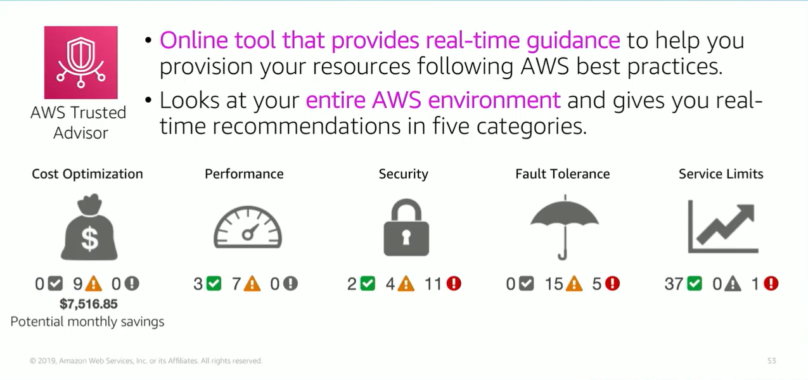

# Module 9: AWS Trusted Advisor Tool

Favorite: No
Archive: No
Notebook: AWS Cloud (../../AWS%20Cloud%2035b6c6880dca809b964ce3b71f757313.md)
Edited: June 1, 2026 4:15 PM
Created: June 1, 2026 4:03 PM

## AWS Trusted Advisor

- AWS Trusted Advisor looks at your resource usage and makes recommendations that can help you optimize costs, such as eliminating unused and idle resources or making commitments to reserve capacity.
- Trusted Advisor can recommend you improve the performance of your service by checking service limits, looking at your provisioned throughput, and monitoring for overutilized instances.
- Trusted Advisor recommendations can also help improve the security of your application by identifying gaps that you need to close and various AWS security features that you need to enable.
- Trusted Advisor examines your permissions.
- Trusted Advisor also provides fault tolerance recommendations to help increase the availability and redundancy of your AWS application so that you can take advantage of automatic scaling, health checks, multi-AZ deployments, and backup capabilities.
- Trusted Advisor checks for service usage that is more than 80% of the service limit. Values are based on a snapshot, so your current usage might differ. Limit and usage data can take up to 24 hrs to reflect any changes.

