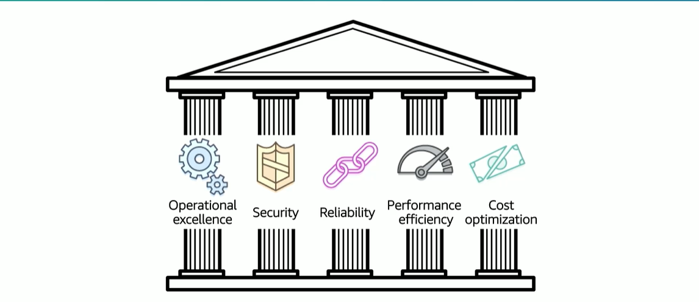

# Module 9: AWS Well-Architected Framework

Favorite: No
Archive: No
Notebook: AWS Cloud (../../AWS%20Cloud%2035b6c6880dca809b964ce3b71f757313.md)
Edited: June 1, 2026 1:36 PM
Created: June 1, 2026 1:30 PM

## What is the AWS Well-Architected Framework?

- It is a guide designed to help you build the most secure, high performing, resilient, and efficient infrastructure possible for your cloud applications and workloads.
- It provides a set of foundational questions and the best practices that can help evaluate and implement your cloud architectures.
- AWS developed Well-Architecture Framework after reviewing thousands of customer architectures on AWS.

## Pillars of AWS Well-Architected Framework

## Pillar Organization

