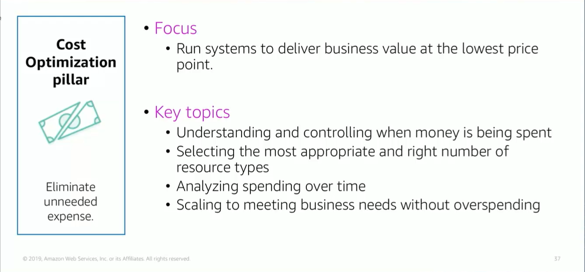

# Module 9: Cost Optimization Pillar

Favorite: No
Archive: No
Notebook: AWS Cloud (../../AWS%20Cloud%2035b6c6880dca809b964ce3b71f757313.md)
Edited: June 1, 2026 3:43 PM
Created: June 1, 2026 3:35 PM

## Cost Optimization Pillar

## Cost Optimization Design Principles

- Adopt a consumption model; where you only pay for the computing resources you require. Increase or decrease usage depending on business requirements, not by using elaborate forecasting.
- Measure overall efficiency; measure the business output of the workload and the costs that are associated with delivering it. Use this to know the gains that you are making from increasing output and reducing costs.
- Stop spending on data center ops; AWS does the heavy lifting of racking, stacking, and powering servers, which means you can focus on your customers and business projects instead of the IT structure.
- Analyze and attribute expenditure; cloud makes it easy to accurately identify system usage and costs, and attribute IT cost to individual workload owners. Having this capability helps you measure ROI and gives workload owners an opportunity to optimize their resources and reduce costs.
- Reduce cost of ownership; managed and app-level services reduce operational burden of maintaining servers for tasks such as sending email or managing databases. Because managed services operate at cloud scale, cloud service providers can offer a lower cost per transaction or service.

## Cost Optimization Foundational Questions

