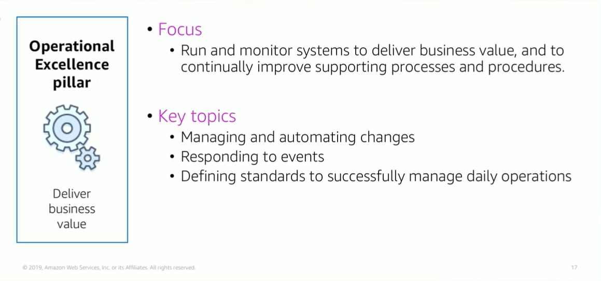

# Module 9: Operational Excellence Pillar

Favorite: No
Archive: No
Notebook: AWS Cloud (../../AWS%20Cloud%2035b6c6880dca809b964ce3b71f757313.md)
Edited: June 1, 2026 1:48 PM
Created: June 1, 2026 1:38 PM

## Operational Excellence Pillar

## Operational Excellence Design Principles

- Perform operations as code is where you define entire workload, that is apps and infrastructure, as code. By doing this, you limit human error and enable consistent responses to events.
- Annotate documentation focuses on automating the creation of annotated documentation after every build. Annotations can be used as input to your operations as code.
- Frequent, small, reversible changes; you should design workloads to enable components to be updated regularly. Make changes in small increments that can be reversed if they fail.
- Refine operations procedures frequently is about looking for opportunities to improve operations procedures and update them as they evolve.
- Anticipate failure; identify potential sources of failure so that they can be removed or mitigated. Test failure scenarios and validate your understanding of their impact regularly.
- Learn from all operational events and failures; this is where you share what is learned across teams and throughout the entire organization.

## Operational Excellence Foundational Questions

- Operations teams create and use procedures to respond to operational events and validate the effectiveness of these procedures to support business needs.
- Operations teams collect metrics that are used to measure the achievement of desired business outcomes.
- Business priorities and customer needs change over time. It’s important to design operations that evolve in response to change and to incorporate lessons learned through their performance.

