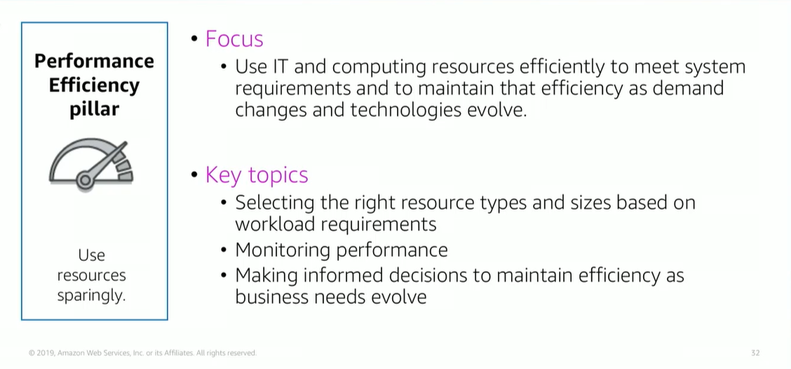

# Module 9: Performance Efficiency Pillar

Favorite: No
Archive: No
Notebook: AWS Cloud (../../AWS%20Cloud%2035b6c6880dca809b964ce3b71f757313.md)
Edited: June 1, 2026 3:34 PM
Created: June 1, 2026 3:23 PM

## Performance Efficiency Pillar

## Performance Efficiency Design Principles

- Democratize advanced technologies; here you consume technologies as a service, example, technology such as NoSQL databases, media transcoding, and machine learning require expertise. In the cloud, these technologies become services that teams can consume. Consuming technologies enables teams to focus on product development instead of resource provisioning and management.
- Go global in minutes; where you deploy systems in multiple AWS Regions to provide lower latency and a better customer experience at minimal cost.
- Serverless architectures; to remove operational burden of running and maintaining servers to carry out traditional compute activities. This can also lower transactional costs because managed services operate at cloud scale.
- Experiment more often by performing comparative testing of different types of instances, storage, or configurations.
- Mechanical sympathy by using a technology approach that aligns best to what you are trying to achieve. Example, consider your data access patterns when you select approaches for databases or storage.

## Performance Efficiency Foundational Questions

