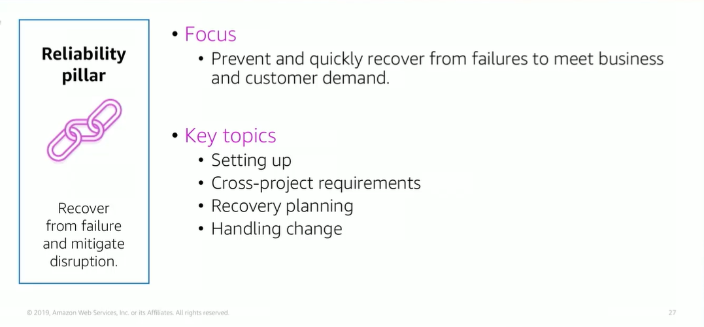

# Module 9: Reliability Pillar

Favorite: No
Archive: No
Notebook: AWS Cloud (../../AWS%20Cloud%2035b6c6880dca809b964ce3b71f757313.md)
Edited: June 1, 2026 2:05 PM
Created: June 1, 2026 1:58 PM

## Reliability Pillar

## Reliability Design Principles

- Test recovery procedures is where you test how your systems fail and validate your recovery procedures. This practice can expose failure pathways that you can test and rectify before a real failure scenario.
- Automatically recover from failure; you monitor systems for key performance indicators and configure your systems to trigger an automated recovery when a threshold is breached. This practice enables automatic notification and failure tracking and for automated recovery processes that work around of repair the failure.
- Scale horizontally; this is where your replace one large resource with multiple smaller resources and distribute requests across these smaller resources to reduce the impact of a single point failure on the overall system.
- Stop guessing capacity; you monitor demand and system usage and automate the addition or removal of resources to maintain the optimal level for satisfying demand.
- Manage change in automation; you use automation to make changes in infrastructure and manage changes through automation.

## Reliability Foundational Questions

