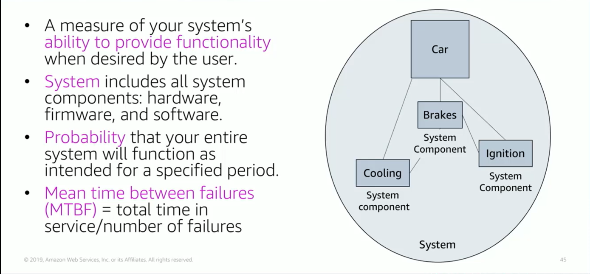

# Module 9: Reliability and Availability

Favorite: No
Archive: No
Notebook: AWS Cloud (../../AWS%20Cloud%2035b6c6880dca809b964ce3b71f757313.md)
Edited: June 1, 2026 4:02 PM
Created: June 1, 2026 3:43 PM

## Reliability

- A common way to measure reliability is to use statistical measurements such as Mean time between failures (MTBF); it is the total time in service over the number of failures.

## Understanding Reliability Metrics

- Example: You have an application that you bring online Monday at noon. The application is said to be available. It functions normally until it fails Friday at noon. Therefore, the time to failure or length of time the app was available is 96 hours. You spend from Friday at noon until Monday at noon diagnosing why the app failed and repairing it, at which point you bring the app back online. Therefore, time to repair is 72 hours and you had no weekend. It happens again and fails Friday at noon. This failure-repair-restore cycle happens every week and you don’t get a weekend.
- You can now calculate the average of these numbers. Your mean time to failure is 96 hours and mean time to repair is 72 hours. Your mean time between failures is 168 hours or 1 week, which is the sum of the mean time to failure and the mean time to repair.

## Availability

- Failure of the system components impacts the availability of the system.
- Formally, availability is the percentage of time that a system is operating normally or correctly performing the operations of it or normal operation time over total time.
- Availability is reduced any time the application isn’t operating normally including both scheduled and unscheduled interruptions.
- Availability is also defined as the percentage of uptime, that is length of time that a system is online between failures over a period of time, which is commonly one year.
- A common shorthand when referring to availability is the number of nines. Example. five nines mean 99.999% availability.

## High Availability

- A highly available system is one that can withstand some measure of degradation while still remaining available.
- In a highly available system, downtime is minimized as much as possible and minimal human intervention is required.
- A highly available system can be viewed as a set of system-wide shared resources that cooperate to guarantee essential services.
- High availability combines software with open standard hardware to minimize downtime by quickly restoring essential services when a system component or app fails.
- Services are restored rapidly, often in less than a minute.

## Availability Tiers

- Availability requirements vary.
- The length of disruption that is acceptable depends on the type of application.

## Factors that influence Availability

